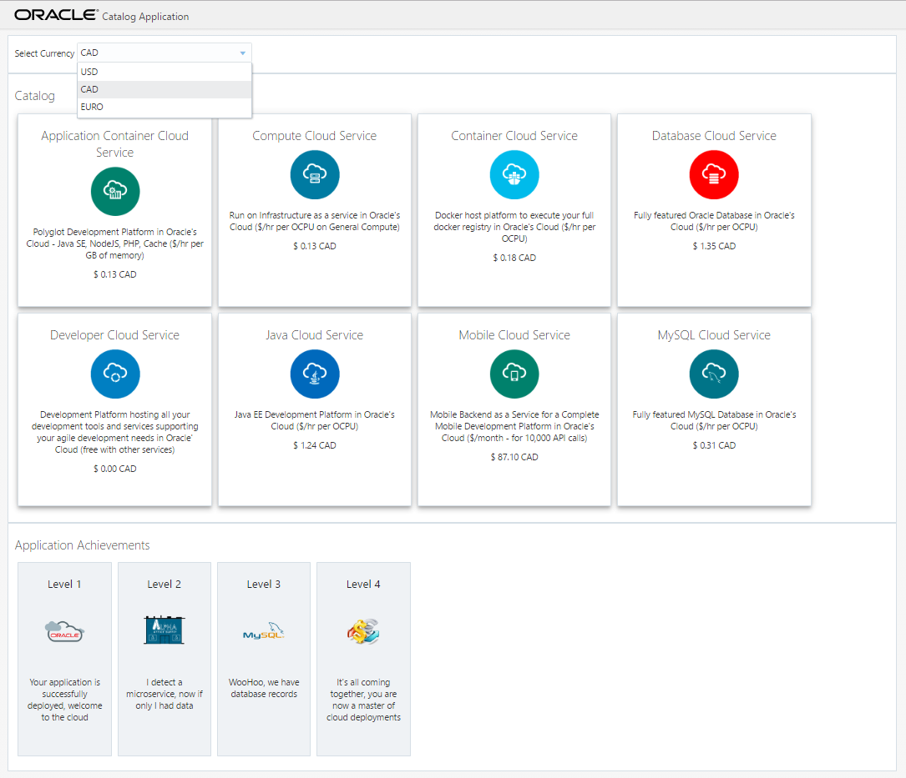
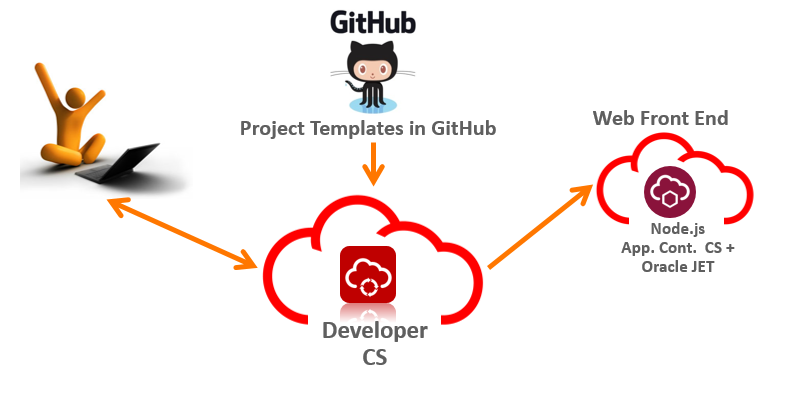
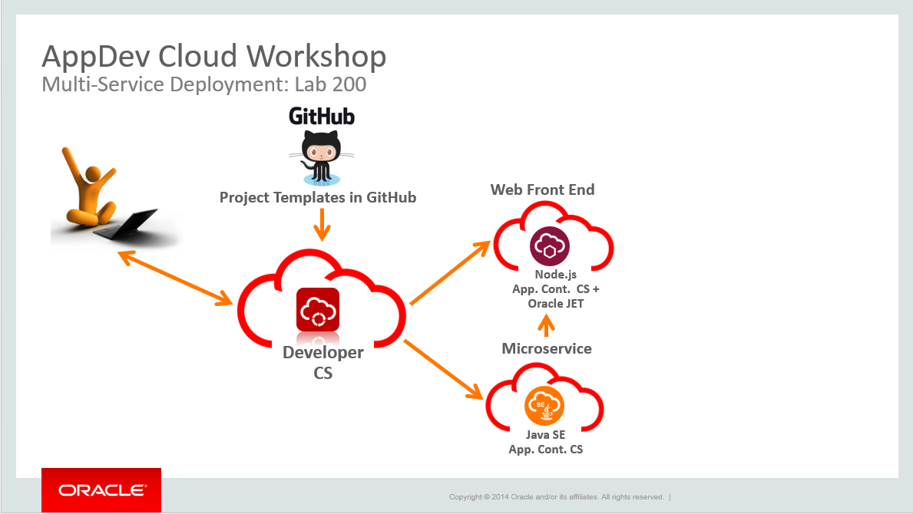

# Workshop Architecture Guide
    
## Workshop Goal

- To inform and understand the AppDev services provided to you in your trial account
- To understand Oracle's support for Polyglot Development
- To build a modern microservice architecture in the cloud
    - Our Application will display a catalog of information provided by a catalog microservice that uses a MySQL DB. We will also leverage a currency microservice to provide exchange rate information for that catalog
- To apply DevOps techniques for Automation to build, configure and deploy your applications to the cloud

## Workshop Technologies
We will be executing the workshop running many different technologies behind the scenes, this section will outlne the main technologies we will be leveraging:

 - Developer Cloud Service: is centralized hub of development and DevOps technologies and tools. Of which we will be using a few:
    - Git for source code
    - Maven for build scripting
    - Shell for build scripting
    - Continuous Integration platform to run automated builds
    - Continuous Delivery platform to run automated deploys
- Our UI application:
    - Written in NodeJS
    - Uses (Oracle JET)[www.oraclejet.org] as a client side UI framework
- Our MySQL microservice
    - Written in Java
    - Leverages JAX-WS and Grizzly IO to provide the REST and embedded web services
    - Leverages a backend MySQL Cloud Service instance
- Our Currency Microservice
    - Built using Google's Go Programming Language
    - Runs on a Docker container
    
## Architecture Goal
To Build out a Catalog UI supported by multiple microservices - providing supporting data and currency calculations

### Lab 100
Deploy the UI

### Lab 200
Deploy a Microservice

### Lab 300
Wire the Microservice up to at MySQL Database

### Lab 400
Deploy a second microserivce on a Docker image
