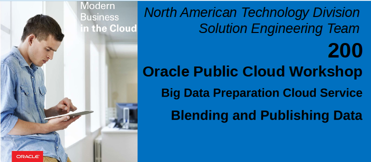
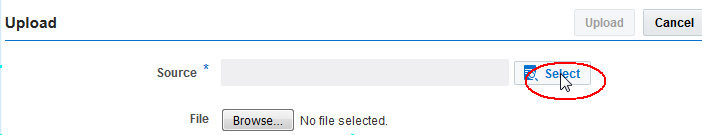
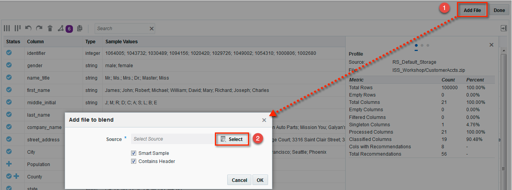
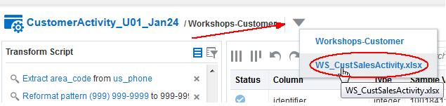
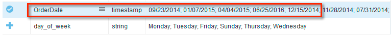
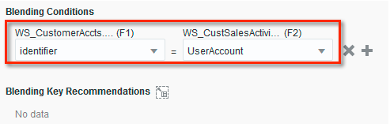
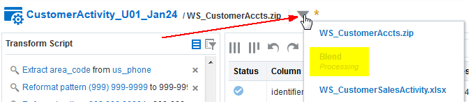
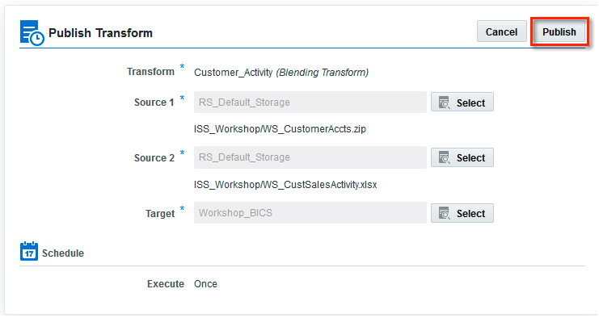

Updated: February 1, 2017

# Introduction
This lab will build upon the previous workshop lab by adding a new related dataset into the mix and completion of the final step of processing and publishing your prepared results.  These processes are as easy to complete as the first workshop lab and again by both technical and non-technical users in an independent fashion.

To refresh from the first workshop lab, we are still within the Big Data Preparation process phase, but we are nearing the point where we can transition to analysis and reporting of our prepared and enriched dataset.

Again, the overall goal is to ensure data consistency and thus higher quality analysis results as a self-service activity.

This will be the final data preparation workshop lab before we transition to analyzing our processed dataset this afternoon.

**Please direct comments to:  Derrick Cameron (derrick.cameron@oracle.com)**

## Credits
This lab was originally developed by Richard Stang and has been updated to reflect deployment and delivery logistics.  The NAS Innovation and Shared Services Team supports this workshop.  

## Workshop Objectives
- How to connect to the Big Data Preparation Service (BDPCS).
- Exploration of the basic features of the service.
- How to create a Transform and add an additional related dataset.
- How to configure a Transform, reviewing recommendations and tailoring the Transform script.
- How to publish our results to the Business Intelligence Cloud Service so that one can begin analyzing the processed and enriched results.

# Pre-Lab Information

## Assumptions
You have brought a laptop to the workshop with wireless networking that is capable of connecting to Oracle’s public cloud.  Specifically, the Big Data Preparation Cloud Service.  A compatible web browser as specified in the workshop invitation.

## Objective
We will be taking the cleansed and enriched customer information from the first workshop lab and blending a related dataset that contains customer sales activity.  Once the results are successfully blended, we will then process and publish the blended results to the Business Intelligence Cloud Service (BICS).

# Big Data Preparation Cloud Service Overview
### **Step 1:**  Accessing the Service URL
Your workshop leader will provide the specific cloud service URL as well as the credentials needed to login to the service.
- Open a web browser and type-in the URL to access the BDP Cloud Service.
- When presented with the following screen, enter your workshop User Name, Password and Identity Domain.

    

### **Step2:**  Login Success - The Home Page

Upon successful login, you should see the following Home page:

## Source Connection Setup
The two BDPCS Source Connections utilized in this workshop will be used:
- Default\_Oracle\_Cloud\_Storage
- Oracle\_BICS

The sections below provide examples of the configuration information that is required for the two sources:
- An Oracle Cloud Storage Service instance where our input files to be Transformed will reside.

    

- A Transformation target source, a Business Intelligence Cloud Service (BICS) instance that will be used in the afternoon analytics lab sessions.

    

**Note:**  You may explore the specific settings for connections via the Catalog page tab.  Please do not modify any of the specified connection information.

# Blending Datasets with Big Data Preparation Cloud Service
## Add a dataset to an existing transform
### **Step 1:**  Upload a File
- From the Home Page, click the Upload button.

    

- Select source.

    

    

- Select file (provided by your instructor).

    

    

### **Step 2:**  Edit the Transform from Workshop Lab 100
- Click the Catalog tab
- Access the operations menu associated with your Customer\_Activity Transform from Lab 100 and select Edit menu item to edit the Transform.

    

- The displayed transform should resemble the following:

    

- Add file to Transform.  With the transform open, press the Add File button in the upper right of the screen.  This opens a dialog where you will specify the file and processing options.  
- Press the Select button to select the file to be added to the Transform.

    

- Select the Source (Default\_Oracle\_Cloud\_Storage) or the Source name provided to you by your workshop leader, and then the Workshops-Customer folder.
- Select the Customer Sales Activity (WS\_CustomerSalesActivity.xlsx) or the filename as provided by the workshop leader and press OK.

    

- This will return you to the Transform page.  Next to the Transform name, note the yellow asterisk indicating that BDPCS is currently processing the request to add the file to the Transform.
- **Note:** Processing the request to add a file to the Transform will take a few minutes.  Please be patient.

    

### **Step 3:** Configure the Customer Sales Activity dataset Transforms
- Select the dataset/file in the Transform.
- Click the dropdown list icon
- Select the dataset/file that you just added

    

- The file transform should resemble this:

    

- Step 7: Extract Day of the Week from OrderDate.  Select OrderDate from the Recommendations list.

    

- From the list of Recommendations, click the checkmark for Extract day\_of\_week from OrderDate to apply this transform.

    

- This will add a column to the dataset containing the day of the week associated with the respective OrderDate.

    

- Format OrderDate.  Returning to the list of Recommendations, click the checkmark for Format epoch date in OrderDate as MM/dd/yyyy to apply this transform.  ***Note: An epoch date is a date value using a POSIX/UNIX encoding format.  The number of seconds from January 1, 1970.***

    

- This will format the data as shown here:

    

- Step 9: Associate BrandName with Brand\_Cat domain.  Select BrandName from the Recommendations list.

    

- Click the checkmark for Classify BrandName as domain Brand\_Cat.

    

- This associates BrandName with a knowledge object that will allow us add a product category to our dataset.  After the domain assignment recommendation has been accepted, an additional Recommendation appears.  Click the checkmark for Enrich BrandName with Brand\_Cat.BrandCategory to accept the Recommendation to add a Brand Category column to our dataset.

    

- The resulting enrichment:

    

## Blending Two Datasets Within a Transform
- Invoke the dataset Blend.  From the main Transform screen, press the Blend button.  This will display the Blending Configuration dialog.

    

- Configure the blend conditions.
- Click the checkmark next to Use F1.identifier with F2.UserAccount as blend key to accept these fields as our Blending Conditions.
- Click the Right Join radio button to select Right Join as the Output Option.

    **Blending Conditions:**  Blending or joining two datasets in BDPCS requires columns from each dataset that contain matching values.  These are used to stitch or blend the two datasets together in a coherent fashion.  In this particular instance, the identifier column in our first dataset contains values that match the UserAccount column values in the dataset we just added.  BDPCS noticed this column value similarity and has already provided a Recommendation that we use this pair of columns for our Blend Conditions.  We will accept this Recommendation.

    ** Output Options:** In addition to the Blending Conditions, we also need to configure our Output Options.  We have three options to choose from as shown below, but for our purposes, we are focused on customer sales activity, so the most appropriate choice is Right Join.  This will ensure all of our activity records are included while excluding any customers that do not have sales activity.  The join behavior is show via the Output Options graphic.  The Match, Left and Right options correspond to how the datasets are shown in the Blending Conditions.  Here the Customer Accounts information is the left dataset and the right dataset contains our Sales Activity.

    

- Note that the Blending Conditions are populated after accepting the Recommendations.

    

- Select the Column Selection tab.  Here we have an opportunity to exclude columns from the blended output dataset.  We will accept the default of all columns selected.
- Press the Submit Button to invoke Blend processing

    

- This will return you to the Transform page.  Next to the Transform name, note the yellow asterisk indicating that BDPCS is currently processing the dataset Blend request.
- **Note:** Blend processing will take a few minutes.  Please be patient.

    

## Configure the Blended Dataset transforms
- After Blend processing successfully completes, edit the Transform and select the Blend dataset.

    

- Move the UserAccount column before the gender column.  Scroll down the list of columns then click and drag the UserAccount column, then drop above the gender column.

    

This completes the transforms for the blended dataset.  Press the Done button to close the Transform.

## Publishing the Transform
- From the Catalog tab, click the Transform operations menu
Select the Publish menu item.

    

- Specify the Publishing Target.  The Source 1 and 2 fields are prepopulated with your default input datasets.  You need to specify the Target, which will be the Business Intelligence Cloud Service (BICS) Source.
- Press the Select button associated with the Target Source.
- Select the BICS Source that your workshop instructor has provided to you.

    

- Press the Publish button to invoke Blend processing and to Publish to the BICS Target.
- **Note:** Blend and Publish processing will take a few minutes.  Please be patient.

    

- Review the Blend and Publish Job Status.  Click the Jobs Tab.

    

- You should see a job associated with your Publish request.  Click the Name to see more Job details.

    

- The details displayed should indicate Success or Failure.  Successful BICS Publishing log output example:

    

Note the writeThroughput is 10613, the number of customer sales activity records.

# Lab 200 Summary
This completes Lab 200.  The results published exist as a database table in the Business Intelligence Cloud Service (BICS).  Here is an example of the results in BICS.

Hands-on Lab 300 will focus on analyzing and reporting the results we just published to the Business Intelligence Cloud Service.
