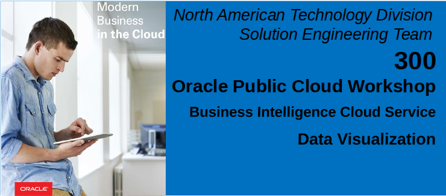
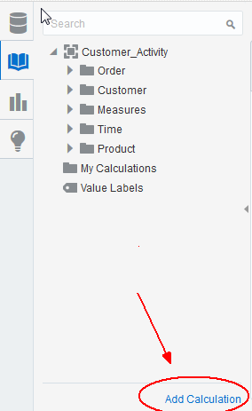
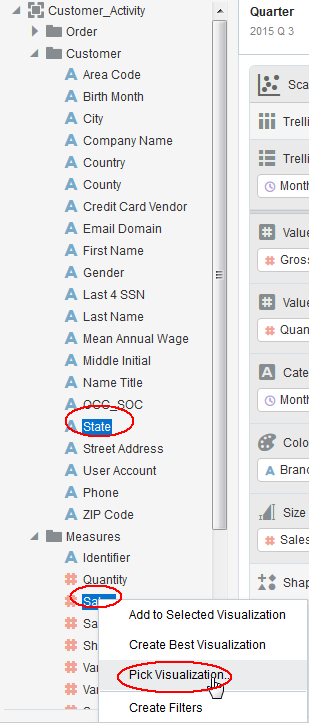
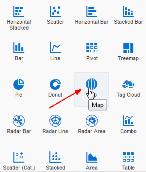
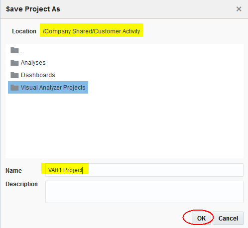

Updated: February 1, 2017

# Introduction

This is the third lab that is part of the Oracle Public Cloud Big Data Preparation and Business Intelligence workshop. These labs will give you a basic understanding of the Oracle Big Data Preparation and BI Cloud Services, and how those in a non-technical line of business role can quickly access, cleanse, validate, explore, and analyze their business information without needing IT support.

This lab will walk you through accessing and exploring information you have first prepared in Lab 1, and how to create dashboards and analytic workbooks on your curated data. First, you will create a Visual Analyzer Project, and then add visualizations to your canvas to gain an understanding of patterns in the data.  After you create the VA project, in lab 400 you will create an ‘Analysis’ workbook for publishing into a dashboard.  Finally you will create a new dashboard and add your content to it.

The following shows the self service flow of information, as business users take prepared data, explore it, and create dashboards off the curated data.

**Please direct comments to: derrick.cameron@oracle.com**

## Objectives
- Understand basic BICS Services.
- Understand how to access and explore data prepared by Big Data Preparation Cloud Service.
- How to create visual analyzer projects and visualizations.

# Business Intelligence Cloud Services

### **Step 1:** Log into BICS and review the Console
- Log into BICS and select the Console.

    

- Review (but do not select) the various functions.

    

# Visual analyzer
### **Step 1:** Create a new VA project

- Hover over elements to get familiar with controls.  Note in particular the `Undo Last Edit` icon for when you make a mistake and want to back up.

    

    

### **Step 2:** Select Items
- Select the highlighted items (hold CTRL key down) and drag to the canvas.

    

### **Step 3:** Create Treemap Visualization
- Select Treemap visualization.  Note other visualization choices.

    

- Drag Brand Category to the color section.

    

This visual tells us that electronics is our largest selling (revenue) item overall.  We would now like to study profitability over time.

### **Step 4:** Create calculation gross profit
- Select Add Calculation.

    

- Gross profit is sales – variable costs.  Start typing sale..then note type ahead picks of available fields – double click to select Sales.

    

- Select minus symbol, and then enter var..pause..and then select Variable Cost.  Enter Display Name ‘Gross Profit’, validate, and then Save.

    

### **Step 5:** Create new visualization
- Expand the time folder on the left, hold the CTRL key down and (multi) select **Brand Category, Quantity, Quarter, and Gross Profit**.  Drag this to the immediate left of the Treemap.

    

- Here we get a breakdown of profit and shipping volume by month.  However we don’t know how the past three years compare and what trends are occurring.

    

- Select Year and drag it up to the top left corner of the Scatter visualization that was auto-selected in the previous step. Note that the axis (and other) elements appear when you hover over various regions of the visualization. IE: drag Year up to the upper left and the trellis placeholders will appear.  Drag and drop Year over the Trellis Rows placeholder.  See how separate rows of scatter visualizations are created for each year.

    

- Select show assignments.  This allow us to see the layout of the visualization.

    

- We will add one more dimension to enhance the information this visualization is communicating.  Drag Sales to the bubble size region.

    

    

- Select items in the chart to see all the visualizations on a canvas are automatically linked so when you select an item(s) the related information is highlighted on all other visualizations.

    

- Let’s drill down on Q3 of 2015.  (This will help us forecast what will happen in Q3 of 2016.)  Select and then double click on the highlighted item 2015 Q3 electronics. Filters are automatically applied and we drill to month and model.

    

- Double clicking drills down on all dimensions.  In this case from quarter to month and from product category to brand.

    

### **Step 6:** Add one final visualization.  View data by geography
- Expand Customer folder and select **Sales and State** (use **CTRL** key), and then right click and select ‘Pick Visualization’.  Select Map visualization.

    

    

- Here we can easily see where sales of electronics (filters are still in place) are taking place.  We can also select any item on any visualization and see related information in other visualizations.

    

- Save project – call it VA-XX Project where `XX` is your assigned participant number.  Click on the folders to save in My Folder.

    

    

What did we learn from using Visual Analyzer?
- VA allows you to simply drag items in the canvass and intelligently chooses how to display your data for you automatically, but also lets you select from a rich and diverse set of visual choices.
- All your visualizations dynamically respond to selections and choices you make while navigating such that consistency and integrity are maintained across all charts and reports.  That is, selecting any item on any visual element is immediately reflected on all reports and charts.
- VA is very effective at quickly allowing you to identify data patterns and drill down on those patterns to uncover causal relationships.
- VA is an excellent data discovery solution that enable users to uncover patterns in their data with little or no advance training.
