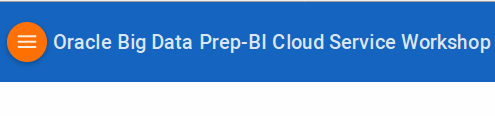

## IMPORTANT: How to prepare for this Workshop

The **Laptop** is bold: 
- The workshop participants should have a WiFi enabled laptop with the following web browser:
    - Google Chrome 29 and later or
    - Mozilla Firefox 24 and later
    - **Note: YOU CANNOT BE LOGGED INTO BDPCS AND BICS AT THE SAME TIME ON TWO DIFFERENT BROWSER TABS.  YOU MUST FIRST LOG OUT OF ONE BEFORE LOGGING INTO THE OTHER.**

**URLs/Access:**
- All userids: bdpuser1...8 (see password on whiteboard) 
- BDPCS: https://bdpinstance5-a423927.bigdatapreparation.us.oraclecloud.com/appui/
- BICS:  https://analyticsteam1-bestofbusinessanalytics3.analytics.us2.oraclecloud.com:443/analytics

**Files Required for the Labs:** 
- The workshop participants will need to download the following files, which will be used in the labs:
    - [WS\_CustomerAccts.zip](data/WS\_CustomerAccts.zip)
    - [WS\_CustomerSalesActivity.xlsx](data/WS\_CustomerSalesActivity.xlsx)

**Datasheets:** 
- These datasheets are not used in the labs, but may be of interest.
    - [Agile Analytics](datasheets/agile\_analytics.pdf)
    - [Big Data Preparation Cloud Service](datasheets/big-data-prep-cloud-service-ds.pdf)
    - [BI Cloud Service](datasheets/Oracle\_Business\_Intelligence\_Cloud\_Service\_DataSheet.pdf)

**How to View the Lab Guides:**

- The Labguides are best viewed using the Workshop's [GitHub Pages Website URL](https://pcdavies.github.io/BigDataPrepBICS/BDPCS-BICS/) 
- Once you are viewing the Workshop's GitHub Pages website, you can see a list of Lab Guides at any time by clicking on the **Menu Icon**

    

## Oracle Big Data Prep-BI Cloud Service Workshop

The Oracle Big Data Preparation - BI Cloud Service Workshop is a one day workshop that focuses on LOB user preparation, discovery, and reporting on spreadsheet data . Students will begin the day by taking a spreadsheet (csv file), and uploading it to Big Data Preparation Cloud Service. Students will then cleanse and enrich the data with BDPCS in a simple graphical environment, Then they will publish the data to BICS where they will profile and discover patterns in the data. Finally they will create reports and dashboard with the curated content. 

## Workshop Details

**Reference the following Lab Guides by opening their Documentation Files:**

### Lab 100: BDPCS - Preparing and Cleansing Data

**Documentation:** [BDPCS\_L100.md](BDPCS\_L100.md)

**Objectives**

- How to connect to the Big Data Preparation Service (BDPCS).
- Exploration of the basic features of the service.
- How to create a Transform and add a dataset.
- How to configure a Transform, reviewing recommendations and tailoring the Transform script.

### Lab 200: BDPCS - Blending and Publishing Data

**Documentation:** [BDPCS\_L200.md](BDPCS\_L200.md)

**Objectives:**

- How to connect to the Big Data Preparation Service (BDPCS).
- Exploration of the basic features of the service.
- How to create a Transform and add an additional related dataset.
- How to configure a Transform, reviewing recommendations and tailoring the Transform script.
- How to publish our results to the Business Intelligence Cloud Service so that one can begin analyzing the processed and enriched results.

### Lab 300: BICS - Visual Analyzer

**Documentation:** [BICS\_L300.md](BICS\_L300.md)

**Objectives:**

- Understand basic BICS Services.
- Understand how to access and explore data prepared by Big Data Preparation Cloud Service.
- How to create visual analyzer projects and visualizations.

### Lab 400: BICS - Answers and Dashboards

**Documentation:** [BICS\_L400.md](BICS\_L400.md)

**Objectives:**

- Understand how to create analytics workbooks and various types of interactive visualizations.
- Understand how to create dashboards and dashboard prompts.
- How to publish content into dashboards and share with others.
