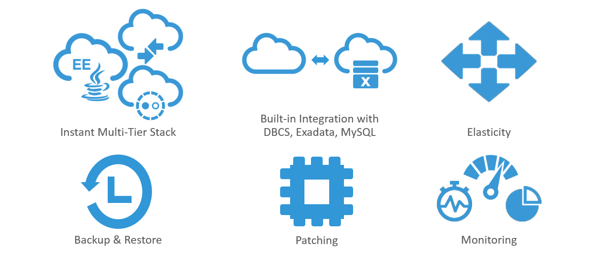
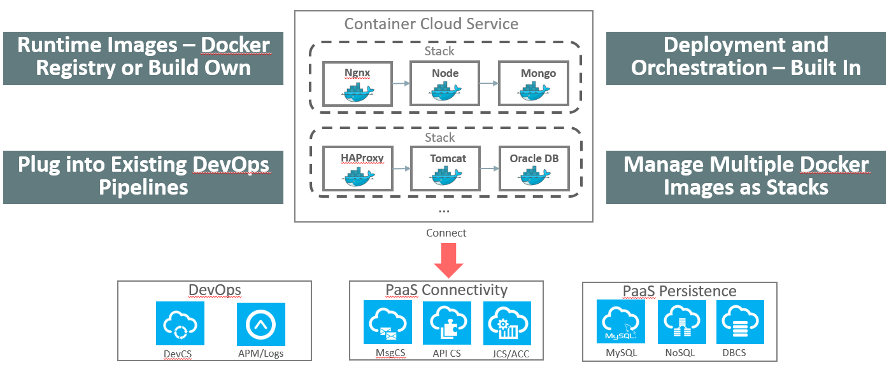
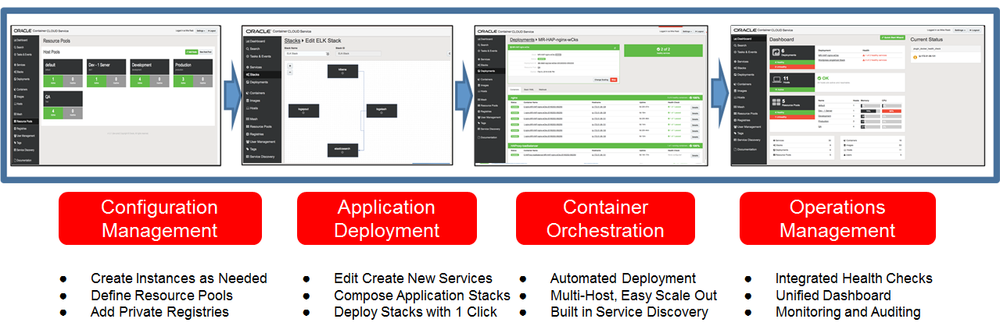
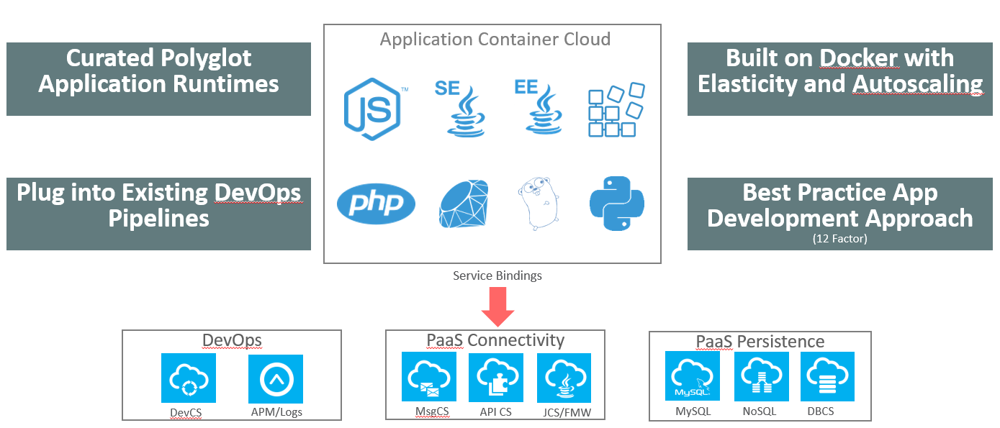
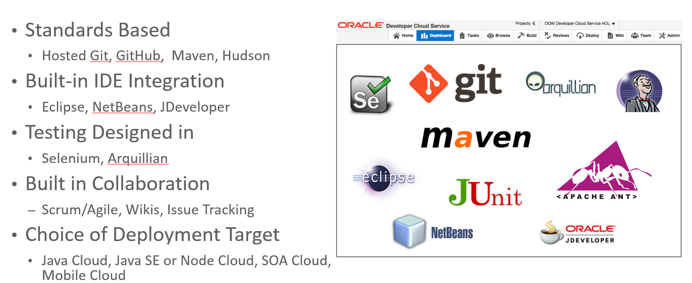

# Oracle Presents
## Touch the Cloud, an AppDev workshop for Trial Accounts 
This workshop designed to help you get started with your Oracle Cloud trial account. To proceed with the workshop, use the menu at the top to traverse the information, content and labs. Below we will provide some breakdown information about your current trial account and the services provided.
    
## Let's start with a Trial Services Breakdown
With your Oracle Cloud Trial you have full feature access to a variety of services. To help break things down we can look at the set of cloud services included in your trial.

<table width="100%">
    <tr>
        <th>What You Have in your Trial</th>
        <th>What Generally Applies to AppDev</th>
        <th>What will we use in this Workshop</th>
    </tr>
    <tr>
        <td align="center"><a href="https://cloud.oracle.com/database" target="_blank">Oracle Database</a></td>
        <td align="center"><a href="https://cloud.oracle.com/database" target="_blank">Oracle Database</a></td>
        <td align="center"><a href="https://cloud.oracle.com/mysql" target="_blank">MySQL</a></td>
    </tr>
    <tr>
        <td align="center"><a href="https://cloud.oracle.com/mysql" target="_blank">MySQL</a></td>
        <td align="center"><a href="https://cloud.oracle.com/mysql" target="_blank">MySQL</a></td>
        <td align="center"><a href="https://cloud.oracle.com/application-container-cloud" target="_blank">Application Container</a></td>
    </tr>
    <tr>
        <td align="center"><a href="https://cloud.oracle.com/goldengate" target="_blank">GoldenGate</a></td>
        <td align="center"><a href="https://cloud.oracle.com/java" target="_blank">Java</a></td>
        <td align="center"><a href="https://cloud.oracle.com/developer-service" target="_blank">Developer</a></td>
    </tr>
    <tr>
        <td align="center"><a href="https://cloud.oracle.com/database-backup" target="_blank">Database Backup</a></td>
        <td align="center"><a href="https://cloud.oracle.com/mobile" target="_blank">Mobile</a></td>
        <td align="center"><a href="https://cloud.oracle.com/container" target="_blank">Container</a></td>
    </tr>
    <tr>
        <td align="center"><a href="https://cloud.oracle.com/big-data-compute-edition" target="_blank">Big Data – Compute Edition</a></td>
        <td align="center"><a href="https://cloud.oracle.com/application-container-cloud" target="_blank">Application Container</a></td>
        <td align="center"><a href="http://www.oracle.com/webfolder/technetwork/jet/index.html" target="_blank">Oracle JET*</a></td>
    </tr>
    <tr>
        <td align="center"><a href="https://cloud.oracle.com/big-data-preparation" target="_blank">Big Data Preparation</a></td>
        <td align="center"><a href="https://cloud.oracle.com/compute" target="_blank">Compute</a></td>
        <td align="center"></td>
    </tr>
    <tr>
        <td align="center"><a href="https://cloud.oracle.com/ravello" target="_blank">Ravello</a></td>
        <td align="center"><a href="https://cloud.oracle.com/bare-metal" target="_blank">Bare Metal</a></td>
        <td align="center"></td>
    </tr>
    <tr>
        <td align="center"><a href="https://cloud.oracle.com/java" target="_blank">Java</a></td>
        <td align="center"><a href="https://cloud.oracle.com/storage" target="_blank">Storage</a></td>
        <td align="center"></td>
    </tr>
    <tr>
        <td align="center"><a href="https://cloud.oracle.com/integration" target="_blank">Integration</a></td>
        <td align="center"><a href="https://cloud.oracle.com/container" target="_blank">Container</a></td>
        <td align="center"></td>
    </tr>
    <tr>
        <td align="center"><a href="https://cloud.oracle.com/soa" target="_blank">SOA</a></td>
        <td align="center"><a href="https://cloud.oracle.com/developer-service" target="_blank">Developer</a></td>
        <td align="center"></td>
    </tr>
    <tr>
        <td align="center"><a href="https://cloud.oracle.com/process" target="_blank">Process</a></td>
        <td align="center"><a href="https://cloud.oracle.com/messaging" target="_blank">Messaging</a></td>
        <td align="center"></td>
    </tr>
    <tr>
        <td align="center"><a href="https://cloud.oracle.com/mobile" target="_blank">Mobile</a></td>
        <td align="center"></td>
        <td align="center"></td>
    </tr>
    <tr>
        <td align="center"><a href="https://cloud.oracle.com/application-container-cloud" target="_blank">Application Container</a></td>
        <td align="center"></td>
        <td align="center"></td>
    </tr>
    <tr>
        <td align="center"><a href="https://cloud.oracle.com/iot" target="_blank">Internet of Things</a></td>
        <td align="center"></td>
        <td align="center"></td>
    </tr>
    <tr>
        <td align="center"><a href="https://cloud.oracle.com/compute" target="_blank">Compute</a></td>
        <td align="center"></td>
        <td align="center"></td>
    </tr>
    <tr>
        <td align="center"><a href="https://cloud.oracle.com/bare-metal" target="_blank">Bare Metal</a></td>
        <td align="center"></td>
        <td align="center"></td>
    </tr>
    <tr>
        <td align="center"><a href="https://cloud.oracle.com/storage" target="_blank">Storage</a></td>
        <td align="center"></td>
        <td align="center"></td>
    </tr>
    <tr>
        <td align="center"><a href="https://cloud.oracle.com/container" target="_blank">Container</a></td>
        <td align="center"></td>
        <td align="center"></td>
    </tr>
    <tr>
        <td align="center"><a href="https://cloud.oracle.com/developer-service" target="_blank">Developer</a></td>
        <td align="center"></td>
        <td align="center"></td>
    </tr>
    <tr>
        <td align="center"><a href="https://cloud.oracle.com/messaging" target="_blank">Messaging</a></td>
        <td align="center"></td>
        <td align="center"></td>
    </tr>
</table>
 
> *Open Source framework 

## Let's dive into what some of these services can do
** Oracle is focused on supporting the Full Spectrum of the Modern AppDev Continuum **

### Modernize Traditional Applications: Java Cloud Service
Running Java EE workloads leveraging the latest Weblogic 12c web containers in the cloud.

### Data Storage Services: Database and MySQL Cloud Service
Run an Oracle Database or MySQL DB in the cloud. Fully featured functionality to support enterprise grade applications.

### Bring Your Own Docker: Container Cloud Service
Leverage a huge library of certified images + your exsisting ecosystem of Docker images and easily wire Container Cloud Service into your Docker DevOps pipeline.

### Build Polyglot Cloud Native Microserivces: Applicaiton Container Cloud
Leverage the lightweight containerized capabilities of Application Container Cloud Service

### DevOps and Devlopment tooling: Developer Cloud Service
All the developer tools in one place to allow you to Plan, Code, Build, Integrate, Test, Run and Collaborate

#
____
You will be leveraging many of these services as you continue on with the upcoming labs

