  
Updated: April 17, 2017

## Introduction

In Lab 300 we will be adding a MySQL databse to our microservice from lab 200. We will be using an automated build process to load our baseline schema onto the database after we have provisioned it.

Please direct comments to: Cam Crockett (cam.crockett@oracle.com)

## Objectives
- Provision a MySQL Database
- Create the baseline schema
- Bind the database to your microservice from lab 200

## Required Artifacts
- We will be leveraging scripts found within the MySQL Microservice from lab 200 that was pulled from [GitHub: https://github.com/c-rocket/TTC-MySQLMicroservice.git](https://github.com/c-rocket/TTC-MySQLMicroservice.git)
- We will require an ssh key: [labkey](labkey)

## Prerequisites

- Expected that labs 100 and 200 have been completed already
- Expected that your storage policy has been set as described in the [prerequisite guide](PreReqGuide.md)

## Technologies Involved
- Oracle Cloud Serivce:
    - Developer Coud Service
    - MySQL Cloud Service

## Architecture
You will be building out the first component of your Microservices Application

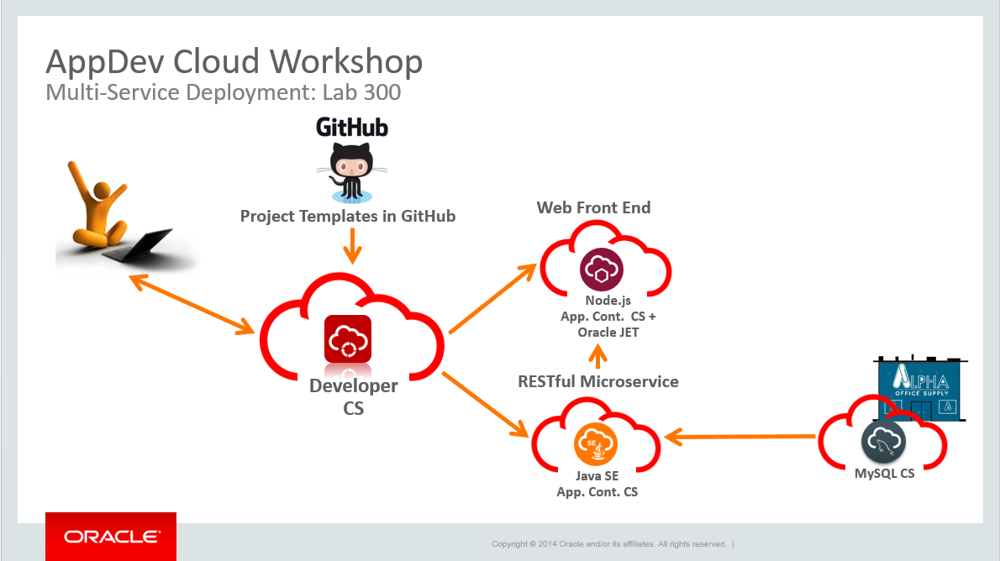

# Provisiona dn Setup a MySQL Cloud Service Instance

## Provision your Database

### **STEP 1**: Login to the MySQL Cloud Service

MySQL Cloud service provides a complete MySQL instance easily provisioned in the cloud.

- Return to the the main Cloud UI Dashboard

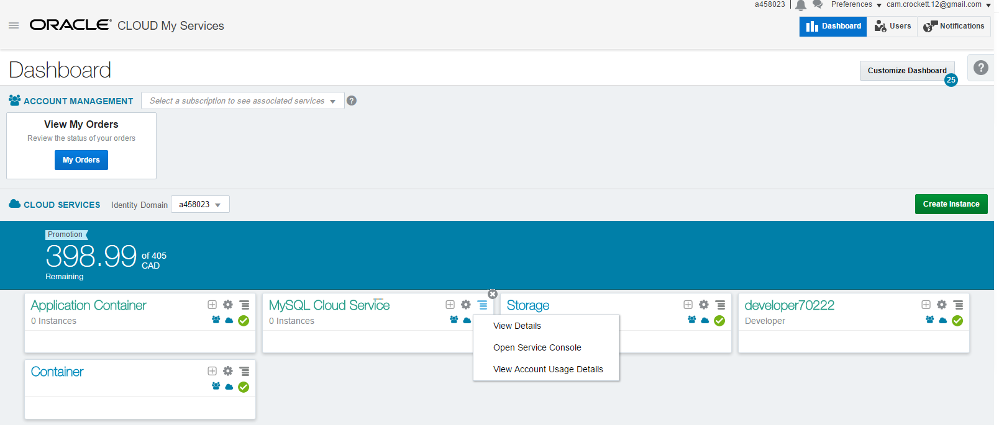
 
 - From the Cloud UI dashboard click on the **MySQL Cloud Service Menu** select **Open Service Console**.   

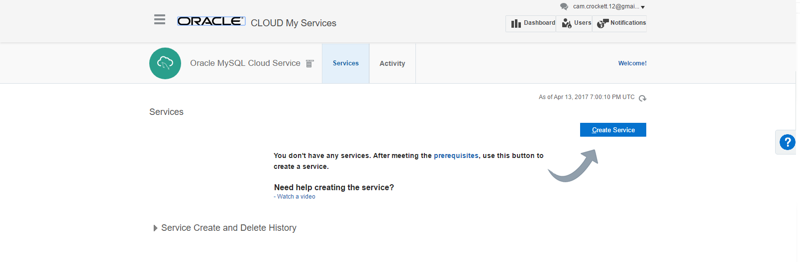

### **STEP 2**: Createa new MySQL Databse

- Click **create service**. Give your service a name.

```
Name: CatalogDB
```

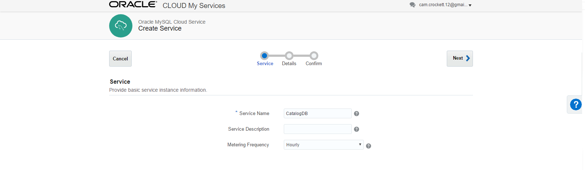

- On the details form fill out as follows and click **Next**.


```
Compute Shape: OC3
SSH Key: <use labkey found in required artifacts>
Usable DB Storage: 25
Administration Username: root
Password: Oracle123!
Database Schema Name: catalog
Backup Destination: none

```


- Confirm your setup and **Create**

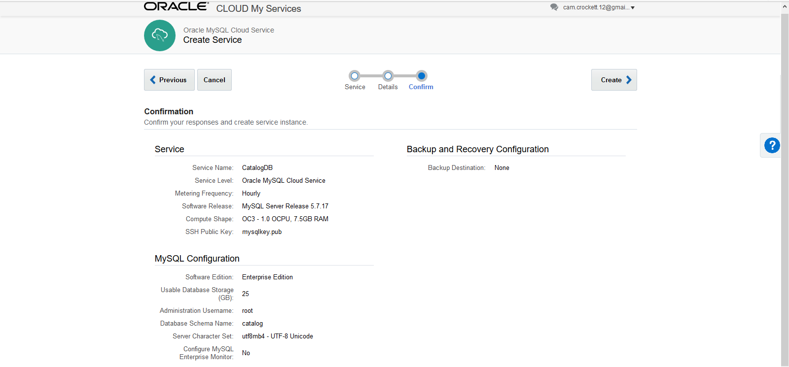

- Your Database is now being provisioned and will be ready shortly


- Verify that your database is provisioned

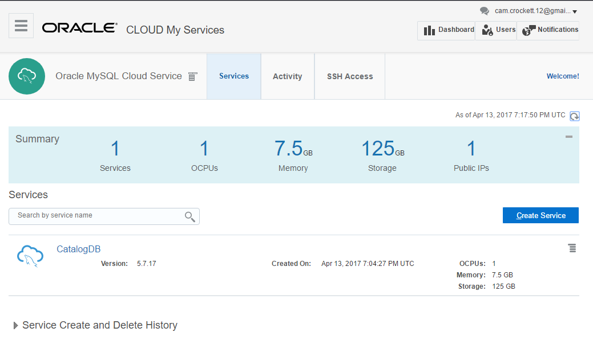

- Click on the insance to view details. Record the public IP of the database

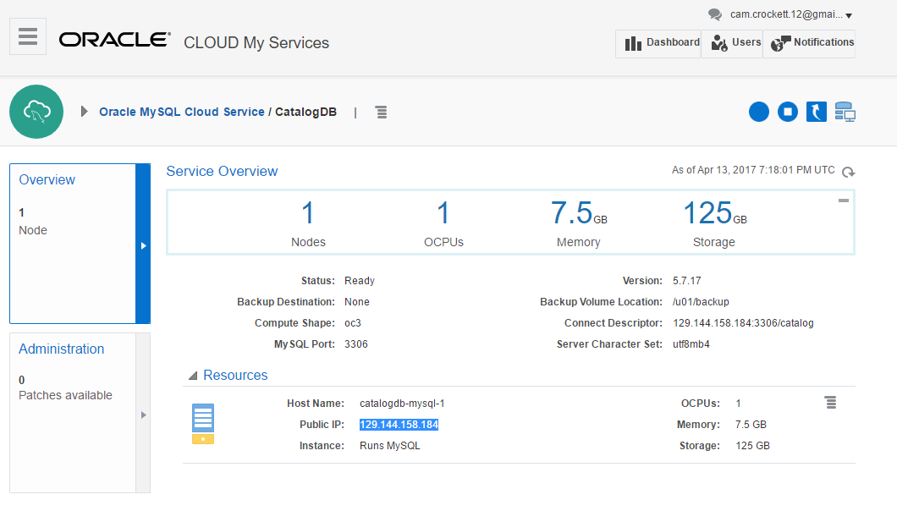

### **STEP 3**: Add a build for the baseline schema setup

- Return to the main project dashbaord for your Touch the Cloud Demo in Developer Cloud Service

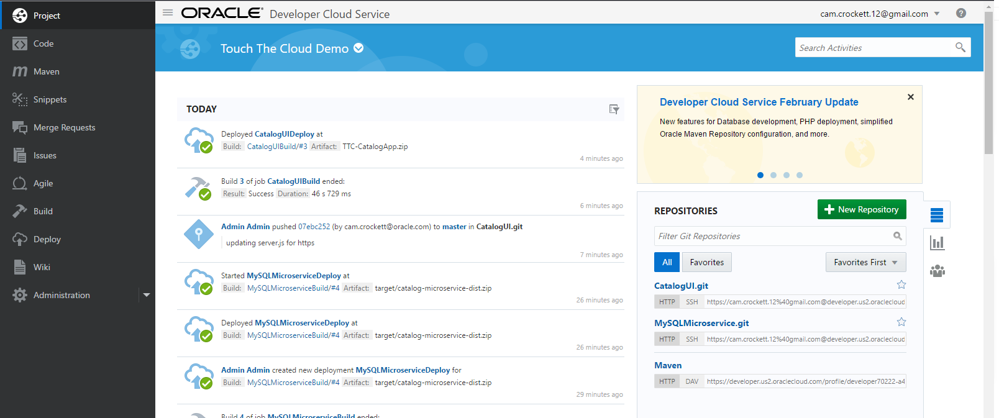

- Click **Build** on the left menu

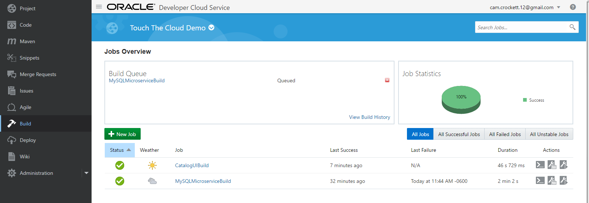

- Create a **New Job**. Fill out the form and click **Save**

> Name: MySQLDBSetup


- You will now be able to configure your build.

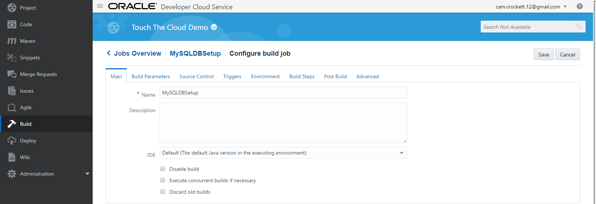

- Select the Build Parameters Tab and check parameterized build.

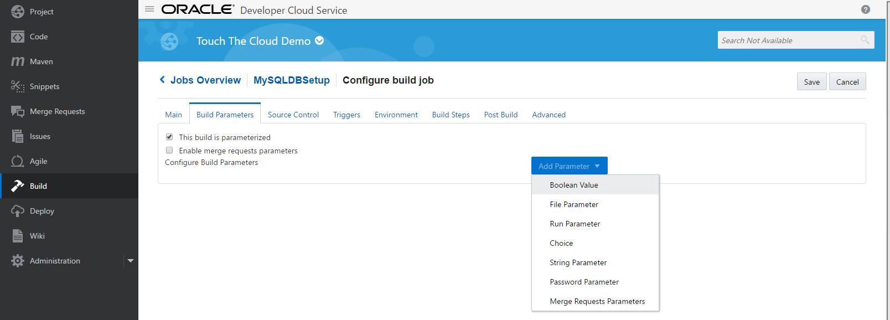

- Add a String Pamerter


```
Name: MYSQL_IP
Default Value: <Public IP of MySQL DB>
```

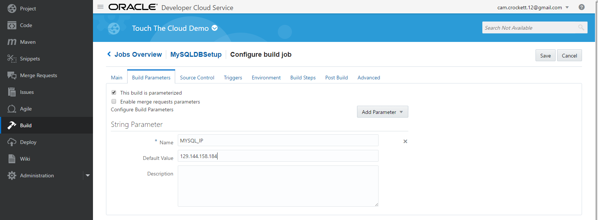

- Select the **Source Control** tab and select **Git**, followed by the **MySQLMicroservice** repository. Add the **Master branch**.

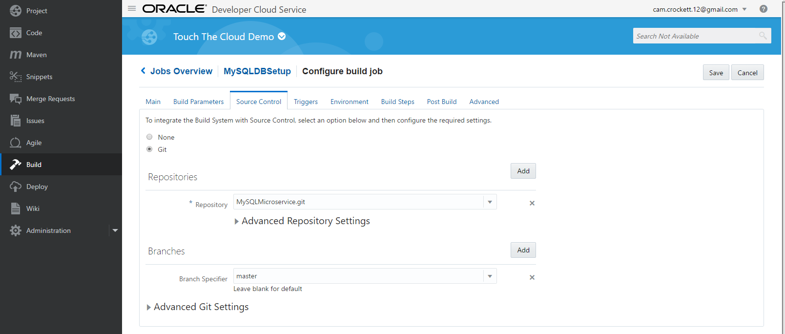

- Select the **Build Step** and add a Shell Build step

```shell
cd src/main/resources/db/setup
sudo -su scp -i mysqlkey -o StrictHostKeyChecking=no mysql_setup.sql opc@${MYSQL_IP}:/tmp/mysql_setup.sql
sudo -su ssh -i mysqlkey -o StrictHostKeyChecking=no opc@${MYSQL_IP} sudo su - oracle -c 'mysql "catalog" < "/tmp/mysql_setup.sql"'
```

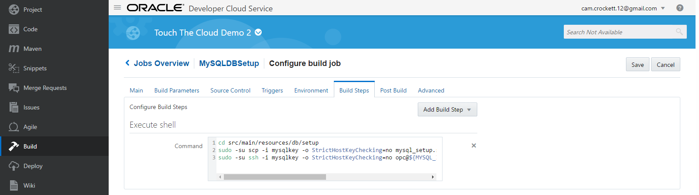

- Save and Execute the Build. Note you will get a pop-up from your praramaterized build to confirm the MYSQL_IP. Leave the default value in place.


- Your build should execute successfully

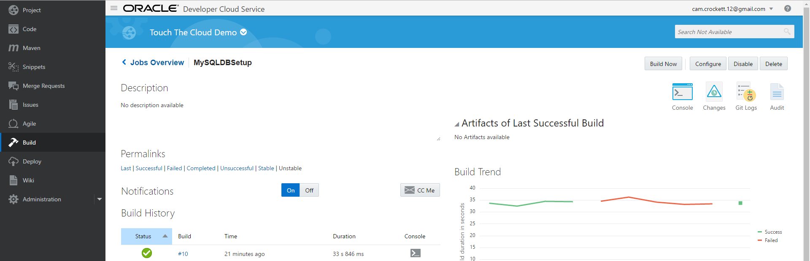

### **STEP 4**: Bind the database to your microservice
- Open your main Dashboard Console. Select Application Container and open the service console

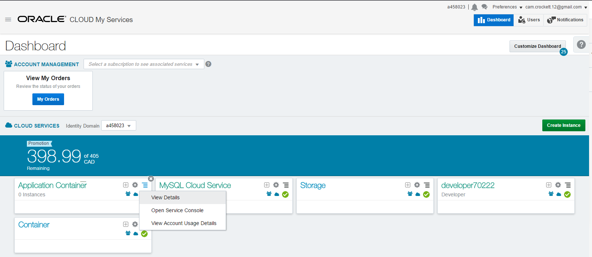

- You should see both of your Applications

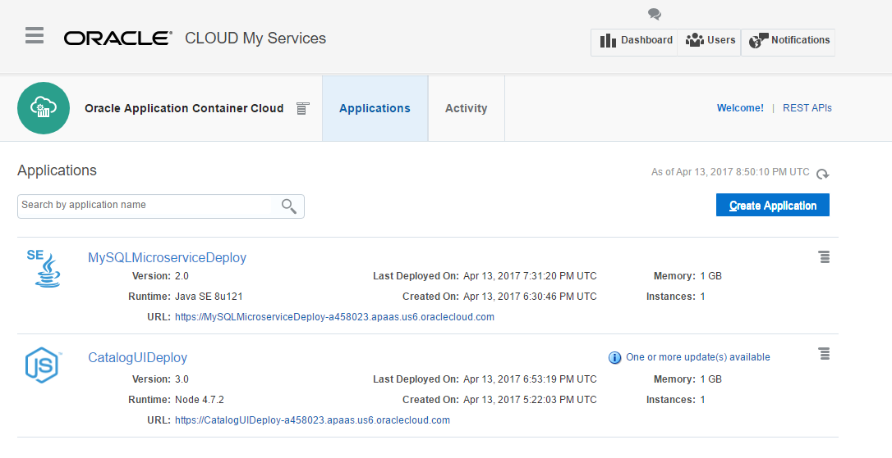

- Select the MySQLMicroserviceDeploy Application

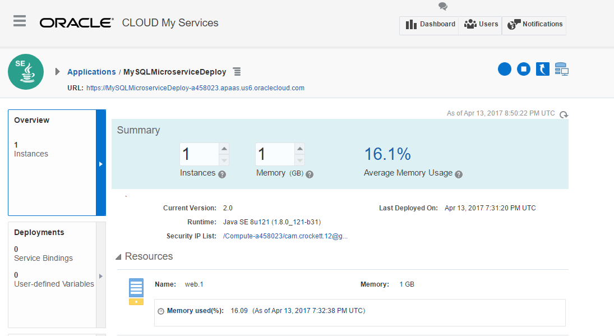

- Select the Deployments tab

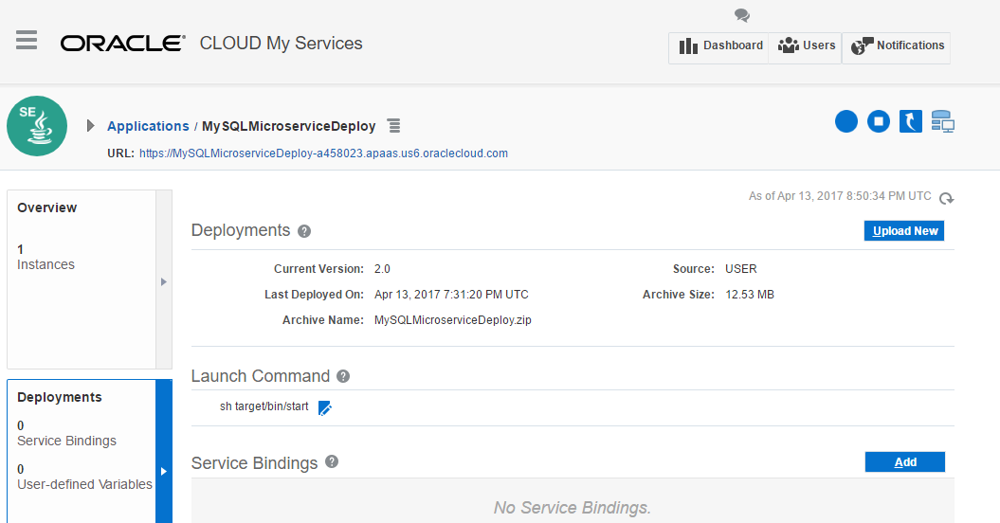

- Select Add under Service Bindings

```
Service Type: MySQL CS Service
Service name: Catalog DB
Username: root
Password: Oracle123!
```


- Apply and Edit the changes to the MySQLMicroserviceDeploy application


- Once redeployment has finished you will see the service bindingin the deployment detials

> Note: Selecting the show all variables under environment variables will display all variables added that are associated with the binding

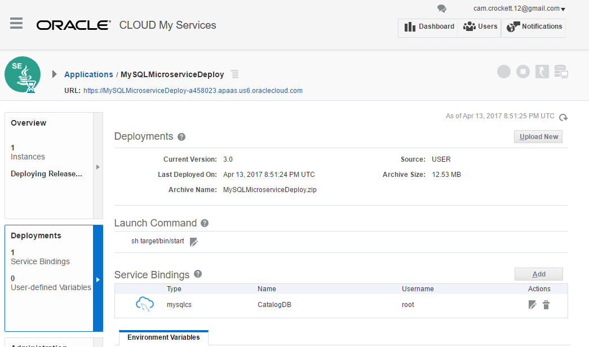

### **STEP 6**: Verify the Catalog Data

- Return to the main screen for Application Container Cloud Serivce

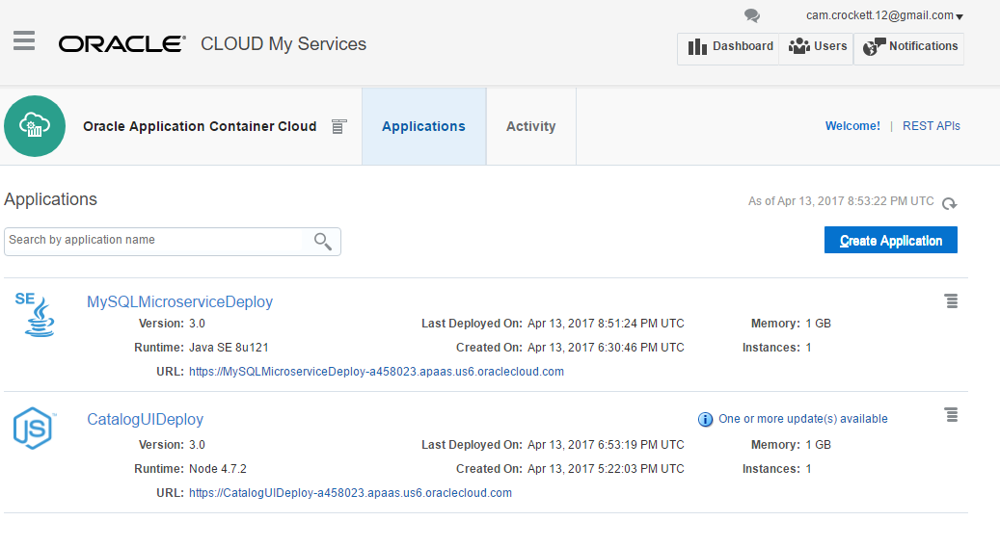

- Open the URL for the MySQLMicroserviceDeploy Application and append "/catalog/v1" to see the JSON data now available


- Return to the main screen for Applicaiton Container Cloud Serivce


- Select the URL for the CatalogDeployUI to see the catalog on screen and achievement 3 unlocked.


**You have now completed lab 300**
