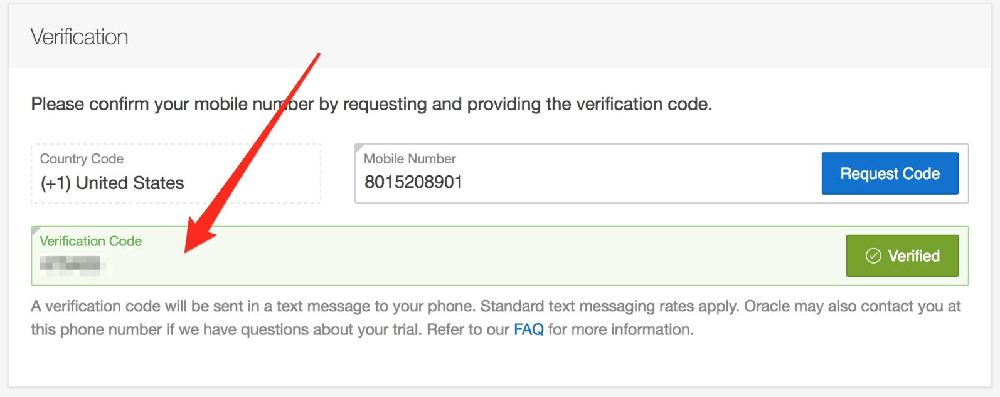

# Solution Engineering North American Technology Division Interviews

## Table of Contents
- [Interview Schedule](#Interview-Schedule)
- [Overview Presenation](#Overview-Presentation)
- [Recent Project Presentation](#Recent-Project-Presentation)
- [Touch the Cloud Presentation](#Touch-the-Cloud-Presentation)
- [Technical Question and Answer Interview](#Technical-Question-and-Answer-Interview)
- [Management Interview](#Management-Interview)
- [Visual Aids](#Visual-Aids)
- [Oracle Trial Account](#Oracle-Trial-Account)

## Interview Schedule

**Note:** As you prepare presentations, **we will stick to the allotted time** for each of these interview sections listed below. 

### **Technical Interview** - 45 to 50 minutes

| Interview Section | Minutes | Description |
| --- | --- | --- | 
| Overview | 3 - 5 | Brief overview of yourself, covering your techincal experience and capabilities |
| Recent Project Presentation | 10 - 12 | Brief description/presentation on a technical development project on which you have worked |
| Touch the Cloud Presentation | 10 - 12 | Brief presentation on Oracle Cloud Product(s) of interest and relevance |
| Technical Q & A Interview | 20 | Techincal Question and Answer Interview |

### **Management Interview** - 20 minutes

| Interview Section | Minutes | Description |
| --- | --- | --- | 
| Management Interview | 20 | Interview with Solution Engineering Leadership|

## Overview Presentation

During this presentation we ask that you provide a brief overview of yourself, including your technical experience and skills. It's not necessary to go into much detail, as we will ask more question during the [Technical Question and Answer Interview](#Technical-Question-and-Answer-Interview) section of the interview. 

## Recent Project Presentation

During this presentation we would like you to provide an overview of a development project on which you have recently worked. Feel free to use the whiteboard or laptop available in the interview room. If you use powerpoint, please keep your presentation to approximately 5 slides. 

## Touch the Cloud Presentation

During this presentation we ask that you provide a brief summary of the Oracle Cloud Products you have investigated, and that you feel are of interest and relevance. You can find the information you need from Oracle's main [Cloud Home Page](https://cloud.oracle.com/) website. From this website you can investigate Oracle's three categories of Cloud Offerings: [Platform as a Service](https://cloud.oracle.com/en_US/paas), [Infrastructure](https://cloud.oracle.com/en_US/iaas) and [Software as a Service](https://cloud.oracle.com/en_US/saas). Note: The job for which you are applying will focus primarily on **Platform as a Service** and **Infrastructure as a Service**.  

When providing your Oracle Cloud Product Presentation, you have two options. With both these options, if you choose to use Powerpoint, please keep your presentation to 5 slides or less. 

- **Option 1** - Oracle Cloud Investigation and Demo:

    This option is prefered, but not required. We will provide more detail on how to acquire an [Oracle Trial](#Oracle-Trial-Account) account below, but in summary, using an Oracle Trial account you can investigate any of the Oracle **Infrastructure** or **Platform** Cloud Services, and present what you learned about your experience and interest in these products. Many of Oracle's **Platform** Services (e.g: Application Container Cloud Service, Container Cloud Service, Developer Cloud Service, Oracle Database\/MSQL Cloud Services and Java Cloud Service provide simple demonstrations. Example are also available using Oracle's **Infrastructure** Cloud Services. 

- **Option 2** - Oracle Cloud Investigation:

    As an option to getting a trial account, you can investigate the **Platform** and **Infrastructure** Services and present back some of your findings, understanding and interests. 

## Technical Question and Answer Interview

During this section of the interview we will ask technical questions based on your experience, and requirements of the Solution Engineering position. We hope to gain a better understanding of your development expertise, your understanding of development methodologies, and your experience with various programming languages and open source tools and frameworks. 

## Management Interview

During this section of the interview you will meet with a member of the Solution Engineering leadership, during which time we hope to learn more about you and your interest in the Solution Engineering position at Oracle. 

## Visual Aids

### Whiteboard / Powerpoint

- The interview room will be supplied with a white board and laptop that you can use to present your [Recent Project](#Recent-Project-Presentation) and [Touch the Cloud](#Touch-the-Cloud-Presentation) Presentations.
- Oracle Supplied Laptop: We will have a laptop and prejector available for your use. The laptop will have connectivity to the internet, and you can bring a USB drive if you desire to load a presentation to the laptop.

# Oracle Trial Account

Acquiring and Oracle Account is not required for the interview, however, doing so will allow you to see first hand some of Oracle's cloud products before your interview. 

To get an Oracle Trial account, please go this the [Oracle Try It](https://cloud.oracle.com/tryit). From this website you can find answers to your questions concerning the Free Trial account, along with step by step instructions on how to register your account. Some of the services you may desire to use require that your Account's Storage Replication policy is set prior to using those services. Please follow the steps below to set your Replication Policy once your account has been provisioned. 

## Request a trial account

### View Details and Sign Up

- From the **TryIt** page, click on the **View Details & Sign Up** button

    

- Click on the **Get started for free** link

    

### Create your Account

- Enter the required information on the **Create an Oracle Account...** page, and click on **Create Account**.

    

- The following dialog indicates that you will receive an confirmation email.

    

- Check your email, and click on the **Verify email address** button contained in the received email. 

    

- After Verifing your email address, enter your email address into the **User Name** field, and enter your **Password** ,and click on **Sign In**.

    

### Verify your Phone Number

- Enter your **Mobile Phone Number** and click on **Request Code**

    

- Enter the **Verification Code** you receive via phone text message.

    

## Enter Account Information

- Enter the required account information.

    

- Read the information about the use of your credit card, and Click on the **Add Payment Method** button.

    

- Enter your credit card information, and click on **Finish**.

    

- **Accept** the terms and conditions, then click on the **Complete** Button. 

    

- Note the following steps.

    

## Account Confirmation

- The following is an example email confirming your Trial Account request.

    

## Configure Your Storage Replication Policy

Need info
