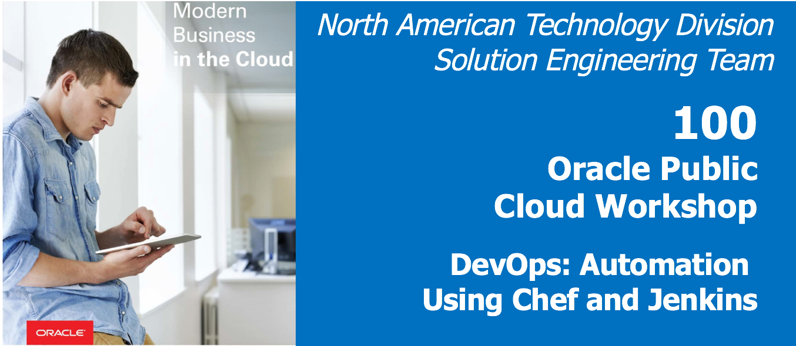

Update: March 24th, 2017

## Introduction

This is the first of several labs that are part
of the **Oracle Public Cloud DevOps workshops**. This workshop will walk
you through building an automated Software Development Lifecycle (SDLC)
pipeline using the Oracle cloud and third party tools

This new pipeline will compile code, build environments in the cloud,
and deploy the code into the new environment. You will assemble this
pipeline leveraging Developer Cloud Service, Jenkins, Oracle Cloud
Orchestrations, and Chef. You will take on 2 Personas during the
workshop. The stack automation engineer will assemble the pipeline and
make it available for developers. The developer will leverage the new
SDLC stack and check in code leveraging the pipeline.

At the end of the workshop you will have deployed a new application in
the Oracle cloud as the developer persona leveraging the pipeline to
complete all the tasks after the code is checked into source control.

Please direct comments to: Dennis Foley (dennis.foley@oracle.com)


## Objectives

-   Create Jenkins Server

-   Configure Chef Server

-   Clone Application

-   Build a new version of the application

## Required Artifacts

-   The following lab requires an Oracle Public Cloud account that will
    be supplied by your instructor.

-   You will need to install an object storage browser

-   You will need a SSH client


# Lab 1 Install Object Storage Tools

### **STEP 1**: Install CloudBerry Explorer for OpenStack desktop Client

**Note**: If you prefer to use Cyberduck you can find instructions at [this URL](https://trac.cyberduck.io/wiki/help/en/howto/oraclecloud) or follow the instructions out lined in **MAC OSX Appendix**. For MAC users you will need to use Cyberduck as CloudBerry only runs on Windows.

-   From any browser, go to [this URL](http://www.cloudberrylab.com/free-openstack-storage-explorer.aspx)

-   Click **Download FREEWARE**. After download completes run executable
    to install.

    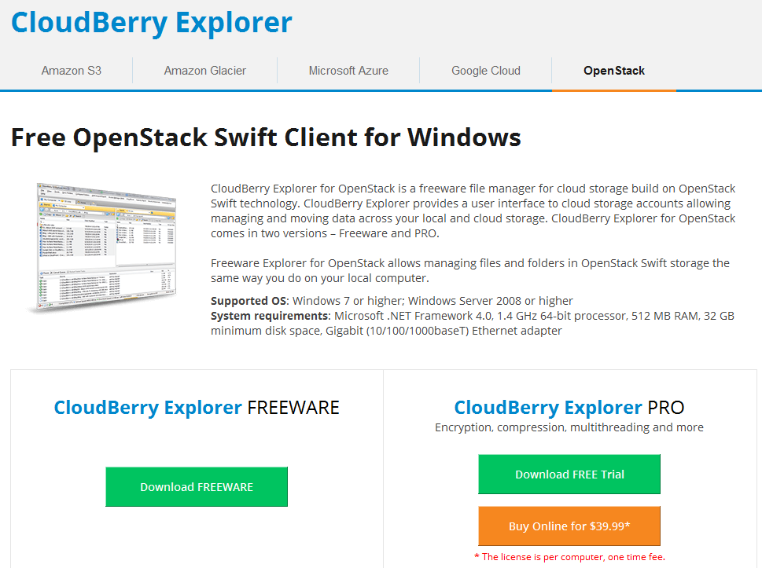

-   Open **CloudBerry Explorer for OpenStack Storage** desktop client.

-   Click **File** and select **New Oracle Cloud Account** from the list
    of options.

    

-   Supply the necessary information:

    **Display name**: `my_domain`

    **Username**: `Storage-<Your Identity Domain>:<Your OPC Username>`

    **Password**: `<Your OPC Password>`

    **Account location**: `Select the correct data center`

    

-   Click **Test Connection**. If you get Connection success click
    **Close** and **OK** to complete the configuration.

    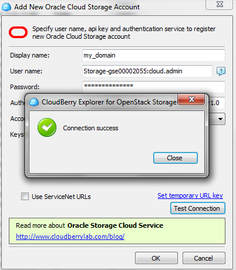

-   From the **Source** dropdown, select the newly created
    **my\_domain** account. You should see the pre-created containers.

    

## Install SSH Client Tool

### **STEP 2**: Install PuTTY

-   From any browser, go to this [URL](http://www.putty.org/)

    

-   Click on the link to download PuTTY. From the PuTTY download page
    click on **putty.exe** to download.

    

-   Save **putty.exe**. Navigate to the location you downloaded the file and
    double click on **putty.exe** to run.

    

-   We will be using PuTTY later in the workshop to access the newly
    create Cloud Instance. You can minimize or exit PuTTY for now.

# Lab 2 Building the Client Machine (Stack Engineer Persona)

## Building the Instance

TOD: Add what we are building

### **STEP 3**: Verify Image file has been uploaded

-   From CloudBerry make sure that **my\_domain** is selected on the
    right hand side. Double click on **compute\_images** to navigate
    into the container. Due to the size of the disk image, we have
    already uploaded the **Jenkins** image file that will be used later
    in the lab.

    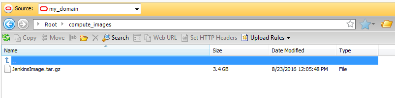

## Preparing Network Assets in the Instance

### **STEP 4**: Move Orchestration from Storage Cloud

-   From CloudBerry make sure that **my\_domain** is selected on the
    left hand side **Source** dropdown. Navigate to
    **SDLC\_Pipeline\_wksp -> general -> orchestration\_json**. ON
    right hand side source select **My Computer**. Either create a new
    directory or navigate to a location on your local system that you
    want to store Workshop Files. In our example we are using
    **D:\\SDLCwithDevOpsWorkshop**.

    

-   Drag and drop **wkshpnetwork.json** from **my\_domain** to **My
    Computer**. When prompted **Do you really want to copy** click
    **Yes**

    

-   Right click on **wkshpnetwork.json** and click **Open** to open the
    file in a text editor.

    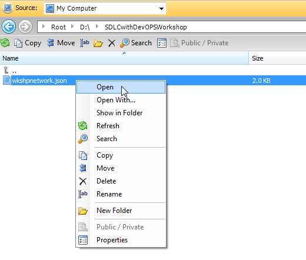

-   Search and replace Identity Domain **gse00002056** with you **your
    Identity Domain**. Save file and exit editor.

    

-   In my\_domain, navigate to **SDLC\_Pipeline\_wksp -> general
    -> SSH\_KEY.** Drag and drop the 3 SSH Key files from
    **my\_domain** over to **My Computer.**

    

# Lab 3 Creating the Instance (Stack Engineer Persona)

## Create the Network Configuration

### **STEP 5**: Login to your Oracle Cloud account

-   From any browser, go to the following URL: https://cloud.oracle.com

-   Click **Sign In** in the upper right hand corner of the browser:

    

-   **IMPORTANT** - Under My Services, ask your instructor which
    **Region** to select from the drop down list, and **click** on the
    **My Services** button.

    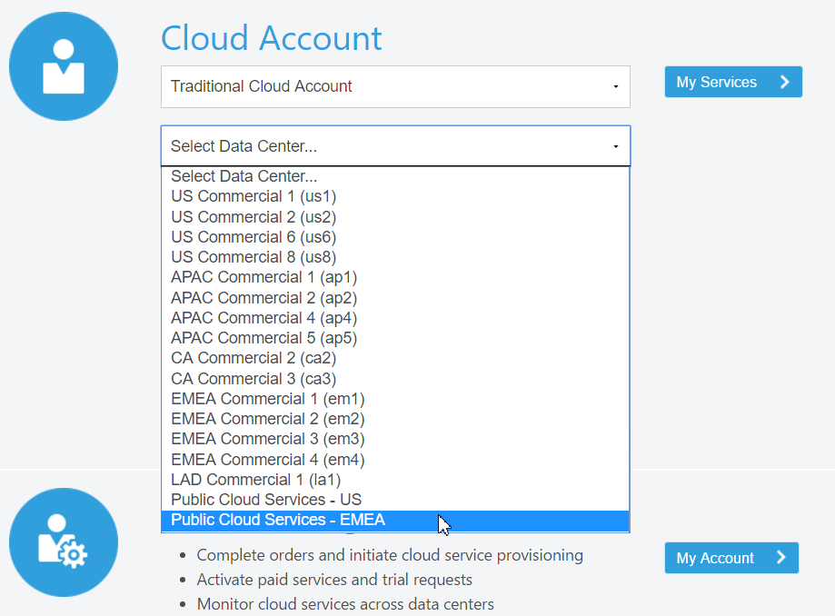

-   Enter your identity domain and click **Go**

    ***NOTE***: the **Identity Domain, User Name** and **Password** values will be given to you from your instructor.

    

-   Once your Identity Domain is set, enter your User Name and Password
    and click **Sign In**

    

-   You will be presented with a Dashboard displaying the various cloud
    services available to this account.

    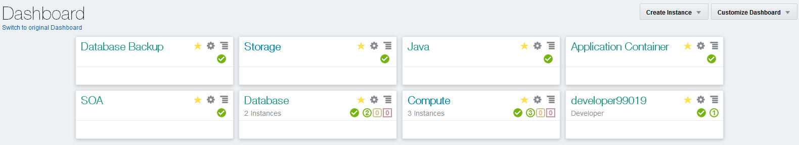

-   If all your services are not visible, **click** on the **Customize Dashboard,** you can add services to the dashboard by clicking **Show**. If you do not want to see a specific, service click **Hide**.

    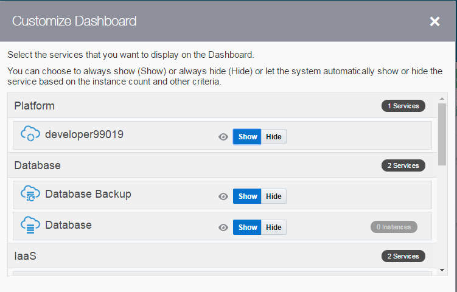

### **STEP 6**: Compute Service Console

-   From the main Cloud Dashboard, click **Compute** to navigate to
    details page.

    

-   Compute Service Details page will give you an overview of your
    compute service. Make note of the default **Site** from the **REST
    Endpoint** (Z\#\# - In our example Z16). Click **Open Service Console**

    

-   The Compute Service Console will be used for the monitoring and
    creation of all compute VM’s. In the upper right hand corner click
    **Site** dropdown:

    

-   Verify that the default **Site** you select matches the default site
    you previously located within the REST endpoint. If it does not
    match, use the **Site Selector** to select the correct **Site**. In
    our example, we are changing from Z17 to Z16 to match the zone
    referenced in the REST endpoint.

    

1.  Upload Orchestration

-   Click on **Orchestrations** Tab. From the Orchestrations page click
    **Upload Orchestration**

    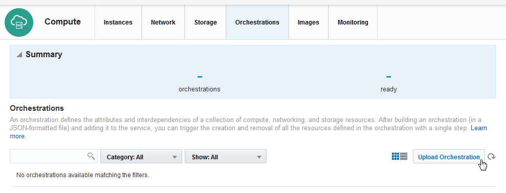

-   Click **Select File** and select the **wkshpnetwork.json** file on
    your workstation that you just edited. Click **Upload**

    

-   You should now see the newly uploaded orchestration in your list.
    Click  and select **Start**

    

-   Click **Yes** to start the Orchestration

    

-   The Orchestration status will change to **Starting**. After a short
    period, the status will change to **Ready**

    

    

### **STEP 7**: Upload SSH Key

-   Click on the **Network** Tab then click **SSH Pubic Keys**. Click
    **Add SSH Public Key**

    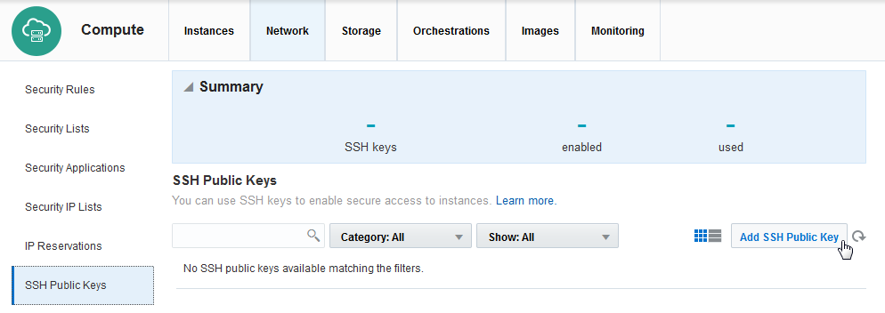

-   Enter Name **DevOpsDemoKey**. This name is important to remember,
    because it will be referenced later when configuring Jenkins. Open
    file **DevOpsDemo.pub**, copied over earlier, in a text editor. Copy
    the key and paste into the **Value** field. Click **Add**

    

    

    ***Note***: If you get an error that it is not a valid key make sure you do not have an extra carriage return at the end of the line.

## Build Instance on Oracle Compute

### **STEP 8**: Associate Image to upload disk

-   Navigate to the **Images** tab and click **Associate Image**

    

-   In the Associate Image window enter the following then click
    **Select File**:

    **Name**: `Jenkins_Server`

    **Description**: `Jenkins Server`

    

-   Verify **JenkinsImage.tar.gz** is selected and click **Ok**

    

-   Verify the information is correct and click **Ok**

    

-   After a short amount of time, you should see your newly created
    Image.

    

### **STEP 9**: Create Instance

-   Now we will use the newly created image to create an Instance.
    Navigate to the **Instances** tab and click **Create Instance**

    

-   Select **Private Images** on the left. Click **Select** to the right
    of the **Jenkins\_Server**

    

-   Click **Shape** and verify that **oc3** shape is selected.

    

-   Click **Instance**. We will leave the default Name.

    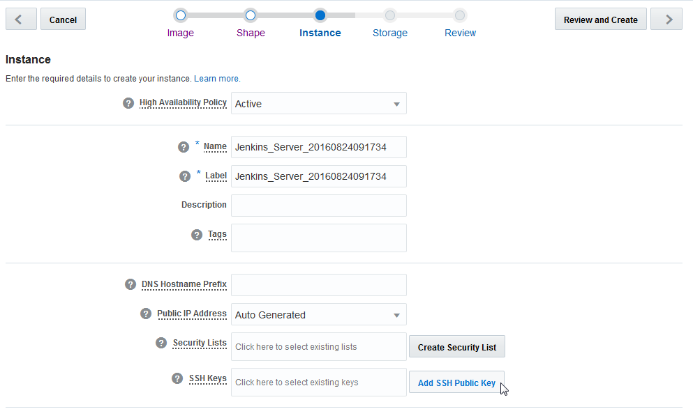

-   Click inside of the **Security Lists** field. Select **default**.

    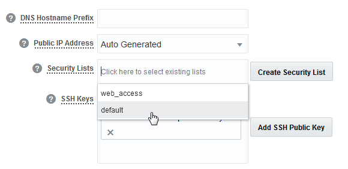

-   Also, select **web\_access** from the Security Lists.

    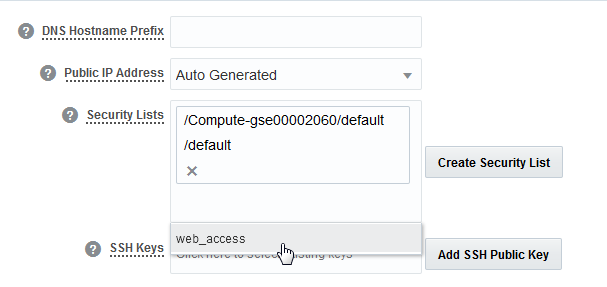

-   Click in the **SSH Keys** field. Select **DevOpsDemoKey** that was
    added previously

    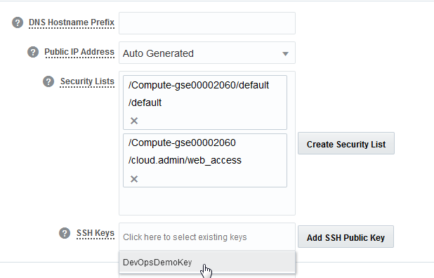{

-   Click **Storage**. Click  next to the default storage, and select **Remove**

    **Note**: By removing the disk, the instance will build the disk as ephemeral, which is faster, and will allow for Snapshots.

    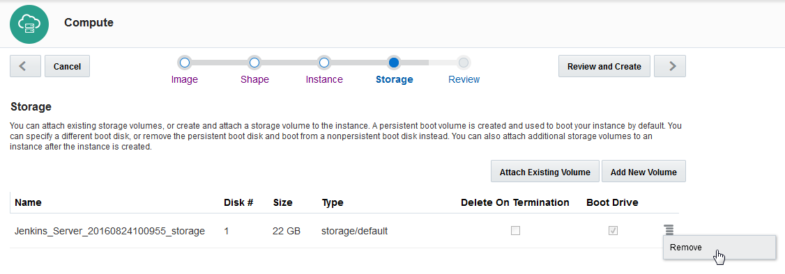

-   Click **Review**. Once you have verified all the information is
    correct click **Create**.

    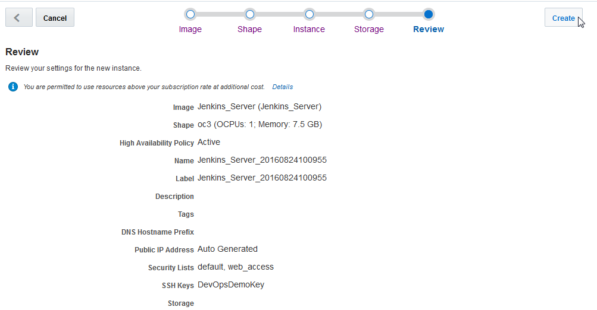

-   From the Summary page, you can monitor the process of the Instance
    creation.

    **Note**: It may take a couple of minutes for the instance to appear.

    

-   While the instance is creating you are able to view details as they
    are made available. Click  and select **View**

    

-   On this screen, you can view all the details about the instance that
    is being created.

    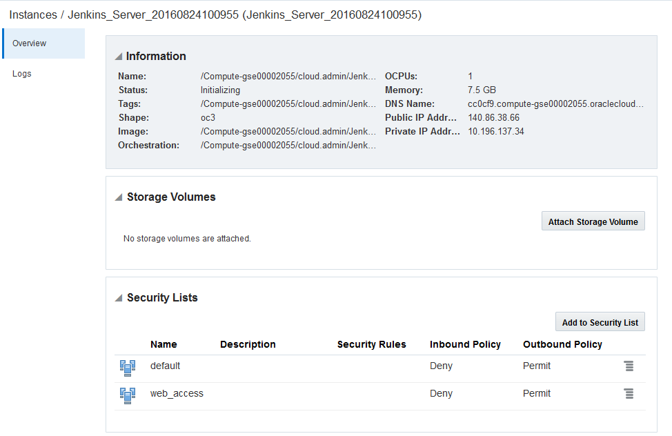

-   Click **Logs** to monitor the Console Log during creation. You might
    need to wait a few minutes before the console log will display.

    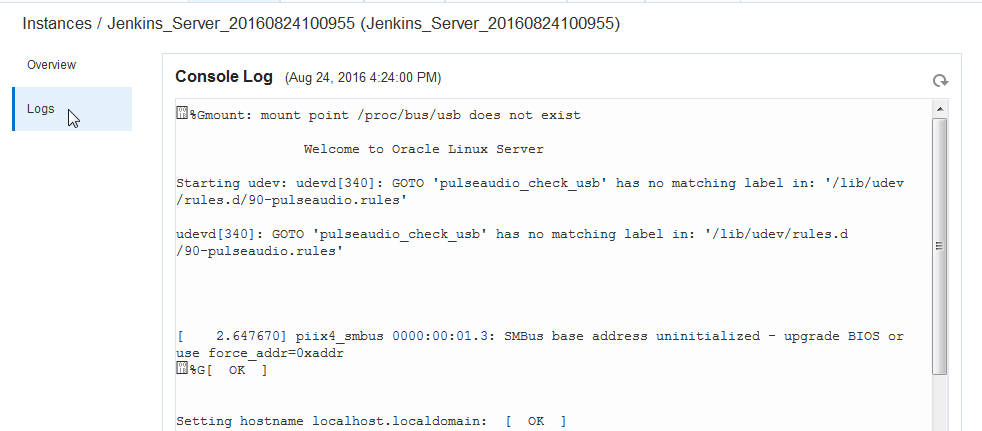

-   Click **Instances** to navigate back to the summary page. After
    about 10 minutes the status of the instance should change to
    **Running**

    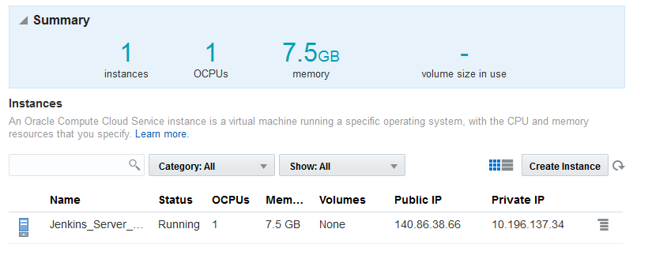

## Log into Instance

### **STEP 10**: Get Public IP of Instance

-   From the Summary page copy down the **Public IP** for your newly
    created instance.

    

### **STEP 11**: Configure PuTTY to connect to Image

-   If you closed out PuTTY start it again.

-   On the **Session** Category paste in the Public IP for you instance.

    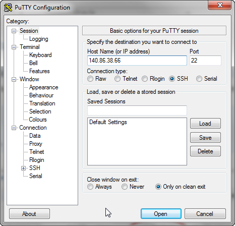

-   Under category **Connection** click **Data**. Enter **opc** for
    Auto-login username.

    

-   Expand **SSH** and click **Auth**. Click **Browse** and select the
    **DevOpsDemo.ppk** file that you downloaded earlier in the lab.

    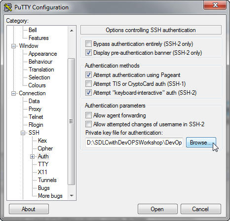

-   Click back on **Session** category. Enter **JenkinsServer** in the
    Saved Sessions and click **Save**. Now click **Open** to connect to
    the instance

    

-   Click **Yes** on PuTTY Security Alert.

    

-   When prompted for a Passphrase enter **Summer15\#**. You are now
    connected to your newly create Jenkins instance.

    

### **STEP 12**: Test Jenkins

    ***Note:** Jenkins is a continuous integration and continuous
    delivery application, used to automate parts of the SDLC. Jenkins
    can be leveraged to build and test software projects continuously
    making it easier for developers to integrate changes to the project,
    and making it easier for users to obtain a fresh build. It also
    allows for continuous delivery of software by providing powerful
    ways to define build pipelines and integrating with many testing and
    deployment technologies.*

-   Open a browser and enter the **Public IP** for your newly create
    instance. The Jenkins login page should render as shown below.

    

-   Click **log in** and enter the following credentials:

    **User**: `opcmasterchef`

    **Password**: `Summer15#`

    

## Configure the Server for work

### **STEP 13**: Configure Chef client (Knife)

-   Switch back to your **SSH** session. Switch to the **jenkins** user
    and change to the home directory

    ```
    sudo -s

    su jenkins

    cd /home/jenkins
    ```

    

    -   Run script **downloadcheffiles.sh** to load the needed chef
    configuration files. ***Note***: The instructor will supply each group with an **Organization Id**. For our example, we will be using Org Id 1.

    `./downloadcheffiles.sh <Username> <Password> <ID Domain> <groupnumber>`

    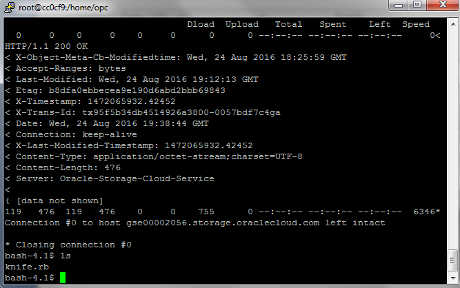

-   Notice that the **.chef** directory now contains 3 files:

    

-   Verify your connectivity to the Chef Server

knife environment list

    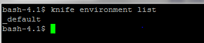

### **STEP 14**: Download WebLogic Maven dependencies

-   Run the script **downloadWLSMavenfiles.sh** to install WebLogic
    Maven dependencies. Run to the following command:

    `./downloadWLSMavenfiles.sh <Username> <Password> <ID Domain> <groupnumber>`

    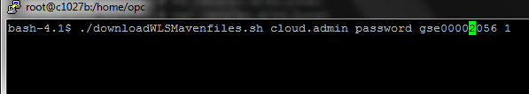

    

### **STEP 15**: Load Cookbooks to Chef

-   **Clone** the Git repository that contains the Cookbooks that will
    be used during the lab.

    `git clone https://github.com/oraclenassolutionengineering/Chef\_Cookbooks`

    **Note:**

    -   **git** is a source control tool used by developers and now with
        the emergence of DevOps, “DevOps Full Stack Engineers” are using
        git as well for the code that decribes the infrastructure.

    -   A **Cookbook** is a term used by Chef. A cookbook is a set of
        recipes, attributes and other Chef files.

        -   A **recipe** is a set of instructions that run on the server
            that configure it.

        -   Attributes are set in cookbooks in the attributes folder

    -   The cookbook we are going to use for this lab has already been
        written and versioned into git. As the full stack engineer, you
        are going to clone the cookbook from the repo, configure it for
        your cloud environment and upload it to the new Chef
        organization.

    

### **STEP 16**: Configuring the Cookbook for your cloud environment

-   Change directories to the WebLogic cookbook:

    `cd /home/jenkins/Chef\_Cookbooks/opcwls`

    

-   We will now update the **cloud-environment.rb** file with your
    Identity Domain and password. Edit file **cloud-environment.rb** in
    **attributes** directory:

    `vi attributes/cloud-environment.rb`

    

-   Update **cloud\_identity\_domain** and **cloud\_password** with your
    credentials.

    

-   Install the WebLogic cookbook: **Note**: berks is a command that comes with a Chef Client installation,it is used to manage and upload cookbooks to a Chef server. The berks install command finds all dependencies defined in a cookbook and downloads them to the local machine.

    `berks install`

    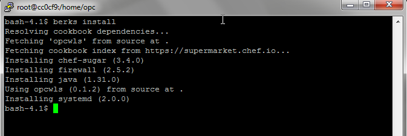

-   Upload Chef Cookbooks to Chef Server. **Note**: Nodes pull cookbooks from the Chef server; to make it
available to Chef Nodes, we must first upload it to the Chef server.

    `berks upload --ssl-verify false`

    

-   Verify the cookbooks uploaded correctly

-   knife cookbook list

    

# Lab 4 Application Development (Developer Persona)

## Create Developer Cloud Service Project

### **STEP 17**: Login to Developer Cloud Service

Oracle Developer Cloud Service provides a complete development platform
that streamlines team development processes and automates software
delivery. The integrated platform includes an issue tracking system,
agile development dashboards, code versioning and review platform,
continuous integration and delivery automation, as well as team
collaboration features such as wikis and live activity stream. With a
rich web based dashboard and integration with popular development tools,
Oracle Developer Cloud Service helps deliver better applications faster.

-   From Cloud UI dashboard click on the **Developer** service. In our
    example, the Developer Cloud Service is named **developer71725**.

    

-   The Service Details page gives you a quick glance of the service
    status overview.

    

-   Click **Open Service Console** for the Oracle Developer Cloud
    Service. The Service Console will list all projects for which you
    are currently a member.

    

### **STEP 18**: Create Developer Cloud Service Project

-   Click **New Project** to start the project create wizard.

-   On Details screen enter the following data and click **Next**.

    **Name**: `Sample Application`

    **Description**: `A quick sample application`

    

-   Select template **Initial Repository** and click **Next**

    

-   Select your **Wiki Markup** preference to **MARKDOWN.** Click
    **Import existing repository** and enter repository URL supplied by
    the instructor. Click **Finish**.

https://github.com/oraclenassolutionengineering/SampleMavenWLSApp

    

-   Project creation will take about 1 minute.

    

-   You now have a new project; in which you can manage your software
    development.

    

### **STEP 19**: Clone Repository

Now that we have imported the Git repository into Developer Cloud
Service, we will want to clone that into our Jenkins image.

-   On the right-hand side, find URL for the newly create Git repository
    and copy into the clipboard. Select the URL and right click to
    select **Copy**. Save this URL, as it will be used several times
    throughout this workshop.

    

-   Back in the ssh session, confirm that you are in the
    **/home/jenkins** directory then enter the following command to
    clone the DevCS Git repository.

    `git clone <copied URL>`

    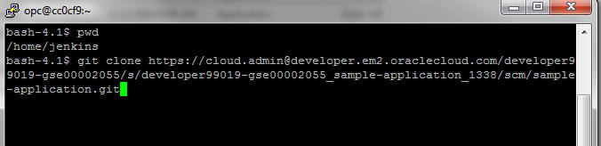

-   When prompted enter your **Oracle Cloud password**

    

# Lab 5 Configure Jenkins for the Sample Application

## Configure Jenkins

### **STEP 20**: Configure Jenkins

-   Switch back to the browser tab where you are logged into Jenkins. If
    you need to login again following the instructions outlined earlier
    in this lab.

-   Click **Credentials**

    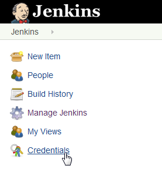

-   We are going to update the credentials for **DevCS**. Click **cloud.admin** and select **Update**

    

-   Enter the password used for the cloud.admin domain user and click **Save**

    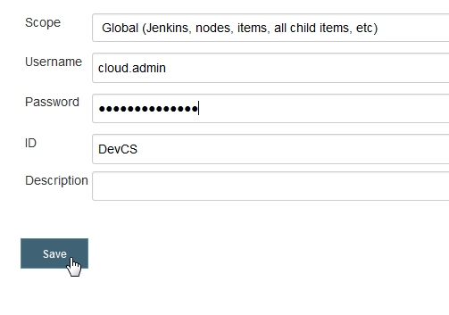

-   Click on **Jenkins** to navigate back to the home page. Click **Manage Jenkins**

    

-   On the Manage Jenkins page click **Configure System**.

    

-   Scroll down the configuration page and locate the **Jenkins
    Location** section. Check the IP of the **Jenkins URL** and enter
    the **Public IP** of your newly created **Jenkins instance**. Click
    **Save**

    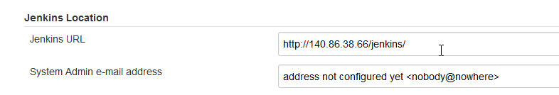

### **STEP 21**: Configure Jenkins job wkshp\_build\_pipeline

-   Click on the job **wkshp\_build\_pipeline**

    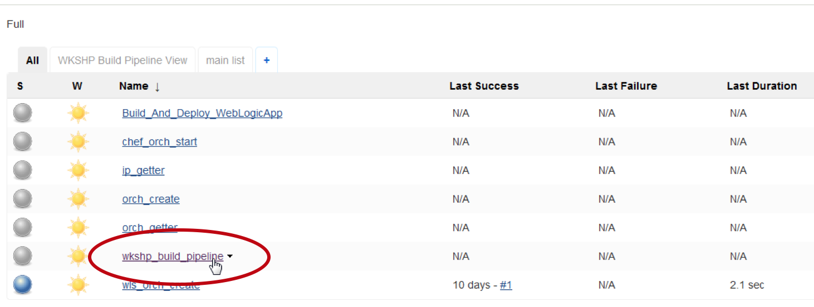

-   Click **Configure**

    

-   On **General** tab, scroll down and update **ID\_DOMAIN** **Default
    Value** with your OPC Identity Domain

    

-   Continue to scroll down and update **Password Default Value**
    parameter with your OPC Password.

    

-   Next we need to get the Compute URL that will be used by REST APIs.
    To get the correct URL, switch back to the OPC Services Dashboard
    browser Tab. Navigate back to the main **Dashboard**. Click the
    **Compute** navigation and select **View Details**.

    

-   Select the **REST Endpoint** and right click to **Copy**.

    

-   Back on the Jenkins administration tab, update the **RESTAPI Default Value** with correct **REST endpoint**

    

-   Continue to scroll down and find **SSHKEY**. Update **Default
    Value** with your **Identity Domain** and the correct **Name** for
    the SSH Key created earlier in the lab guide.

    

-   Click on **Source Code Management** Tab. Enter the Developer Cloud
    Service repository URL that you captured earlier and click
    **Apply**. Then click on **Save**

    

### **STEP 22**: Configure Jenkins job Build\_And\_Deploy\_WebLogicApp

-   Click on Jenkins to navigate back to main page.

    

-   Click on the job **Build\_And\_Deploy\_WebLogicApp**

    

-   Click **Configure**

    

-   On **Source Code Management** tab, scroll down and update **Git
    Repository** with the value that you copied from Developer Cloud
    Service. Click **Apply**, then click on **Save**

    

## Configure DevCS & Jenkins Build Server Integration

### **STEP 23**: Configure Developer Cloud Service

-   Switch back to the browser tab where you are logged into Developer
    Cloud Service. If you need to login again follow the instructions
    outlined earlier in this lab.

-   On left hand navigation panel click **Administration** drop down and
    select **Webhooks**

    

Developer Cloud Service provides out of the box integration with 3^rd^
party systems via Webhooks. We will use the Hudson/Jenkins – Git Plugin
webhook to notify our Jenkins build server of changes to our source code
Git repository.

-   Click **New Webhook** and enter the following information and click
    **Done**

    **Type**: `Hudson/Jenkins – Git Plugin`

    **Name**: **`Jenkins Webhook`

    **Active**: `<Leave checked>`

    **URL**: `<Jenkins Server IP>/git/notifyCommit`

    **Expand URL Parameters**

    **URL**: `HTTP Repository Address`

    **Uncheck** `sha1`

    **Repository**: `Select Git repo with your sample application`

    **Branch**: `master`

    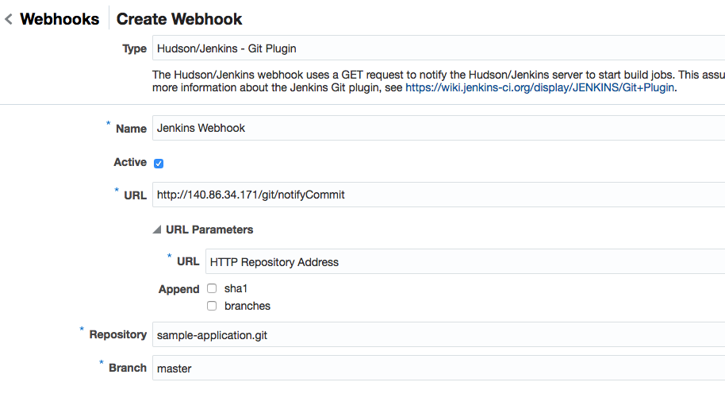

-   Once the Webhook is created click **Test** to validate connectivity.

    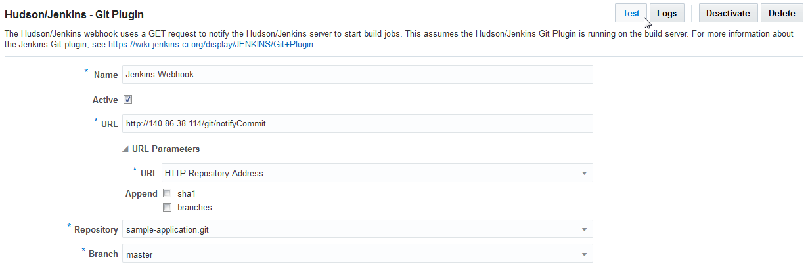

-   Click **Logs** to inspect the status of your connection. A green
    check in the log window will appear when you have connectivity.

    

# Lab 6 Creating a new version of the Application

## Creating a new version of the Application

### **STEP 24**: Modify Application

-   Switch back to your **ssh** session. If your ssh session has closed
    follow instructions described earlier in the lab guide. As the
    **jenkins** user change to the project directory for the application
    that you cloned from Developer cloud service.

    `cd /home/jenkins/sample-application`

    

-   Edit the **index.html** file and change Basic to your name.

    `vi ./src/main/webapp/index.xhtml`

- On line 15 change:**Basic Webapp** to **YOURNAME Webapp**

    Put your curser on the “**B**” of **Basic**,

    **type**: `cw`

    **Enter**: `your name`

    Hit the **esc** key

    **Type**: `:wq` and press **enter**

    

-   View all changes to Git repository: You should see that the
    **index.xhtml** file has been modified

    `git status`

    

-   Commit the changes to your local Git repository:

    `git commit –am “changed title to my name”`

    

-   Push changes to the Developer Cloud Service Git repository. When
    prompted enter your **OPC password**:

    `git push origin master`

    

### **STEP 25**: Automatic deployment of Application

-   Click **Jenkins** to navigate back to the home page. It may take a
    minute to begin, but you should see a job running as shown below.

    

-   From the main page jobs that are running will have the ball on the
    left blinking. It will take about 25 minutes for the job to
    complete.

    

-   While the job is running, we will explore both the Jenkins jobs and
    Chef Server.

## Exploring the Jenkins Server

### **STEP 26**: Explore Jenkins job wkshp\_build\_pipeline

**Description:** Jenkins is a continuous integration and continuous
delivery application, used to automate parts of the SDLC. Jenkins can be
leveraged to build and test software projects continuously making it
easier for developers to integrate changes to the project, and making it
easier for users to obtain a fresh build. It also allows for continuous
delivery of software by providing powerful ways to define build
pipelines and integrating with many testing and deployment technologies.

All the jobs you see listed on the home page are being used for this
lab. The master job is called **Wkshp\_build\_pipeline**. Click on the
link for that job.

-   Click on the job **wkshp\_build\_pipeline**

    

-   Click **Configure**

    

-   Click on the flow tab

    

Here you can see the various jobs getting called to build the
environment and deploy the application. This process is started by a
developer checking in a new version of their code. Creating that
communication between git and this job is something you will do in the
workshop today.

## Explore Chef

### **STEP 27**: Log into Chef Web Console

**Description:** Chef is configuration management tool written in Ruby
and Erlang. It uses a pure-Ruby, domain-specific language (DSL) for
writing system configuration "recipes". Chef is used to streamline the
task of configuring and maintaining a company's servers, and can
integrate with cloud-based platforms

-   Open a browser and enter **140.86.12.215**. The Chef Login page
    should render. Enter Username and Password and click **Sign In**

    **Username**: `sdlcwkshpgroup<Organization Id>`

    **Password**: `Summer15#`

    

    

Notice the Nodes are empty; the last lab of the workshop will create
nodes as part of the Jenkins build process; be sure to check this screen
again at the end of the workshop

-   As the new server is being built by Jenkins it is being
    automatically registered to the Chef Server and assigned a role

    -   Once the new server is registered with Chef it is downloading
        all of the required cookbooks(a collections of recipes) to
        configure the server correctly

        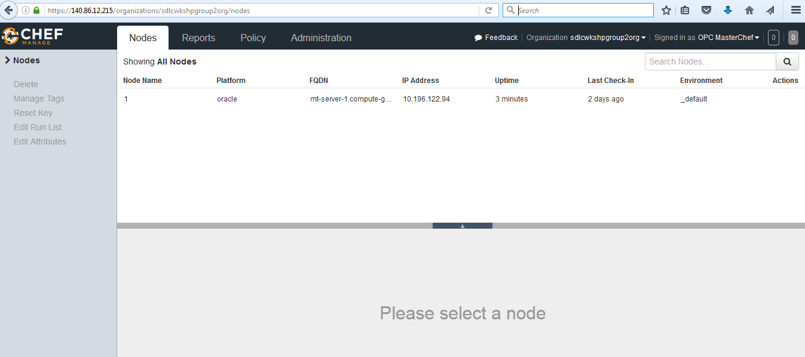

        Earlier when you ran the Berks command, you uploaded all the
        cookbooks required for this workshop.

-   To see the cookbooks you uploaded earlier, click on the “Policy” tab
    on the top of the page.

    -   Select Cookbooks on the left side menu

    -   Highlight any cookbook to see details about that cookbook

        

## Verify Application Deployment

### **STEP 28**: Verify Application Deployment

-   Click **Jenkins** to navigate back to the home page.

    

-   After about 25 minutes you will see success. You new WebLogic
    environment and application is now running.

    

-   Switch back to Oracle Public Cloud. If not already on main dashboard
    click **dashboard**

-   Click **Compute** navigation icon and select **Open Service
    Console**

    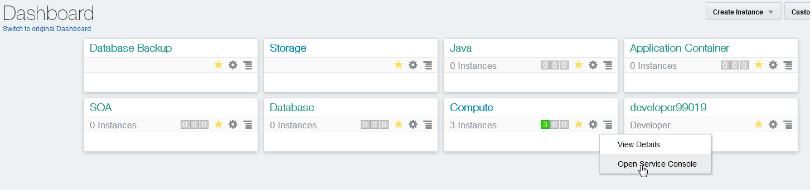

-   Notice that a new compute instance **MT\_Server-1** has been
    created. Copy **Public IP** of newly created instance.

    

-   Along with the provisioning of a new compute instance, WebLogic was
    installed and your sample application has been deployed. Access
    application using the URL and the Public IP of your new **MT\_Server-1**
    
    `<IP>:7001/basicWebapp`

    

-   You have completed the lab.

# Appendix


## MAC OSC - Cyberduck

### **STEP 29**: Download Cyberduck App

-   Download the MAC version of Cyberduck from the following URL:
    <http://cyberduck.io>

-   Unzip the downloaded zip file, and copy the **Cyberduck.app** file
    to the desired directory – e.g. the Application directory

-   Double Click on Cyberduck.app and successfully open the application.

-   Once successfully opened, you will need to fully close the
    application by right clicking on the toolbar icon and selecting Quit

    

-   From the directory where the file was copied, **right click** on the
    **Cyberduck.app** file, and select **Show Package Contents**

    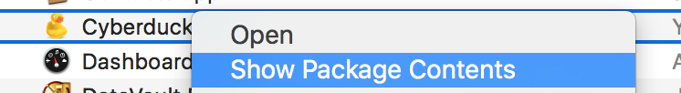

-   In the Explorer window, navigate to the **Contents >
    Resources > Profiles** directory. Leave this window open for the
    next step.

    

1.  Download Oracle Profiles

-   Go to the following URL: <https://trac.cyberduck.io/wiki/help/en/howto/oraclecloud>

-   Select the link to download all Cyberduck profiles

    

-   Using another Explorer window, **Unzip** the downloaded file. Then
    copy the \*.cyberductprofile files from the unzip directory into the
    **Contents > Resources > Profiles** directory of the
    Cyberduck.app

    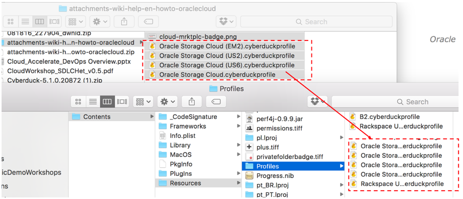

1.  Create Cyberduck connection to Oracle Storage Container

-   Open the Cyberduck app, and click on the “+” sign at the bottom of
    the window to create a new connection

    

-   Enter the appropriate information to configure your Storage
    Container Connection. 
    
    **Select the Oracle Connection type:** `Oracle Storage Cloud Container XX` 
    
    **ServiceName-Identifier**: `Storage-<domain>:<user Name>`

    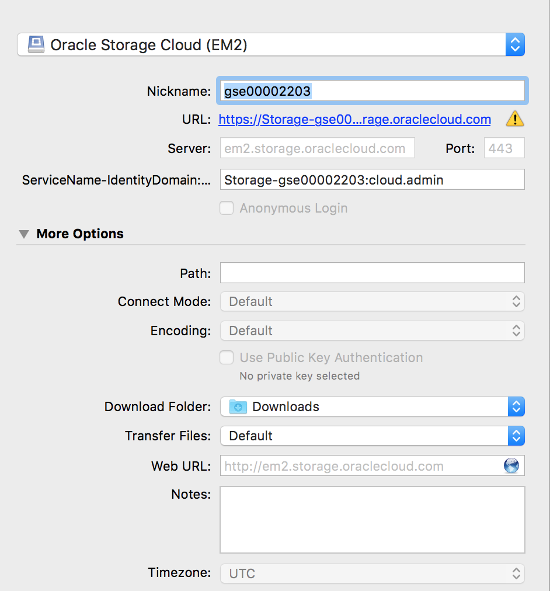

-   Close the dialog to save the connection profile.

-   Double click on the bookmark to connect. You will be prompted for
    your domain’s password.
