# Oracle Public Cloud Workshop: In-memory Option 

Update May 17, 2016

## Introduction

Prior to the availability of and in-memory column
store architecture data was was stored exclusively in a row format to
support efficient DML operations. With the introduction of compressed
in-memory column store structures (in addition to row format storage)
data can now continue to benefit from row storage while also realising
high performance data access with the new columnar structures.

-   Read/write operations continue to store and maintain data in into
    the traditional row store (buffer cache).

-   Read/write operations can now optionally also populate new In-Memory
    column stores, simultaneously updating the column stores
    (transaction consistency is maintained).

-   Read-only operations retrieve data from new In-Memory stores on
    average 10x -- 100x faster.

Database In-Memory is a new component of the System Global Area (SGA),
and is supplemental to Buffer Cache storage. The In-Memory area is a
static pool within the SGA, and is controlled with the initialization
parameter INMEMORY\_SIZE. This can be controlled at the container DB
level and shared across PDBs or specified at the PDB level (collective
size of the PDB storage must be &lt;= CDB storage.

In most cases you will not specify that all data be stored in these new
In-Memory structures due to memory capacity limitations and diminishing
performance improvement returns. While it will likely be apparent from
past experience which tables will benefit from In-Memory, there is an
In-Memory advisor utility that can be used to identify the best
candidates for In-Memory storage where potential performance savings are
maximized. The In-Memory advisor is not covered in these labs.

This series of labs will guide you through the basic configuration of
the In-Memory column store (IM column store), as well as illustrating
the benefits of its key features:

-   In-Memory Column Store Tables

-   In-Memory Joins and Aggregation

-   In-Memory Transaction Manager

To demonstrate these benefits we must first establish a performance
baseline. It would be unfair to compare the IM column store with disk
accessed data. Memory access is in general 10x faster than disk. To do a
fair comparison the performance baseline will be established using the
row store memory space, the buffer cache. For the purposes of the lab
the database environment has been sized so that the tables used will fit
in both the row store and the column store. The idea is that no buffer
accesses will cause physical I/O.

The following five table star schema will be used during the lab and has
been created for you under the ssb user.


Please direct comments to: Derrick Cameron (derrick.cameron@oracle.com)


## Credits

This lab was developed largely from an Oracle Database In-Memory Hands
On Lab document developed by Maria Colgan and Andy Rivenes. It has been
adapted as a customer workshop delivered on a Cloud based RAC instance.

## Objectives

-   Understand how to monitor in-memory column stores.

-   Understand the benefits of using the in-memory column store feature
    for fast query execution.

-   Understand the benefits of using the in-memory column store for fast
    transaction processing.

## Pre-Lab Information

The lab is meant to be completed using the SQL
Developer environment. The following will describe how to get started
with SQL Developer for this lab. You will use a pluggable database
called **pdb1** and a schema called **ssb**. *DO NOT EXPECT YOUR RESULTS
TO MATCH EXACTLY WITH THE SCREEN SHOTS IN THIS LAB DOCUMENT*. In some
cases they will match, and in others they will not. Also note that in
Part 2 -- 4 we make heavy use of autotrace to expose the optimizer to
understand how the database is executing queries. *The execution time of
autotrace has little or nothing to do with how long the query will take,
and may vary significantly in the screen shots with lab experience*. As
a diagnostic tool don't be concerned with this execution time. You can
run the query first IF you want to see query time, or review the ‘cost'
or elapsed time portion of the plan stats.

## Scripts

Scripts have been provided for each step and are located in four folders
(Part1 to Part4). Most are very short, and the commands (sql) are
included in this document, except in part 4 where they are a bit lengthy
and are not included in this document. You may choose to simply cut and
paste from this document into the SQL Developer worksheet, and then copy
from the scripts when you get to Part 4.

## SQL Developer

### **STEP 1**:  Obtain Host Details for SQL Developer Connection

-   Log into OPC and navigate to your database instance.

	

	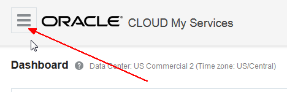

	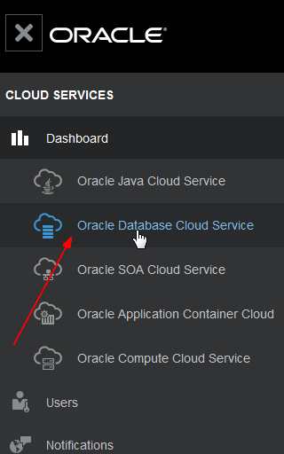

	

	**Note:** that this is an Enterprise Edition Extreme Performance shape, which is required for in-memory features. Note the Public IP and PDB name -- we'll need that later.

	

### **STEP 2**:  Create a New SSH Host

-   Start SQL Developer and go to the top menu and select view SSH.

    

-   Create new SSH Host:

    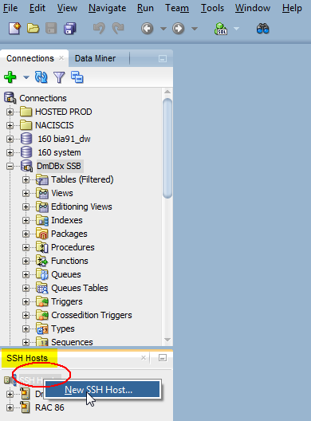

    Enter the following details.

    

    Test the tunnel -- right click and select test.

    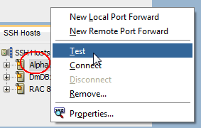

    You should receive this message:

    

### **STEP 3**:  Create a New Connection

-   After opening SQL Developer, create a new connection by right clicking on connections:

	

-   Enter the following (substitute your assigned workstation number):
	
	```
	Connection Name		= 	Alpha01A-EP-DBCS
	Username			=	ssb
	Password			= 	ssb
	```
	
-   Check **save password**

-   Set Connection Type: **SSH**

-   Select the Port Forward you created in the previous step: **Alpha01A-EP-DBCS**

-   Paste the following Service Name.

	```
	Pdb1.<your domain>.oraclecloud.internal
	```
	
	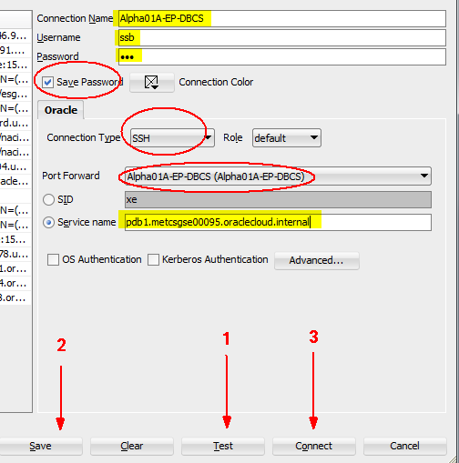

-   Next, open your connection, which then opens a SQL Worksheet tab.

	Most of the exercises will involve copying commands into the worksheet, executing them, and then reviewing the results. After each command, you may wish to clear the results for the next command. See the green arrow to execute and then the eraser icon to clear the results.

	

##  Part 1: Monitoring the In-Memory Column Store

The focus of this lab is to show how the lab environment is setup and to
demonstrate how to monitor the different parts of the In-Memory column
store (IM column store). The lab is using an Enterprise Edition Extreme
Performance cloud instance. Using the Database Cloud Service Console,
note that the in-memory feature is only available on Extreme Performance
instance shape.

### **STEP 4**:  Check how much memory has been allocated to the Oracle Database

-   In your SQL Developer session run the command **show sga** (script **01\_show\_sga.sql**) in the SQL Worksheet window:

	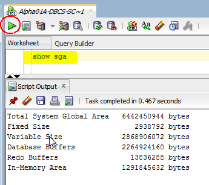

	The result will show you the total SGA size, including the Database Buffers (buffer cache) and the In-Memory Area (IM column store) size.

### **STEP 5**:  Check the size of the IM column store.

Remember the size of the IM column store is controlled by the init.ora parameter INMEMORY\_SIZE.

-   To see the amount of memory assigned to the IM column store, run the command **show parameter inmemory** (script **02\_show\_inmemory.sql**).

	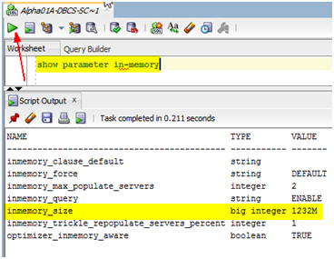

	You should see that the **1232M** has been assigned to IM column store. You
	should also have noticed the additional In-Memory initialization
	parameters:

	**Inmemory\_clause\_default**: allows you to specify a default mode for
	in-memory tables. For example, it can be used to mark all new tables in
	memory or to force certain in-memory options by default if not
	explicitly specified in the syntax. The default value is an empty
	string, which means that only explicitly specified tables are populated
	into the IM column store. This is the same as setting this parameter to
	**NO INMEMORY**. If you want all new tables to be in memory, set
	**INMEMORY\_CLAUSE\_DEFAULT** to **INMEMORY**.

	**Inmemory\_force**: By default any object with the **INMEMORY**
	attribute specified on it is a candidate to be populated into the IM
	column store. However, if **INMEMORY\_FORCE** is set to OFF, then even
	if the in memory area is configured, no tables are put into memory. The
	default value is **DEFAULT**.

	**Inmemory\_query**: Allows you to enable and use the column store at
	either the session or system level. The default value is ENABLE.

	**Inmemory\_max\_populate\_servers**: Controls the maximum number of
	worker processes that can be started and is set to 0.5 X CPU\_COUNT by
	default.

	**Inmemory\_trickle\_repopulate\_percent**: Controls the maximum
	percentage of time that worker processes can perform trickle
	repopulation. The value of this parameter is a percentage of the
	INMEMORY\_MAX\_POPULATE\_SERVERS parameter.

	**Optimizer\_inmemory\_aware**: Controls the use of the In-Memory aware
	cost model and influences the costing of the possible execution plans
	for a query. Setting the optimizer\_inmemory\_aware to false disables
	changes to the optimizer that (for example) consider the portion of a
	table that is currently populated into memory.

### **STEP 6**:  Check the In\_Memory area.

The In-Memory is sub-divided into two pools: a 1MB pool used to store
the actual column formatted data populated into memory, and a 64K pool
used to store metadata about the objects that are populated into the IM
column store. The amount of available memory in each pool is visible in
the V\$INMEMORY\_AREA when using RAC and V\$INMEMORY\_AREA view with
non-RAC, although GV views also work on non-RAC instances. The relative
size of the two pools is determined by internal heuristics, the majority
of the In-Memory area memory is allocated to the 1MB pool.

-   To see the total IM column store usage query the **GV\$INMEMORY\_AREA** (based on non-RAC or RAC environments) performance view (script **03\_im\_usage.sql**):

	```
	SELECT * FROM gv$inmemory_area;
	```
	
	

	Let's move on and check what is actually in the IM column store.

### **STEP 7**:  Review in-memory segments.

There are two new GV\$ views, GV\$IM\_SEGMENTS and IM\_USER\_SEGMENTS that indicates what objects are in the IM column store.

-   To see what information is provided by this performance view, we\'ll
    describe the columns (script **04\_desc.sql**):

	```
	desc gv$im_segments;
	```
	
	

	As you can see from the column names, the view provides information about what objects are in the IM column store.

### **STEP 8**:  Query the GV$IM\_SEGMENTS view

-   To determine what objects are in the IM column store we can query the GV\$IM\_SEGMENTS view using the following query (script **05\_im\_segments.sql**)

	```
	SELECT v.owner, v.segment_name name, v.populate_status status
	FROM gv$im_segments v;
	```
	
	

	The IM column store is currently not populated. We will do that in Step 10.

### **STEP 9**:  Review current attributes for tables.

To add objects to the IM column store, the inmemory attribute must be
set for the object. Four new columns -- INMEMORY, INMEMORY\_PRIORITY,
INMEMORY\_DISTRIBUTE, and INMEMORY\_COMPRESSION have been added to the
\*\_TABLES views to indicate the current In-Memory attributes for a
table. More information on what these attributes mean is included below.

-   Run the following query and look at the current attributes for the tables in the schema by typing (script **06\_im\_attributes.sql**):

	```
	SELECT table_name, cache, inmemory, inmemory_priority,
	inmemory_distribute,inmemory_compression
	FROM user_tables;
	```
	
	

	We see that none of the tables have been marked as CACHE or in-memory, meaning they should be accessed off disk.

### **STEP 10**:  Load tables into cache and memory

-   Issue the following **alter table** commands:

	```
	alter table LINEORDER cache inmemory;
	alter table PART cache inmemory;
	alter table CUSTOMER cache inmemory;
	alter table SUPPLIER cache inmemory;
	alter table DATE_DIM cache inmemory;
	```

	

-   Re-run the following query and look at the new attributes for the
    tables in the schema by typing (script **06\_im\_attributes.sql**).
    Note they are now set to reside in buffer cache and in-memory,
    although these tables are not yet loaded into memory.

	```
	SELECT table_name, cache, inmemory, inmemory_priority,
		   inmemory_distribute,inmemory_compression
	FROM user_tables;
	```
	
	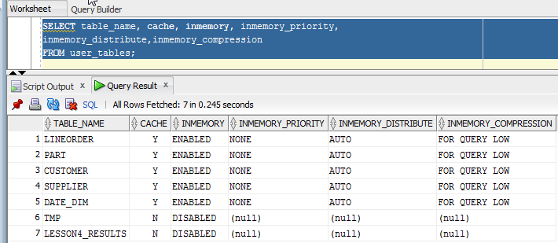

	By adding the INMEMORY attribute to each of the tables we, are telling
	the Oracle Database that this table should be populated into the IM
	column store.

	When the object should be populated, it is controlled by
	**INMEMORY\_PRIORITY**. By default, it is set to NONE, which means
	Oracle automatically decides when to populate the table into the IM
	column store. This is also referred to as “on demand” as Oracle
	typically populates the table after it has been accessed for the first
	time. Alternatively, the priority level can be set, which queues the
	population of the table into the IM column store immediately. The queue
	is drained from CRITICAL to LOW priority. This is also referred to as
	“at startup” as Oracle populates the IM column store using this
	prioritized list at the time the database starts.

	Each node in a RAC environment has its own IM column store. It is
	possible to have completely different objects populated on each node, or
	to have larger objects distributed across all of the IM column stores in
	the cluster. It is also possible to have the same objects appear in the
	IM column store on every node (Engineered Systems only). How each object
	should populate in the column store is displayed in the
	**INMEMORY\_DISTRIBUTE** column of the \*\_TABLES views. The default
	value is **AUTO-DISTRIBUTE**, where Oracle automatically decides how an
	objects should be distribute among the IM column store in a RAC
	environment. On a single instance database this attribute has no effect.

	Each object that is brought into the IM column store is compressed.
	Oracle offers multiple compression techniques which provide different
	levels of compress and performance. By default, data is compressed using
	the FOR QUERY option. This provides the best balance between compression
	and performance.

	The compression option used is shown in the **INMEMORY\_COMPRESSION**
	column of the \*\_TABLES views.

	Although each of the tables has its in-memory attribute set, it doesn\'t
	mean that they necessarily reside in the IM column store. Remember, by
	default the IM column store is only populated when the object is
	accessed.

-   Run the following simple queries on our 5 tables to populate the IM column store (script **07\_im\_start\_pop.sql**):

	```
	SELECT /*+ full(d) noparallel (d) */ Count(*) FROM date_dim d;
	SELECT /*+ full(s) noparallel (s) */ Count(*) FROM supplier s;
	SELECT /*+ full(p) noparallel (p) */ Count(*) FROM part p;
	SELECT /*+ full(c) noparallel (c) */ Count(*) FROM customer c; 
	SELECT /*+ full(lo) noparallel (lo) */ Count(*) FROM lineorder lo;
	```
	
	

	When these select statements are run, background processes populate the
	IM column store. These processes are called worker processes and come in
	the form of ora\_w\*\*\*\_orcl. It is possible to monitor the progress
	of the population by querying the view gv\$IM\_SEGMENTS.

### **STEP 11**:  Review current population status.

Remember the view gv\$IM\_SEGMENTS shows what objects are in the column
store. It also contains information about the population of those
objects.

-   Run the following query to see the current population status for the
    objects in the IM column store (script **08\_im\_populated.sql**).
    Note you may need to re-run the query a couple of times as the
    memory segments are populating and will take several seconds to
    complete.

	```
	SELECT v.owner, v.segment_name name,
		   v.populate_status status, v.bytes_not_populated
	FROM gv$im_segments v;
	```
	
	

	Having 0 in the BYTES\_NOT\_POPULATED column indicates that the entire
	table has been completely populated into the column store. When using
	RAC, small tables are loaded intact within a RAC node. Larger tables are
	distributed across nodes where part of the table is in memory on one
	node while other parts of the table may be in other nodes. What if the
	memory store is not large enough to hold a given table? This results in
	a partial table load where some rows are in memory and some are not (not
	covered in this lab). When queries are issued against this table rows
	are fetched from both the IM Store and the Buffer Cache (or disk),
	resulting in improved query performance to the extent rows are retrieved
	from the column store, in proportion to the percentage residing in the
	column store. Note that the execution plan will not reflect the partial
	table load in the access path, but will show statistics that reflect a
	partial load.

	But what about compression? How large are the actual objects stored in
	the IM column store?

### **STEP 12**:  Calculate compression rates.

The actual size of the objects on disk and their size in the IM column
store can also be seen in the gv\$IM\_SEGMENTS performance view. Using
this information, we can calculate the compression ratio for each of the
objects populated in IM column store. Note, if the objects were
compressed on disk this query would not yield the correct compression
ratio.

-   Run the following query to see the object sizes in the column store (script **09\_comp\_ratio.sql**):

	```
	SELECT v.inst_id, v.owner, v.segment_name,
		   v.bytes orig_size, v.inmemory_size in_mem_size,
		   ROUND(v.bytes / v.inmemory_size, 2) comp_ratio
	FROM gv$im_segments v
	ORDER BY 6;
	```
	
	

	NOTE: This query assumes that the tables are not compressed on disk.
	That is not true for one of our tables LINEORDER. LINEORDER is
	compressed on disk using basic compression so the compression ratio on
	LINEORDER should actually be 2.4X based on its uncompressed size.

###  Conclusion 

In this first part you should have seen how simple it is to configure
the IM column store by setting the initialization parameter
**INMEMORY\_SIZE**. Remember that the IM column store is a new static
pool in the SGA that cannot be resized dynamically and is not managed
via the automatic SGA algorithm.

You also had an opportunity to view objects in the IM column store and
to see how much space they use. In this lab we populated over 4GB of
data into the IM column store, the Lineorder table is the largest of the
tables populated with over 3 million rows. Remember the population speed
depends on the CPU capacity of the system as the data compression is a
CPU intensive operation. The more CPU you have the faster the
populations will occur.

Finally, you got to see exactly what our new in-memory compression
algorithms are capable of. Remember the goal of these algorithm is not
space reduction as with our on-disk compression but performance. The
compression ratio is dependent of the data distribution within each
column.

##  Part 2: Querying In-Memory Column Store Tables

Now that you've gotten familiar with the IM column store let's move on
and look at the benefits of using it. This part of the lab executes a
series of queries against the large fact table LINEORDER, in both the
buffer cache and the IM column store, to demonstrate the different ways
the IM column store can improve query performance above and beyond the
basic performance benefits of accessing data in memory only.

From your SQL Developer session make sure that you have the Part2
directory selected in the \"Files\" window. The scripts in that
directory will be used for the next part of the lab.

### **STEP 13**:  Simple Query Example

Let's begin with the simplest of queries, “What is the most expensive
order we have received to date?” Since we have no alternative access
paths (indexes or views) the execution plan for this query is a full
table scan of the LINEORDER table.

-   To execute the query against the IM column store type (script **01\_im\_query.sql**):

	```
	SELECT Max(lo_ordtotalprice) most_expensive_order
	FROM lineorder;
	```
	
	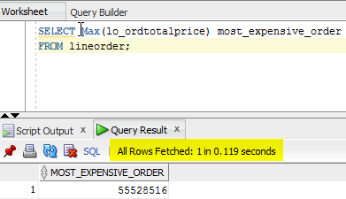

	**Note:** that the elapsed time for the query is shown just above the result window.

### **STEP 14**:  Execute query against buffer cache.

To execute the same query against the buffer cache we will need to
disable the IM column store via a hint called NO\_INMEMORY, as the
Optimizer will favor accessing the data in the column store when the
execution plan is a full table scan, as it is in this case.

-   To execute the query against the buffer cache type (script **02\_buffer\_query.sql**):

	```
	SELECT /*+ NO\_INMEMORY */ Max(lo_ordtotalprice) most_expensive_order
	FROM lineorder;
	```

	

	As you can see the query executed extremely quickly in both cases
	because this is purely an in-memory scan. However, the performance of
	the query against the IM column store was significantly faster than on
	the traditional buffer cache? Why?

	The IM column store only has to scan a single column - lo\_ordtotalprice
	- while the row store has to scan all of the columns in each of the rows
	until it reaches the lo\_ordtotalprice column. The IM column store also
	benefits from the fact the data is compressed so the volume of data
	scanned is less. Finally, the column format requires no additional
	manipulation for SIMD vector processing (Single Instruction processing
	Multiple Data values). Instead of evaluating each entry in the column
	one at a time, SIMD vector processing allows a set of column values to
	be evaluated together in a single CPU instruction.

### **STEP 15**:  How can you tell if your query is using the IM column store?

Using the \"Autotrace\" icon in the SQL Developer SQL Worksheet tool bar
we can display the execution plans and the database statistics from
running the two previous queries, and we can compare the results. For
each of the previous queries that were run, you will re-run the query
using the \"Autotrace\"icon to display the explain plan and the
statistics for that query. Before you run the second query, we will
\"pin\" the first autotrace tab so that we can compare the execution for
both queries. The following will walk through this process. Don\'t
worry, it sounds harder than it really is.

-   First let\'s open the SQL **script 03\_query\_autotrace.sql**. We will see both of the queries that were run in steps 1 and 2:

	**In-Memory Column Store query**

	```
	Select max(lo_ordtotalprice) most_expensive_order From LINEORDER;
	```
	
	

-   Now run the query against the buffer cache by selecting the second query and clicking the autotrace icon in the worksheet toolbar:

	**Buffer Cache query with the column store disables via INMEMORY\_QUERY parameter**

	```
	Select /*+ NO\_INMEMORY */ max(lo_ordtotalprice) most_expensive_order From LINEORDER;
	```

	

	

	You will notice that both of the execution plans are similar but the
	first query run against the IM column store has a new set of keywords
	“INMEMORY FULL”, while the buffer cache query does not. These keywords
	indicate that the LINEORDER table has been marked for IN MEMORY and we
	may use the column store in this query. What do we mean by “may use”?
	There are a small number of cases were we won't use the IM column store
	even though the object has been marked IN MEMORY. This is similar to how
	the keyword STORAGE is used on Exadata environments.

	In order to confirm that the IM column store was used, we need to
	examine the session level statistics. Notice that in the IN MEMORY run
	several IM statistics show up. The only one we are really interested in
	is the \"IM scan CUs columns accessed\" which has been highlighted.

	**IM scan CUs columns accessed**: Total number of Compression Units (CU)
	actually accessed by this query

	As our query did a full table scan of the LINEORDER table, that session
	statistic shows that the LINEORDER table has several CUs in the IM
	column store. Notice that in our second, buffer cache query that
	statistic does not show up. Only one statistic shows up, \"IM scan
	segments disk\" with a value of 1. This means that even though the
	LINEORDER table is in the IM column store, we actually scanned that
	segment outside of the column store either from disk or the buffer
	cache. In this case it was from the buffer cache as the query did no
	physical IO.

### **STEP 16**:  Review IM session statistics.

Let\'s take a look at the IM session statistics. All of the statistics related to the IM column store begin with IM.

-   You can see the full list of these statistics by typing (script **04\_list\_im\_stats.sql**):

	```
	SELECT inst_id, display_name
	FROM gv$statname
	WHERE display_name LIKE 'IM%'
	order by 2,1;
	```

	

	That's a lot of statistics. So many that we can\'t even display them all
	on a single screen in SQL Developer. Don't worry though, you don't need
	to know about all of them and we\'ll explain the ones the you need to
	pay attention to as we continue on in the lab.

### **STEP 17**:  Review specific order.

Traditionally, a full table scan is not the most efficient execution
plan when you are looking for a specific entry in a table. Tables stored
in the IM column store breaks this stereotype and we can demonstrate
this by looking for a specific order in the LINEORDER table based on the
orderkey.

-   To execute the query against the IM column store type (**script 05\_single\_key\_im.sql**):

	```
	SELECT lo_orderkey, lo_custkey, lo_revenue
	FROM lineorder
	WHERE lo_orderkey = 5000000;
	```
	
	

-   To execute the same query against the buffer cache type (script **05\_single\_key\_buffer.sql**):

	```
	select /*+ NO\_INMEMORY */
	lo_orderkey, lo_custkey, lo_revenue
	from LINEORDER
	where lo_orderkey = 5000000;
	```
	
	

	Again the IM column store shows an impressive improvement over the
	traditional buffer cache, but how?

### **STEP 18**:  Review effect of predicates on queries.

Remember the IM column store has access to a storage index on each of
the columns, which enables it to do min/max pruning. The where clause
predicate is compared to the min/max range for each in-memory segment of
the corresponding column, and if the value doesn't fall in the specified
range then the segment is skipped completely.

-   To execute our query again type (script **06\_storage\_index.sql**):

	```
	SELECT lo_orderkey, lo_custkey, lo_revenue
	FROM lineorder
	WHERE lo_orderkey = 5000000;
	```
	

	You can tell that min/max pruning occurred by looking at three of the IM session statistics.

	**IM scan CUs columns accessed**
	
	**IM scan segments minmax eligible**
	
	**IM scan CUs pruned**

	From these results you can see just how effective the min/max pruning
	can be. The statistics show that a large number of segments were pruned
	out because no rows passed the min/max comparison. That means we never
	scan those segments. Only a small number of segments had a min / max
	range that our value fell into (scan CUs columns accessed).

	At this stage you might be thinking that a simple index on the
	lo\_orderkey would provide the same performance as the IM column store
	and you would be right. There is an invisible index already created on
	the lo\_orderkey column of the LINEORDER table.

-   By using the parameter **OPTIMIZER\_USE\_INVISIBLE\_INDEXES** we can
    compare the performance of the IM column store and the index (script
    **06\_index\_comparison.sql**).

	```
	set timing on;
	
	-- Execute the In-Memory query as baseline
	
	Select /*+ Without index */ lo_orderkey, lo_custkey, lo_revenue
	From LINEORDER
	Where lo_orderkey = 5000000;
	```
	
	

	Enable the use of invisible indexes
	```
	alter session set optimizer_use_invisible_indexes=true;

	Session altered.
	Elapsed: 00:00:00.125
	```
	
	Execute the query again include a new comment to ensure a hard parse. We will compare the elapsed time of the query in memory between with and without indexes.

	```
	Select /*+ With index */ lo_orderkey, lo_custkey, lo_revenue
	From LINEORDER
	Where lo_orderkey = 5000000;
	```

	

	Re-set optimizer\_use\_invisible\_indexes back to false for remainer of lab.

	```
	alter session set optimizer_use_invisible_indexes=false;
	```
	
### **STEP 19**:  Review multiple single column predicate query results

However, it's not often that an analytical query has only one equality
where clause predicate. What happens when there are multiple single
column predicates on a table? Traditionally you would create a
multi-column index. Can storage indexes compete with that?

Let's change our query to look for a specific line item in an order and
monitor the session statistics:

-   Execute the query against the IM column store type (script **07\_multi\_preds.sql**):

	```
	SELECT lo_orderkey, lo_custkey, lo_revenue
	FROM lineorder
	WHERE lo_custkey = 5641
	AND lo_shipmode = 'XXX AIR'
	AND lo_orderpriority = '5-LOW';
	```
	

	Based on the elapsed time and the session statistics you can see that
	the In-Memory storage index is still used. In fact, we are able to use
	multiple storage indexes together in a similar manner to how Oracle
	Database can combine multiple bitmap indexes. Unfortunately, we don't
	have a multi-column index created for this query so running it against
	the buffer cache means we must do a full table scan.

-   You can see how that affects performance by opening the script **07\_multi\_preds\_buffer.sql** and run the SQL statement with autotrace so that you can see the session statistics.

	```
	Select /*+ NO_INMEMORY */ lo_orderkey, lo_custkey, lo_revenue
	From LINEORDER
	Where lo_custkey = 5641 
	And lo_shipmode = 'XXX AIR'
	And lo_orderpriority = '5-LOW';
	```
	
	

### **STEP 20**:  Review min/max query results.

What if the where clause predicate isn't an equality predicate? Can you
still benefit from min/max pruning? Let's change the query to ask “What
was the most expensive bulk order to fill, where a bulk order is one
that has a quantity greater than 52 items?”

-   To execute the query against the IM column store type (script **08\_min\_max.sql**):

	```
	SELECT Max(lo_supplycost) most_expensive_bluk_order
	FROM lineorder
	WHERE lo_quantity > 52;
	```

	

	To execute the same query against the buffer cache, we will need to
	disable the IM column store via a hint, as the Optimizer will favor
	accessing the data in the column store when the execution plan is a full
	table scan, as it is in this case.

-   To execute the query against the buffer cache type (script **08\_min\_max\_buffer.sql**):

	```
	SELECT /*+ NO_INMEMORY */
	Max(lo_supplycost) most_expensive_bluk_order
	FROM lineorder
	WHERE lo_quantity > 52;
	```
	
	

	The IM column store still out-performs the buffer cache because it only
	has to scan a single column lo\_quantity and although the where clause
	predicate is not an equality, we are still able to use the In-Memory
	storage index.

### **STEP 21**:  Review more complex where clause.

Let's kick it up a notch and see what happens when we have more complex
where clause predicates that include multiple columns and a sub select
on the LINEORDER table. The query this time is to determine which of the
expensive bulk orders generated the least amount of revenue for the
company when shipped by truck versus air.

-   To execute the query against the IM column store type (script **09\_multi\_col.sql**):

	```
	SELECT lo_orderkey, lo_revenue
	FROM lineorder
	WHERE lo_revenue = (SELECT Min(lo_revenue)
	FROM lineorder
	WHERE lo_supplycost = (SELECT Max(lo_supplycost)
	FROM lineorder
	WHERE lo_quantity > 10)
	AND lo_shipmode LIKE 'TRUCK%'
	AND lo_discount BETWEEN 2 AND 5);
	```
	
	

	

-   To execute the same query against the buffer cache type (script **09\_multi\_col\_buffer.sql**):

	```
	SELECT /*+ NO\_INMEMORY */
	lo_orderkey, lo_revenue
	FROM lineorder
	WHERE lo_revenue = (SELECT /*+ NO_INMEMORY */ Min(lo_revenue)
	FROM lineorder
	WHERE lo_supplycost = (SELECT /*+ NO_INMEMORY */
	Max(lo_supplycost)
	FROM lineorder
	WHERE lo_quantity > 10)
	AND lo_shipmode LIKE 'TRUCK%'
	AND lo_discount BETWEEN 2 AND 5);
	```

	
	
### Conclusion 

In this second part of the lab you had an opportunity to try out
Oracle's in-memory performance claims with queries that run against a 6
million row table(LINEORDER), which resides in both the IM column store
and the buffer cache. From a very simple single row look-up, to more
complex queries with multiple sub-queries, the IM column store was able
to out perform the buffer cache queries. Remember both sets of queries
are executing completely within memory, so that's quite an impressive
improvement.

These significant performance improvements are possible because of
Oracle's unique in-memory columnar format that allows us to only scan
the columns we need and to take full advantage of SIMD vector
processing. We also got a little help from our new in-memory storage
indexes, which allow us to prune out unnecessary data. Remember that
with the IM column store, every column has a storage index that is
automatically maintained for you.

In this lesson you also got an opportunity to get your first experience
with monitoring an in-memory workload. Those of you familiar with
Oracle's Exadata Engineered Systems will see a lot of similarity here.
There is a new keyword (**IN MEMORY**) in the execution plan to indicate
which operations within that plan are eligible to be executed on the IM
column store. But to confirm that these operations actually took place
in the IM column store you need to examine the new set of in-memory (IM)
session statistic.

## Part 3: In-Memory Joins and Aggregation

Up until now we have been focused on queries that scan only one table,
LINEORDER. Let's broaden the scope of our investigation to include joins
and parallel execution. This lesson executes a series of queries that
begin with a single join between the fact table, LINEORDER, and a
dimension table but works up to a 5 table join. The queries will be
executed in both the buffer cache and the column store, to demonstrate
the different ways the column store can improve query performance above
and beyond the basic performance benefits of scanning data in a columnar
format.

### **STEP 22**:  Simple join query.

We will begin with the simplest join query, a join between the fact
table LINEORDER and the dimension table DATE\_DIM. This is a “What if”
style query that calculates the amount of revenue increase that would
have resulted from eliminating certain company-wide discounts in a given
percentage range for products shipped on a given day (Christmas eve
1996).

-   To execute the query against the IM column store type (script **01\_join\_im.sql**):

	```
	SELECT SUM(lo_extendedprice * lo_discount) revenue
	FROM lineorder l,
	date_dim d
	WHERE l.lo_orderdate = d.d_datekey
	AND l.lo_discount BETWEEN 2 AND 3
	AND l.lo_quantity < 24
	AND d.d_date='December 24, 1996';
	```
	
	

	The IM column store has no problem executing a query with a join because
	it is able to take advantage of Bloom Filters. A bloom filter transforms
	a join to a filter that can be applied as part of the scan of the fact
	table. Bloom filters were originally introduced in Oracle Database 10g
	to enhance hash join performance and are not specific to Oracle Database
	In-Memory. However, they are very efficiently applied to columnar data
	via SIMD vector processing. Here is a brief description of how they
	work:

	When two tables are joined via a hash join, the first table (typically
	the smaller table) is scanned and the rows that satisfy the ‘where'
	clause predicates (for that table) are used to create a hash table.
	During the hash table creation, a bit vector or bloom filter is also
	created based on the join column. The bit vector is then sent as an
	additional predicate to the second table scan. After the where clause
	predicates have been applied to the second table scan, the resulting
	rows will have their join column hashed and it will be compared to
	values in the bit vector. If a match is found in the bit vector that row
	will be sent to the hash join. If no match is found, then the row will
	be discarded. On Exadata the bloom filter or bit vector is passed as an
	additional predicate so it will be offloaded to the storage cells making
	bloom filtering even more efficient.

	It's easy to identify bloom filters in the execution plan. They will
	appear in two places, at creation time and again when it is applied.
	Below is the plan for the query in step 1 with the bloom filter
	highlighted: You can also see what join condition was used to build the
	bloom filter by looking at the predicate information under the plan.
	Look for **‘SYS\_OP\_BLOOM\_FILTER'** in the filter predicates.

-   To execute the query against the buffer cache type (script **01\_join\_buffer.sql**):

	```
	SELECT /*+ NO_INMEMORY */
	SUM(lo_extendedprice * lo_discount) revenue
	FROM lineorder l,
	date_dim d
	WHERE l.lo_orderdate = d.d_datekey
	AND l.lo_discount BETWEEN 2 AND 3
	AND l.lo_quantity < 24
	AND d.d_date='December 24, 1996';
	```

	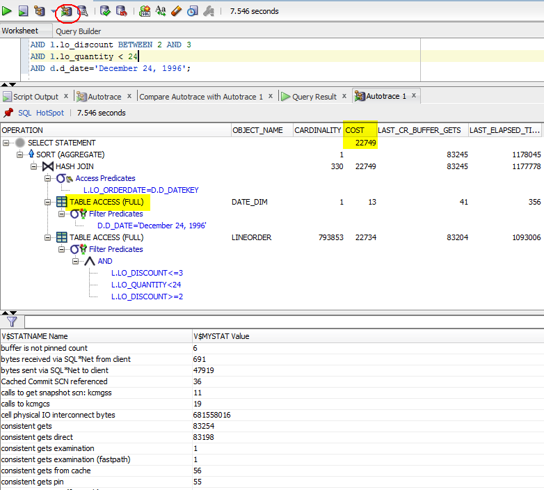

### **STEP 23**:  Review more complex example.

Let's try a more complex query that encompasses two joins and an
aggregation of a lot more data. In this case the query will compute the
revenue generated from a specific product in the busiest month of the
year, December. As we are dealing with more data let's use parallel
execution to speed up the elapsed times so we don't need to wait too
long for the results.

-   To execute the query against the IM column store type (script **02\_2join\_im.sql**):

	```
	SELECT /*+ parallel(2)*/ p.p_name, SUM(l.lo_revenue)
	FROM lineorder l,
	date_dim d,
	part p
	WHERE l.lo_orderdate = d.d_datekey
	AND l.lo_partkey = p.p_partkey
	AND p.p_name = 'hot lavender'
	AND d.d_year = 1996
	AND d.d_month = 'December'
	GROUP BY p.p_name;
	```
	
	

	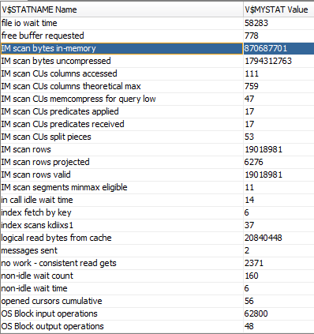

	If you examine the execution plan for this SQL statement you will see
	that two bloom filter were created. The bloom filter is created on the
	lo\_partkey and the data column. Oracle Database is not limited to just
	one bloom filter per scan. It is possible to apply multiple bloom
	filters on a single table scan when appropriate.

-   To execute the query against the buffer cache type (script **02\_2join\_buffer.sql**):

	```
	SELECT /*+ NO_INMEMORY parallel(2) buffer cache */
	p.p\_name, SUM(l.lo_revenue)
	FROM lineorder l,
	date_dim d,
	part p
	WHERE l.lo_orderdate = d.d_datekey
	AND l.lo_partkey = p.p_partkey
	AND p.p_name = 'hot lavender'
	AND d.d_year = 1996
	AND d.d_month = 'December'
	GROUP BY p.p_name;
	```
	

	You may be wondering if all of the benefits we saw during the table scan
	tests in Part 2 are still relevant now that we are executing joins. The
	answer is a definite YES!

	The bloom filters created for the joins benefit from the In-Memory
	storage index and the min/max pruning it provides. You can see just how
	beneficial it provides by looking at the execution statistics for our
	previous query.

	On examining the output, you will realize how few Compression Units
	(CUs) Oracle Database actually looked at to evaluate this query. By
	applying the bloom filter predicate on the lo\_partkey column and using
	the storage index on that column, the join was reduced to scan of a
	handful of CUs.

### **STEP 24**:  Review another complex example.

Let's introduce a third table to our query. This time our query will
compare the revenue for different product classes, from suppliers in a certain region for the
year 1997. This query returns more data than the others we have looked
at so far.

-   To execute the query against the IM column store type (script **03\_3join\_im.sql**):

	```
	SELECT /*+ parallel(2)*/ d.d_year, p.p_brand1,SUM(lo_revenue) rev
	FROM
	lineorder l,
	date_dim d,
	part p,
	supplier s
	WHERE l.lo_orderdate = d.d_datekey
	AND l.lo_partkey = p.p_partkey
	AND l.lo_suppkey = s.s_suppkey
	AND p.p_category = 'MFGR#12'
	AND s.s_region = 'AMERICA'
	AND d.d_year = 1997
	GROUP BY d.d_year,p.p_brand1;
	```
	
	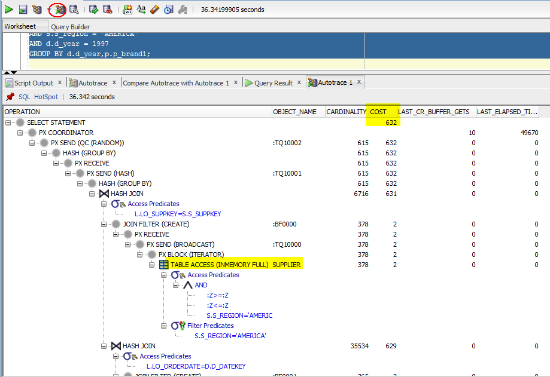

	

-   To execute the query against the buffer cache type (script **03\_3join\_buffer.sql**):

	```
	SELECT /*+ opt_param('inmemory_query','disable') NO_VECTOR_TRANSFORM parallel(2) */
	d.d_year, p.p_brand1,SUM(lo_revenue) rev
	FROM lineorder l,
	date_dim d,
	part p,
	supplier s
	WHERE l.lo_orderdate = d.d_datekey
	AND l.lo_partkey = p.p_partkey
	AND l.lo_suppkey = s.s_suppkey
	AND p.p_category = 'MFGR#12'
	AND s.s_region = 'AMERICA'
	AND d.d_year = 1997
	GROUP BY d.d_year, p.p_brand1;
	```
	
	

	In this case, we see three join filters have been created and applied to
	the scan of the LINEORDER table, one for the join to the PART table, one
	for the join to DATE\_DIM, and one for the join to the SUPPLIER table.
	How is Oracle able to apply two join filters when the join order would
	imply that the LINEORDER is accessed before the SUPPLER table?

	This is where Oracle's 30 years of database innovations kick in. By
	embedding the column store into Oracle Database we can take advantage of
	all of the optimizations that have been added to the database over the
	last 11 releases. In this case, the Optimizer has switched from its
	typically left deep tree to create a right deep tree using an
	optimization called ‘swap\_join\_inputs'. Your instructor can explain
	‘swap\_join\_inputs' in more depth should you wish to know more. What
	this means for the IM column store is that we are able to generate
	multiple bloom filters before we scan the necessary columns for the fact
	table, meaning we are able to benefit by eliminating rows during the
	scan rather than waiting for the join to do it.

### **STEP 25**:  Review OLAP Style ‘What if' queries.

Up until this point we have been focused on joins and how the IM column
store can execute them incredibly efficiently. Let's now turn our
attention to more OLAP style “What If” queries. In this case our query
examines the yearly profits from a specific region and manufacturer over
our complete data set.

-   To execute the query against the IM column store type (script **04\_vgb\_im.sql**):

	```
	Select /*+ parallel(2) */ d.d_year, c.c_nation, sum(lo_revenue - lo_supplycost) profit
	From LINEORDER l, DATE_DIM d, PART p, SUPPLIER s, CUSTOMER C
	Where l.lo_orderdate = d.d_datekey
	And l.lo_partkey = p.p_partkey
	And l.lo_suppkey = s.s_suppkey
	And l.lo_custkey = c.c_custkey
	And s.s_region = 'AMERICA'
	And c.c_region = 'AMERICA'
	Group by d.d_year, c.c_nation
	Order by d.d_year, c.c_nation;
	```
	

	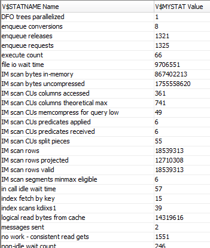

	Our query is more complex now and the majority of the time is no longer
	spent in the scan operations of the execution plan. More time is now
	being spent joining, sorting, and aggregating the data. You can check it
	out for yourself by examining the execution plan.

-   To execute the query against the buffer cache type (script **04\_vgb\_buffer.sql**):
	
	```
	SELECT /*+ opt_param('inmemory_query','disable') parallel(2) 
	NO_VECTOR_TRANSFORM BUFFER CACHE */
	d.d_year, c.c_nation, SUM(lo_revenue - lo_supplycost) profit
	FROM lineorder l,
	date_dim d,
	part p,
	supplier s,
	customer c
	WHERE l.lo_orderdate = d.d_datekey
	AND l.lo_partkey = p.p_partkey
	AND l.lo_suppkey = s.s_suppkey
	AND l.lo_custkey = c.c_custkey
	AND s.s_region = 'AMERICA'
	AND c.c_region = 'AMERICA'
	GROUP BY d.d_year, c.c_nation
	ORDER BY d.d_year, c.c_nation;
	```
	
	

	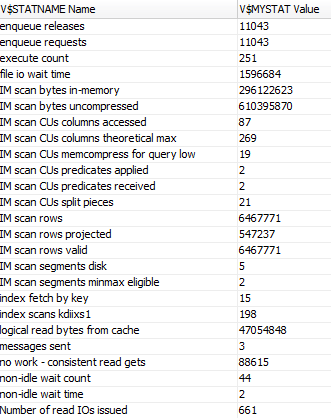

	Move on to step 5 to see how an alternative execution plan for our query
	will help improve the performance of the operations that occur after the
	scan operations.

### **STEP 26**:  Review Vector Group By optimizer transformations.

In order to speed up the operations above the scan in the execution
plan, Oracle has introduced a new Optimizer transformation, called
**Vector Group By**. This transformation is a two-part process not
dissimilar to that of star transformation. First, the dimension tables
are scanned and any where clause predicates are applied. A new data
structure called a key vector is created based on the results of these
scans. The key vector is similar to a bloom filter as it allows the join
predicates to be applied as additional filter predicates during the scan
of the fact table, but it also enables us to conduct the group by or
aggregation during the scan of the fact table instead of having to do it
afterwards. The second part of the execution plan sees the results of
the fact table scan being joined back to the temporary tables created as
part of the scan of the dimension tables. These temporary tables contain
the payload columns (columns need in the select list) from the dimension
table. The combination of these two phases dramatically improves the
efficiency of a multiple table join with complex aggregations. Both
phases are visible in the execution plan of our query.

Let's take one more look at Vector Group By in action. This time we will
expand the query to look at the profits we made across the 6 years we
have been in business, for all customers. We will also change the
comparison criteria on this step. Instead of comparing the IM column
store performance to the buffer cache, we will compare the query
performance with and with Vector Group By.

-   To see the results of this slightly more complex query and our new
    comparison criteria, open the script **05\_vgb2\_im.sql** and run
    the SQL statement with autotrace so that you can see the execution
    plan and session statistics:

	```
	Select   /*+ VECTOR_TRANSFORM parallel(2) */ d.d_year, c.c_nation, sum(lo_revenue - lo_supplycost) profit
		From      LINEORDER l, DATE_DIM d, PART p, SUPPLIER s, CUSTOMER C
			Where	l.lo_orderdate = d.d_datekey
			And     l.lo_partkey = p.p_partkey
			And		l.lo_suppkey = s.s_suppkey
			And     l.lo_custkey = c.c_custkey
			And     s.s_region = 'AMERICA'
        Group by d.d_year, c.c_nation
        Order by d.d_year, c.c_nation;
	```

	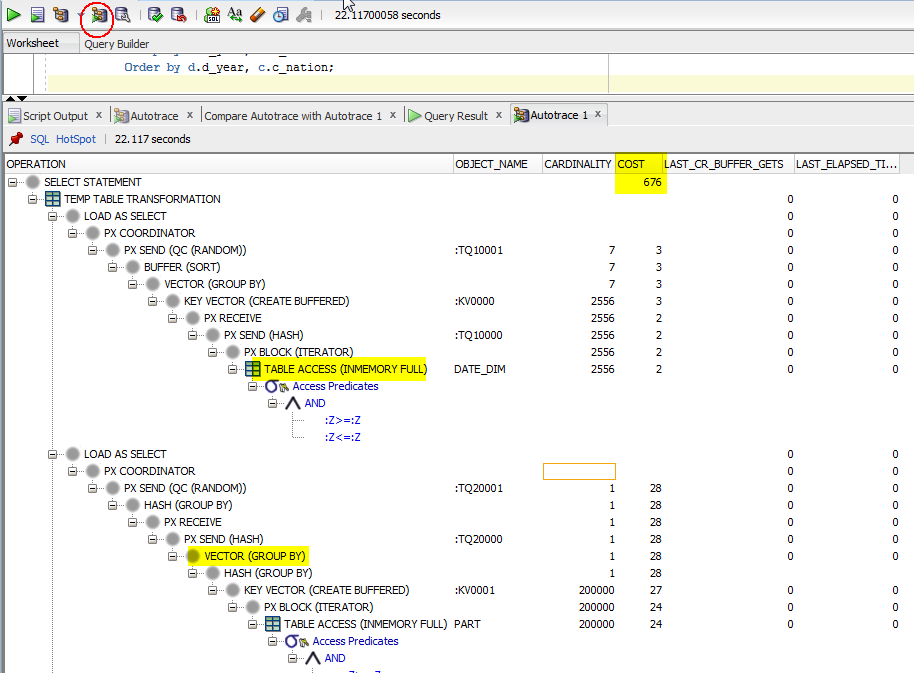

	

-   To run the script with vector group by disabled open the script
    **05\_vgb2\_im\_novgb.sql** and run the SQL statement with
    autotrace, so that you can see the execution plan and session
    statistics:

	```
	SELECT /*+ NO_VECTOR_TRANSFORM parallel(2)  */ 
           d.d_year, c.c_nation, sum(lo_revenue - lo_supplycost) profit
           From      LINEORDER l, DATE_DIM d, PART p, SUPPLIER s, CUSTOMER C
           Where    l.lo_orderdate = d.d_datekey
           And        l.lo_partkey       = p.p_partkey
           And        l.lo_suppkey      = s.s_suppkey
           And        l.lo_custkey        = c.c_custkey
           And        s.s_region            = 'AMERICA'
           Group by d.d_year, c.c_nation
           Order by d.d_year, c.c_nation;
	```

	

	

	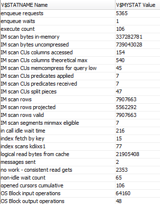

### Conclusion 

Part 3 saw our performance comparison expanded to queries with both
joins and aggregations. You had an opportunity to see just how
efficiently a join, that is automatically converted to a bloom filter,
can be executed on the IM column store.

You also got to see just how sophisticated the Oracle Optimizer has
become over the last 30 years, when it used a combination of complex
query transformations to find the optimal execution plan for a star
query.

Finally you got an opportunity to see the new vector group by
transformation in action. This new transformation allows us to not only
convert joins to filter applied as part of a scan but also to complete
all aggregation operations as part of the scan of the fact table.

## Part 4: In-Memory Transaction Manager

It's clear that the IM column store can dramatically improve the
performance of all types of queries but very few database environments
are read only. For a column store to be truly integrated into a database
environment it has to be able to handle both bulk data loads AND online
transaction processing.

This lesson demonstrates how the Oracle IM column store is the only in
memory column store that can handle both bulk data loads and online
transaction processing today. We will do this by running a 32-query
workload concurrently with both a bulk load of 1 full day's worth of
data and a more OLTP style DML test (single row DML).

Our query workload is a mix of 7 different kinds of queries, starting
from the most basic single column lookup, to a complex multi-table join
with multiple aggregations. The where clause predicates for the queries
begin simply with equality predicates but become more complete with less
than and between predicates seen in the later queries. You can examine
the queries by opening the file query\_workload.sql.

### **STEP 27**:  Create staging tables.

Before we begin our bulk load DML test we need to extract some data from
the existing data set to act as the “new” data. We will do this by
issuing two CREATE TABLE AS SELECT commands, one against the LINEORDER
table to extract one day's worth of data, and one against the DATE\_DIM
table so we can add a new day.

-   Below is example of one of the queries we will use (script **01\_cr\_ext\_tables.sql**):

	```
	CREATE TABLE etl_lo AS
	(SELECT lo_orderkey, lo_linenumber, lo_custkey, lo_partkey, lo_suppkey,
	lo_orderdate + 1 LO_ORDERDATE, lo_orderpriority, lo_shippriority,
	lo_quantity, lo_extendedprice, lo_ordtotalprice, lo_discount,
	lo_revenue, lo_supplycost, lo_tax, lo_commitdate + 1 LO_COMMITDATE,
	lo_shipmode
	FROM lineorder
	WHERE lo_orderdate IN (SELECT * FROM
	(SELECT lo_orderdate FROM lineorder
	GROUP BY lo_orderdate
	ORDER BY lo_orderdate DESC)
	WHERE ROWNUM <= 1));
	```

	
	
	```
	create table etl_dd as
           (select * from date_dim where d_datekey in
                  (select *  from
                        (select d_datekey from date_dim
                          group by d_datekey order by d_datekey desc)
                      where rownum <= 1)
			);

	update etl_dd  set d_datekey = d_datekey + 1;
	Commit;
	
	select lo_orderdate, count(*) from etl_lo  group by lo_orderdate order by lo_orderdate desc;
	```

	

### **STEP 28**:  Execute workload to establish baseline.

All good performance comparison tests require a baseline to be
established and this is no exception. We will establish a baseline by
executing the 32-query workload without any concurrent DML. The sql
script **02\_timeit.sql** will automatically execute the workload and
record the response time for each query in the new table
**LESSON4\_RESULTS**.

-   To establish the baseline, open the script **02\_timeit.sql** and click the **run** script icon. Note script is too lengthy to post here.

	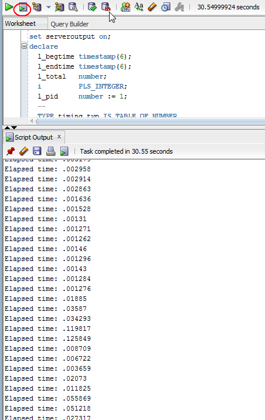

	These results are store in a results table which we will review in Step 31, together with Step 29 and 30 (next).

### **STEP 29**:  Execute workload with concurrent bulk DML.

Now let's rerun the query workload while we also execute a bulk load
into the LINEORDER table. This load will add 1.2M rows LINEORDER table.

NOTE: With a bulk load all of the data is inserted into the table in a
single transaction (only one commit). That means none of the data will
be visible to the session doing the queries until the bulk load
completes. This is the typical nature of a bulk load done in a data
warehouse or an operational store.

**We will be executing a DML statement (data insert) in the first tab and simultaneously executing a workload in a second NEW TAB.**

-   Clear data from existing tab:

	

-   **NOTE: it is very critical that you open a new NON BLOCKING tab so
    that the statements will execute simultaneously**. This is done by
    enter the following to create a new non-blocking query tab:
    **&lt;ctl&gt; &lt;shift&gt; N** (note: on a Mac this is
    &lt;Command&gt; &lt;Shift&gt; N)

-   Go back to the first tab and enter the following, but DO NOT YET EXECUTE IT (script **03\_bulk\_dml.sql**).

	```
	set timing on
	insert into lineorder select * from lineorder where rownum<1200000;
	commit;
	```

	Enter this into the sql worksheet, but **DO NOT YET EXECUTE IT**:

	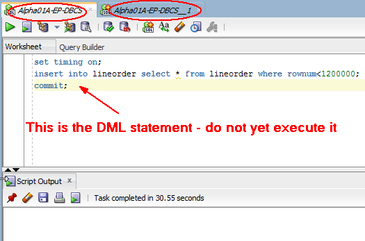

-   Select the second tab and paste the script contents from **03\_timeit.sql**.

	

-   Right click on the second tab to create a new tab group. It will be
    easier to execute the two queries when you have two side by side
    panels.

    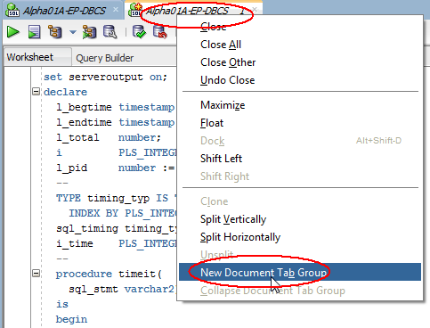{width="3.6875in"
    height="2.810129046369204in"}

-   Go back to the First Tab -- hit execute, and then immediately after that, select the second tab and select execute. 

	

	This is the output which is stored in a results table. We will review the results later in Step 5.

	

### **STEP 30**:  Execute workload with concurrent serial DML statements.

The next part of our comparison will rerun the query workload while we
also execute a set of more OLTP-style DML commands (INSERTS, DELETES,
UPDATES ,etc.) into the LINEORDER table. There are 26 DML commands in
the workload (20 inserts, 3 updates, and 3 deletes). Each command
commits immediately and none of the transactions are rolled back.

NOTE: As each DML command commits immediately, the session executing the
queries will see the information immediately after the commit.

**Again, we will be executing DML statements (data update and inserts)
in the first tab, and simultaneously executing a workload in the second
TAB.**

-   Clear data from existing tab:

	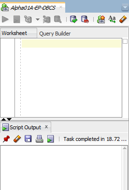

-   Then past the contents of script **04\_single\_dml.sql** into this first tab, **but do not yet execute.**

	

-   Select the second tab and paste the script contents from **04\_timeit.sql**.

	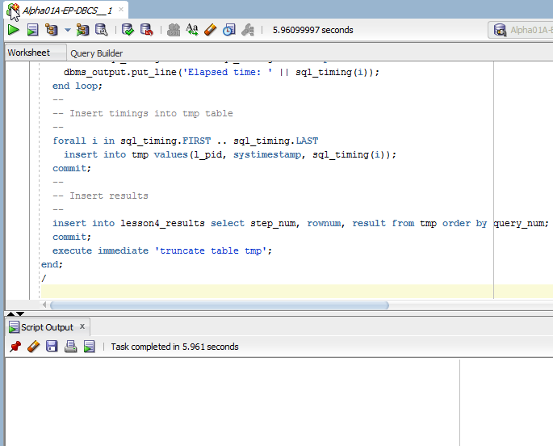

-   Go back to the first tab -- hit execute, and then immediately after that select the second tab and select execute.

	

	This is the output which is stored in a results table. We will review the results in the next Step.

	

### **STEP 31**:  Compare results with the different workloads.

With the three runs complete, let's compare the response time of each query in our workload in the three tests.

We can do the comparison by selecting the response time for each query across our three-performance run; baseline, bulk DML, and single record DML.

-   To run the comparison query, open the script **05\_results.sql** and click on the run script icon. You can do this in either open tab.

	```
	Select s1.result as no_dml, s2.result as bulk_dml, s3.result as single_dml 
	From   (select result, query_num from lesson4_results where step_num=1) s1, 
       (select result, query_num from lesson4_results where step_num=2) s2,
       (select result, query_num from lesson4_results where step_num=3) s3
	Where  s1.query_num=s2.query_num
	AND    s1.query_num=s3.query_num;
	```

	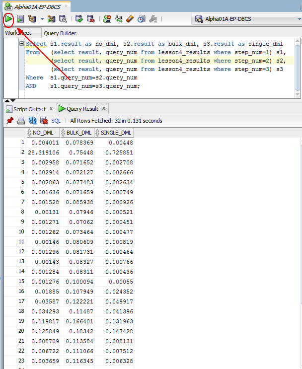

	```
	0.004011	0.078369	0.00448
	28.319106	0.75448	 	0.725851
	0.002958	0.071652	0.002708
	0.002914	0.072127	0.002666
	0.002863	0.077483 	0.002634
	0.001636	0.071659 	0.000749
	0.001528	0.085938 	0.000926
	0.00131	 	0.07946 	0.000521
	0.001271 	0.07062 	0.000451
	0.001262 	0.073464 	0.000477
	0.00146 	0.080609 	0.000819
	0.001296 	0.081731 	0.000464
	0.00143 	0.08327 	0.000766
	0.001284 	0.08311 	0.000436
	0.001276 	0.100094 	0.00055
	0.01885 	0.107949 	0.024352
	0.03587 	0.122221 	0.049917
	0.034293 	0.11487 	0.041396
	0.119817 	0.166401 	0.131963
	0.125849 	0.18342 	0.147428
	0.008709 	0.113584 	0.008131
	0.006722 	0.111066 	0.007512
	0.003659 	0.116345 	0.006328
	0.02073 	0.114507 	0.009521
	0.011825 	0.110248 	0.009138
	0.055869 	0.104569 	0.027681
	0.051218 	0.105459 	0.007998
	0.027317 	0.006483 	0.002763
	0.066793 	2.008433 	0.004625
	0.065345 	0.007045 	0.003932
	0.152946 	0.162069 	0.032241
	0.003179 	0.069539 	0.002992
	```

### Conclusion 

One of the most commonly asked questions about the new IM column store
is, how is it impacted by DML. Lesson 4 demonstrated just how little
impact DML has on the performance of the IM column store.

Remember, new data added as part of a bulk load operation is only
visible after the session doing the DML commits. If the bulk load is
done using a direct path operation, the data is written directly to disk
and by-passes the buffer cache and the IM column store. The next query
that accesses that data will trigger the newly inserted data to be
populated into the column store.

Single row change done via the buffer cache (OLTP style changes), are
typically committed immediately and are reflected in the column store as
they occur. The buffer cache and the column store are kept
transactionally consistent.