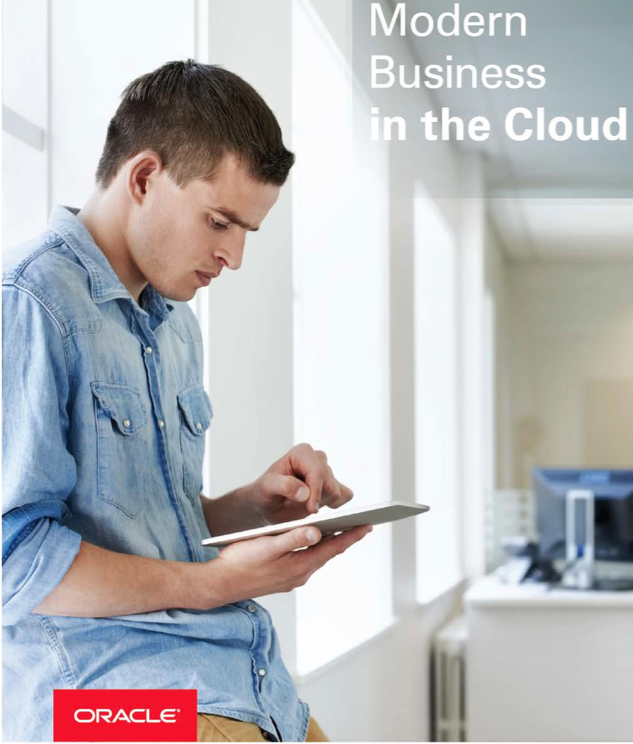

Update March 27, 2017

## Introduction

This is the first of several labs that are part
of the Oracle Public Cloud Database Cloud Service workshop. These labs
will give you a basic understanding of the Oracle Database Cloud Service
and many of the capabilities around administration and database
development.

This lab will walk you through creating a new Database Cloud Service
instance. After the database has been created, you will connect into the
Database image using the ssh private key and familiarize yourself with
the image layout. Next you will learn how to create an ssh configuration
file that can be used to tunnel simultaneously multiple ports to a
remote OPC instance. Using the tunnels, you will learn how to access
various Database consoles.
 
- To log issues and view the Lab Guide source, go to the [github oracle](https://github.com/pcdavies/DatabaseCloudService/tree/master/dbcs) repository.

## Objectives

-   Create Database Cloud Service

-   SSH Configuration

-   Explore VM and Consoles

## Required Artifacts

-   The following lab requires a VNC Viewer to connect to an Image
    running on Oracle's IaaS Compute Service.

## Client Image

For the Database Cloud Service Workshop we will be using a Client Image
that will represent your on-premises environment. In this image we have
installed an Oracle 12.1.0.2 database that contains a Pluggable database
that we will be migrating to our Oracle Public Cloud Database instance.
The image also contains SQL Developer 4.1 that will be used to connect
to both your local and cloud database.

The Client Image is a VM that is running on Oracle's IaaS Compute
service.

**Retrieve Public IP for Client Image**

### **STEP 1**: Login to your Oracle Cloud account

-   Open a browser and go to the following URL:

	https://cloud.oracle.com

-   Click **Sign In** in the upper right hand corner of the browser

	

- **IMPORTANT** - Under my services, select from the drop down list the correct data center and click on **My Services**. If you are unsure of the data center you should select, and this is an in-person training event, ***ask your instructor*** which **Region** to select from the drop down list. If you received your account through an Oracle Trial, your Trial confirmation email should provide a URL that will pre-select the region for you.

	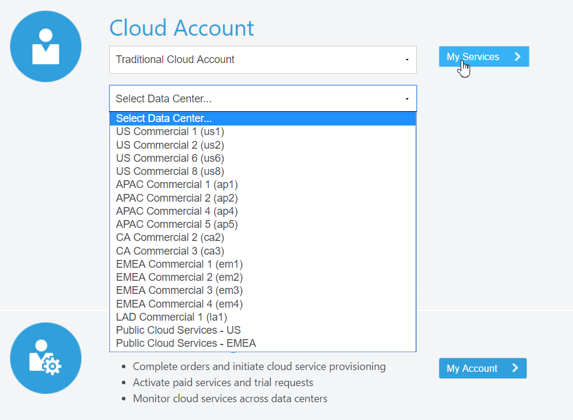

-   Enter the **identity domain** and click **Go**

	**NOTE**: The **Identity Domain, User Name** and **Password** values will be given to you from your instructor.

	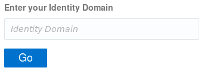

-   Once your Identity Domain is set, enter your User Name and Password
    and click **Sign In**

	**NOTE**: the **Identity Domain, User Name** and **Password** values will be given to you from your instructor.

	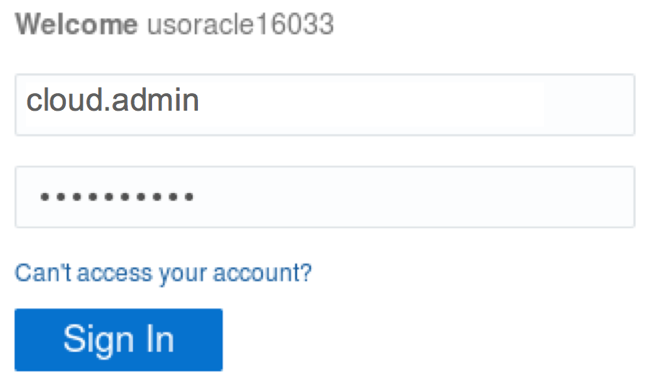

-   You will be presented with a Dashboard summarizing all of your
    available services.

	

-   If all of your services are not visible, **click** on **Customize
    Dashboard.** You can then add services to the dashboard by clicking
    **Show**. If you do not want to see a specific service click
    **Hide**.

	

### **STEP 2**:  Access Compute Service Console

-   From the main dashboard, click on the **Compute** service link

	

-   From this page you can view general information about this Compute
    Cloud Service. Click on the **Open Service Console** button.

	

### **STEP 3**:  Copy Public IP for Client Image

-   The Compute Service Console will show you all running VM's. Note: If
    a compute service is not visible, as shown below, the following task
    will provide instructions on how to change to the correct zone.

	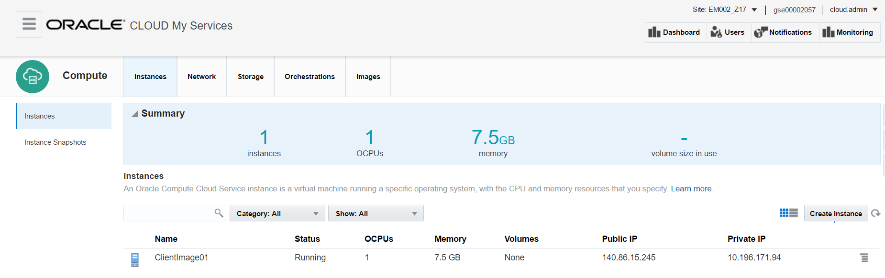

-   Identity Domains will have multiple sites. Please ask you instructor
    which site the Client Image is running on. If needed, click the
    **Site** drop down to access the **Site Selector,** and choose the
    correct site.

	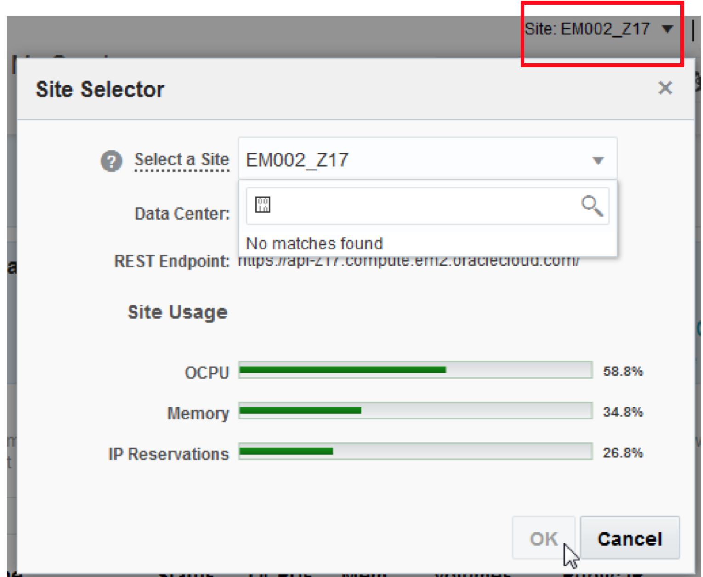

-   Now that you have the correct site selected, find the instance name
    **ClientImage01** and copy down the **Public IP**

	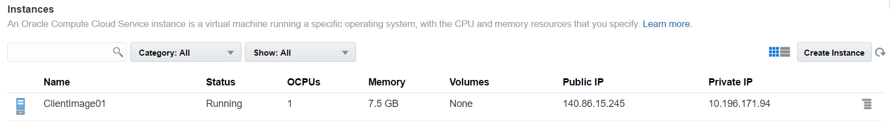

### **STEP 4**:  Connect to Client Image using VNC Viewer

-   If you do not already have a VNC Viewer installed on your computer,
    you will want to download a Viewer, or ask the instructor for the
    Real VNC Viewer executable. Run the VNC Viewer and enter the Public
    IP you just copied, by first appending either the display port
    **:443** or **:10**. Ask your instructor which port is active for
    this workshop. Next, click **Connect**

	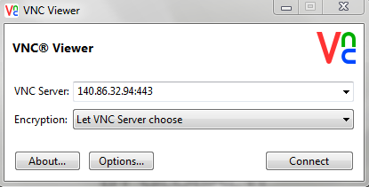

-   Enter the password you used to log into the Oracle Cloud domain, and
    click **OK**

	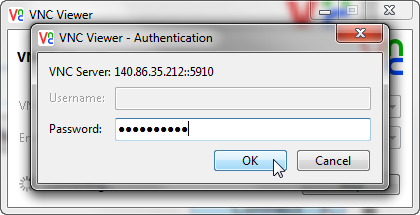

-   You are now connected to the Client Image that will be used for all
    labs. You might want to place the image in full screen mode so that
    there is no confusion as to which environment you are working in.
    Note: the use of the compute “Client” image provides us the
    opportunity to simulate an on premises environment. We have
    pre-installed several tools, a database, etc. within this compute
    Client image. Of course, you could install the same tools and
    database on your laptop or in an on premises environment to
    accomplish the same functionality provided by the Client Image, but
    to reduce the time required to complete the workshop, the Client
    Image just simplifies the configuration you'd be required to
    perform.

	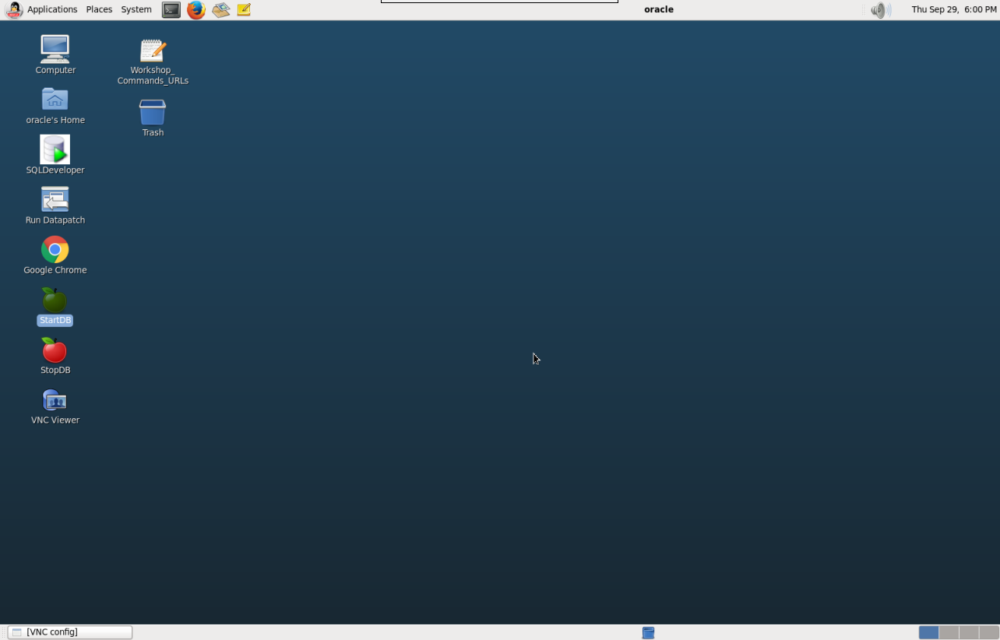

## Create Database Cloud Service

**Create Database Cloud Service Instance**

### **STEP 5**:  Login to your Oracle Cloud account

-   From within the VNC Session open **Chrome**
     and go to the following URL:

	https://cloud.oracle.com

-   Click **Sign In** in the upper right hand corner of the browser

- **IMPORTANT** - Under my services, select from the drop down list the correct data center and click on **My Services**. If you are unsure of the data center you should select, and this is an in-person training event, ***ask your instructor*** which **Region** to select from the drop down list. If you received your account through an Oracle Trial, your Trial confirmation email should provide a URL that will pre-select the region for you.

	

-   Enter the **identity domain** and click **Go**

	**NOTE**: The **Identity Domain, User Name** and **Password** values will be given to you from your instructor.

	

-   Once your Identity Domain is set, enter your User Name and Password
    and click **Sign In**

	**NOTE**: the **Identity Domain, User Name** and **Password** values will be given to you from your instructor.

	

-   You will be presented with a Dashboard summarizing all of your
    available services.

	

### **STEP 6**:  Create Database Cloud Service

-   From the main dashboard, click on the **Database** service link

	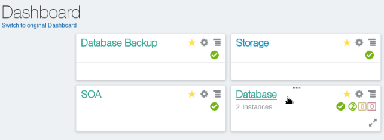

-   From this page you can view general information about this Database
    Cloud Service. Click on the **Open Service Console** button.

	

-   From the console, click **Create Service**

	

### **STEP 7**:  Identify the Instance Configuration

When providing a name, please note you may have another service instance
already created in your account, so the name must be unique.

-   Enter **Alpha01B-DBCS** in the **Service Name** field

	

-   Enter **Alpha Office Database Cloud Service** in the **Description** field

	

-   Select **Oracle Database Cloud Service** for the **Service Level**

	

-   Select **Hourly** for the **Metering Frequency**

	

-   Select **Oracle Database 12c Release 1** for the **Software	Release**

	

-   Select **Enterprise Edition** for **Software Edition**

	

-   Select **Database Type** for **Single Instance**

	

-   Your selections should appear as below. Click on the **Next** Button to navigate to the Service Details page.

	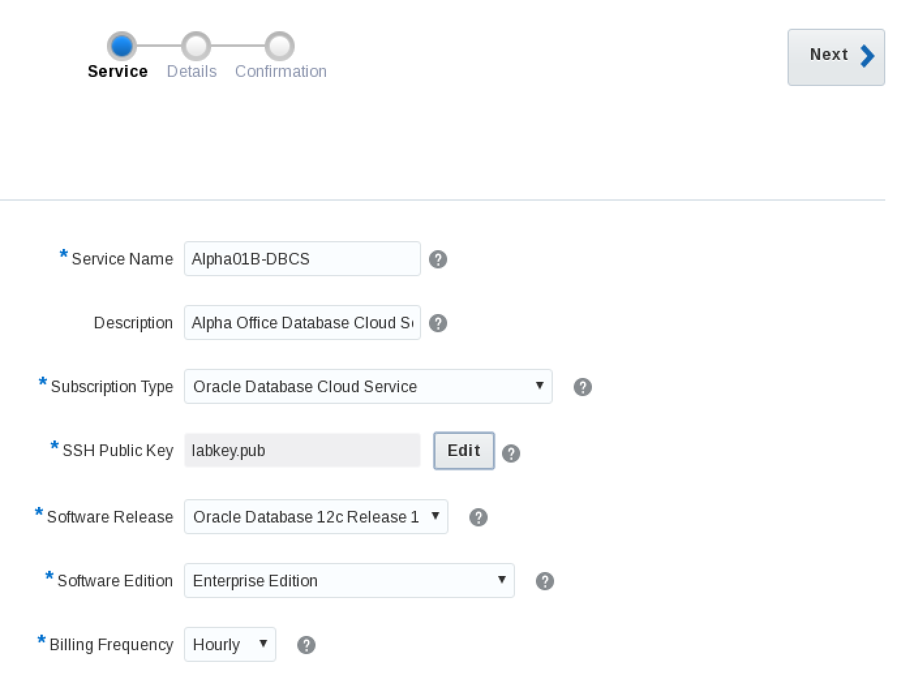

-   In the **Database Configuration section**, provide the following:

	```
	DB Name (SID) = ORCL
	PDB Name = PDB1
	Administration Password = Alpha2014_
	Confirm Password = Alpha2014_
	Usable Database Storage (GB) = Use Default (25)
	Total Data File Storage (GB) = Use Default (88.5)
	Compute Shape = OC3 - 1 OCPU, 7.5 GB RAM
	```
	
	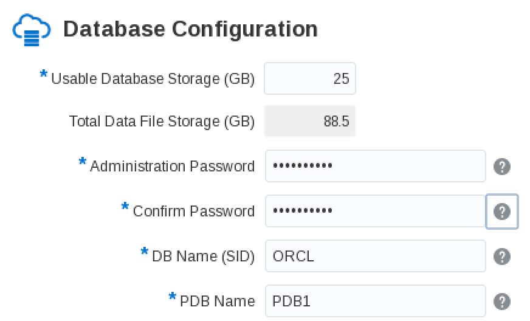

-   Click on the **Edit** button next to the **SSH Public Key** field

	

-   Click on the **Choose File button** next to the **Key File Name** field

	

-   Click on the **OPCWorkshop** folder, then double click on the **lab** folder

	

-   Scroll down the list of files, and select the **labkey.pub** file.  Then click on the **Open button**.

	


-   In the **Backup and Recovery Configuration** section, provide the following:
	
	```
	Backup Destination = Both Cloud Storage and Local Storage
	Cloud Storage Container = Storage-<your domain name>/Alpha01B_DBCS_SC
	Cloud Storage User Name = <your Cloud user name>
	Cloud Storage Password = <your Cloud password>
	Check the Create Cloud Storage Container box
	```
	
	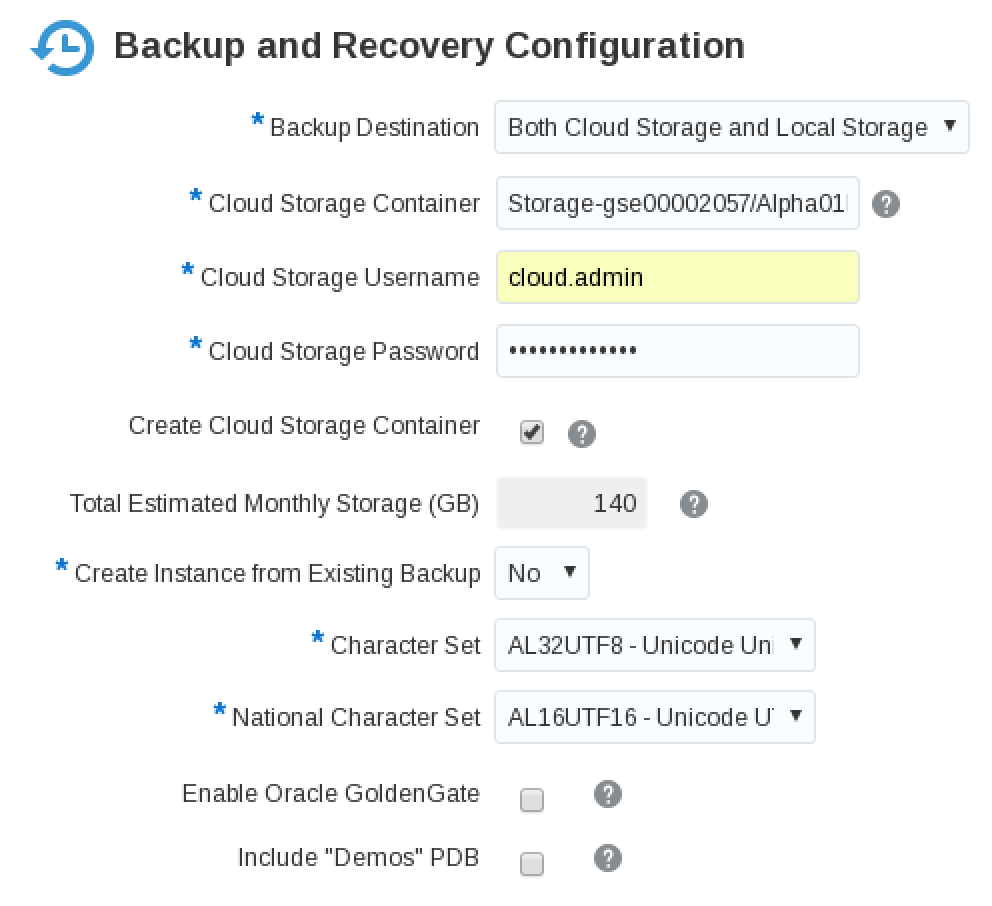

-   Your Service Details screen should appear as follows: Click on the **Next** button

	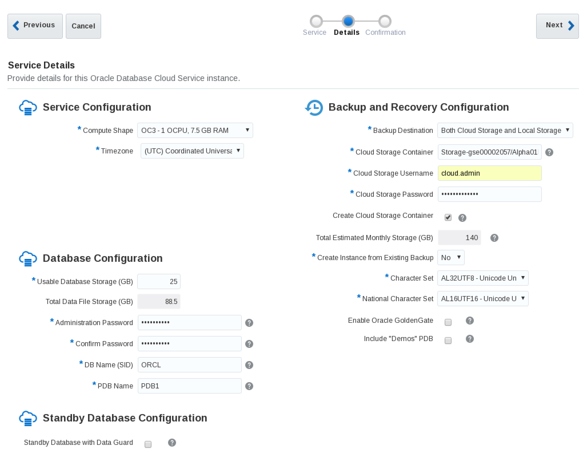

-   Confirm the Database Cloud Service configuration is correct, and click on the **Create** button:

	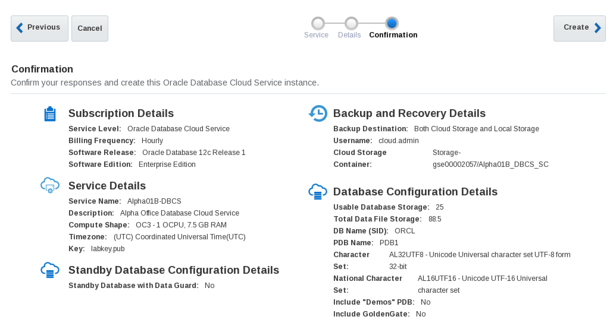

-   You should now see your new Database Cloud Service instance **Alpha01B-DBCS**

	

-   The creation of the DBCS instance will take approximately 20
    minutes. While your DBCS instance is being created, you can monitor
    the progress by clicking on the **In Progress** link, and view the
    current status.

	**NOTE**: We will continue with the lab by utilizing **Alpha01A-DBCS** DBCS instance already created. Alpha01A-DBCS was created following the exact steps you just performed.

	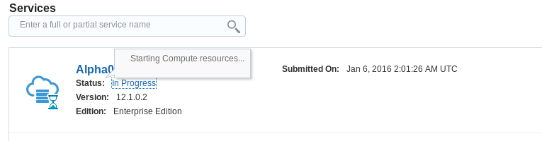

## SSH Configuration and Image Exploration

**Record IP address of Database Cloud Service**

In the upcoming steps you will record the IP addresses of the Virtual
Machine on which the cloud service runs. You will then update the ssh
configuration file for **Alpha01A-DBCS**.

### **STEP 8**:  Record the IP address of the Database Cloud Service

-   Click on **Alpha01A-DBCS** from the list of Database Instances

	

-   Note the IP address of **Alpha01A-DBCS**. In this example, we will note the IP address of 129.144.19.238

	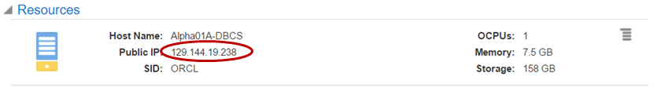

**Create SSH config file and start tunnels**

### **STEP 9**:  Run the SSH configuration script to start tunnels in the background

For security reasons the default Oracle Public Cloud network
configuration is locked down. You have the option of opening up ports to
the various servers in your environment by ether using the Compute Cloud
Service console and creating/re-using protocol definitions and access
rules OR you can create SSH tunnels to the specific server/port
combinations as needed. This lab and the rest of the labs require access
via development tools and the browser to various admin consoles running
on the cloud servers themselves.

In this step you will run a script that creates and configures a SSH
file used to connect to your various servers. Once the script is
generated, it will create SSH tunnels in the background with connections
via selected ports used in this and other labs.

-   Open a terminal Window by clicking the terminal icon in the screen's
    top menu bar:

	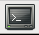

-   cd into the lab directory **cd lab**

-   Type **./setssh.sh DBONLY**

	```
	./setssh.sh DBONLY
	```
	
	If you make an error you'll see:

	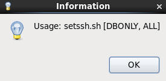

-   If the script runs successfully, you will enter the DB IP address
    obtained in Step 6. Click **OK**.

	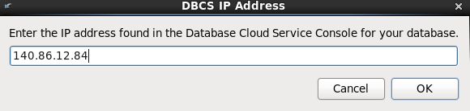

-   The script will try a test connection to your server. If it
    encounters errors, you will be re-prompted to enter the IP address.
    If successful, a SSH configuration file is created and a SSH session
    to the DB server will be placed in the background. A successful
    completion will show:

	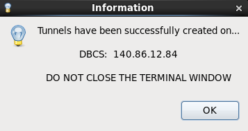

-   Click **OK**

-   You can look at the generated configuration file by type **gedit
    myssh** within the terminal window. Notice under the **Host
    AlphaDBCS** section of the config file that the DBCS IP address has
    been inserted in 5 areas defining LocalForward ports (1526, 443,
    4848, and 5500). These ports can now be accessed locally using
    “localhost” in connection information or URLs.

	Example:

	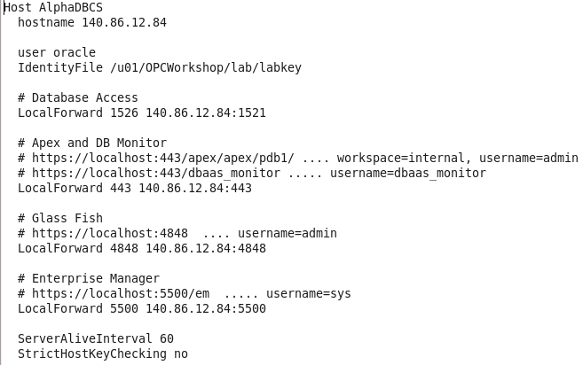

-   Close the edit session.

-   You can also do **ps -ef | grep DBCS** to see the running background
    session.

	```
	ps -ef | grep DBCS
	```

	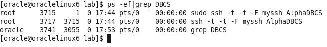

## Explore DB image via SSH

### **STEP 10**:  Open a new SSH Connection to browse the database image

In the previous step, SSH tunnels were started in the background to
support our browser and development tools. In this step, we will
demonstrate how to do an explicit SSH into your DB cloud server.

-   In the same terminal window you ran the setssh.sh script; enter the
    following command using the IP address for your DBCS cloud instance.

	```
	ssh -o StrictHostKeyChecking=no -i ./labkey oracle@<your-DB-IP>;
	```
	
	

-   Now that you are connected to **Alpha01A-DBCS,** let's look around. Issue a **df** command to see mounted disks.

	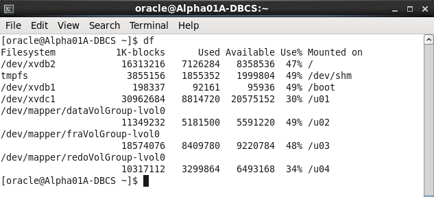

-   Issue the following command to view the Database environment
    variable.

	```
	env | grep ORA
	```

	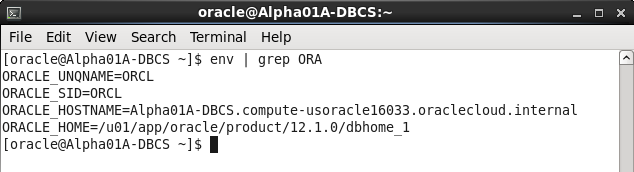

-   Now let's change directories to the Oracle Home and list the
    directories.

	```
	cd $ORACLE_HOME
	ls
	```

	

-   Type **exit** to close the remote Database Image ssh session.

	**NOTE:** By typing exit once, you are only exiting the Cloud DBCS Service. Do not exit the Terminal window, as we have the SSH Tunnels running in the background, and these SSH Tunnels will be used during the remainder of the lab.

## Access the Database Consoles

**Access DB Monitor, Apex, EM Consoles**

**NOTE: For any of the URLs mentioned in this section you can also use
the predefined browser links. If blocked ports on the network cause an
issue loading any of these consoles, the predefined browser links will
help by routing the traffic through the SSH tunnel that should already
be open:**


### **STEP 11**:  Access Database Monitor

To gain access to the various consoles used by the Database Cloud
Service you have two options. You can open up the port on which the
monitor is listening, or you can create a SSH tunnels to the specific
server/port combinations as needed. We have already created the SSH
tunnel and that will be used to access most of the consoles.

In this step you will open the port 443 on the VM using a pre-create
access rule and protocol definition.

-   If not already on the **Alpha01A-DBCS** details page, navigate back
    to Database Cloud Service console and click on **Alpha01A-DBCS** to get
    to this page.

	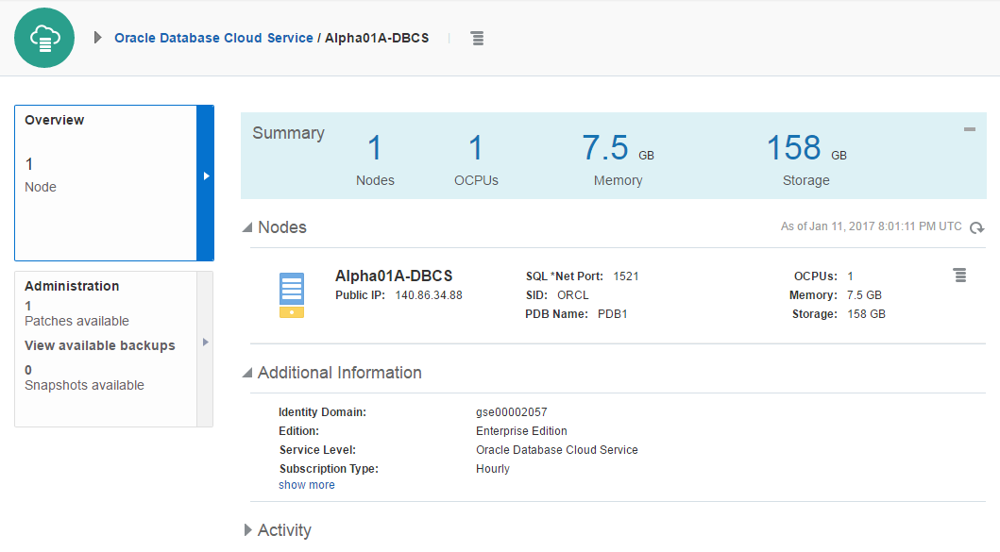

-   At the top of the page click  next to the instance name **Alpha01A-DBCS** and select **Access Rules**.

	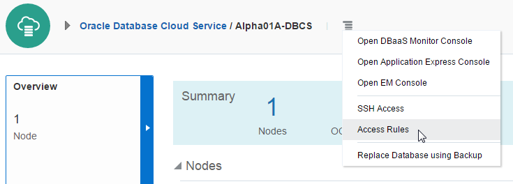

-   From this screen you see all the **Access Rules** that have been
    created for this instance

	

-   Rule name **ora\_p2\_httpssl** is setup to open port 443 to the public internet. Click on the **hamburger menu**  for this rule and select **Enable**

	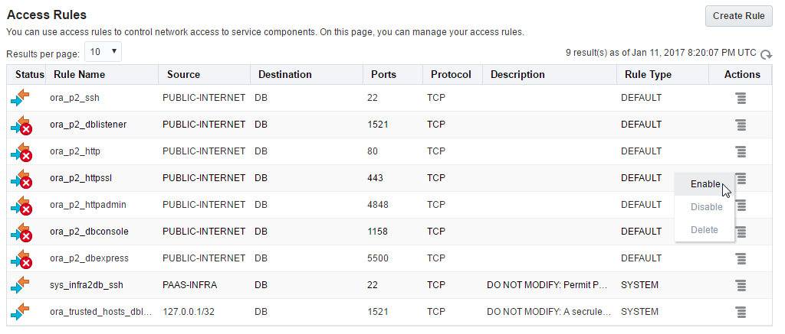

-   On Enable Access Rule popup window, click **Enable**.


-   You should now see that the Access Rule **ora\_p2\_httpssl** is
    enabled. Click on **Oracle Database Cloud Service** to navigate back
    to the Service Console

	

-   For the **Alpha01A-DBCS** instance click the **hamburger menu**  and select **Open DBaaS Monitor Console.**

	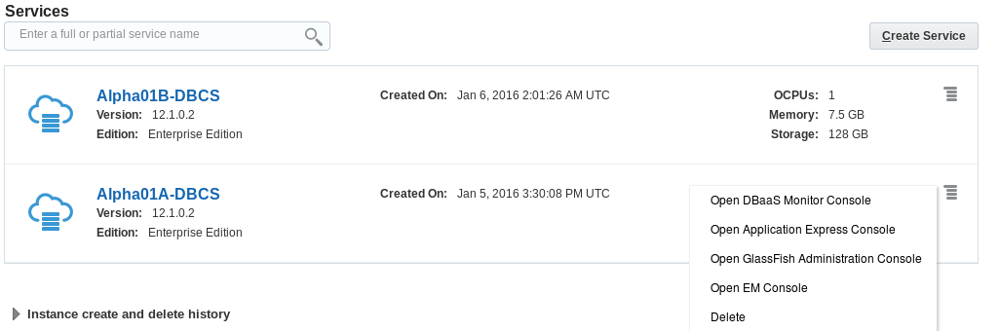

-   If you get a security warning, click **ADVANCED** followed by **Proceed to...**

	

-   When prompted, enter **dbaas\_monitor** for the **User Name** and **Alpha2014\_** for the **Password**.

	
	
-   Once connected to the Database Monitor Console, feel free to explore the various screens.

	

### **STEP 12**:  Access Enterprise Manager DB Express

-   On the browser, open a new tab, and **enter** the following **URL**
    to access the **EM Express** page. The first time the URL is used,
    it can take a minute for the console to load. **Note**: The
    setssh.sh script that you ran earlier in this lab created the ssh
    tunnel that will cause all traffic referencing localhost:5500 to
    actually be routed to the database cloud service.

https://localhost:5500/em


-   If you get a security warning, click **ADVANCED** followed by **Proceed to localhost (unsafe)**

	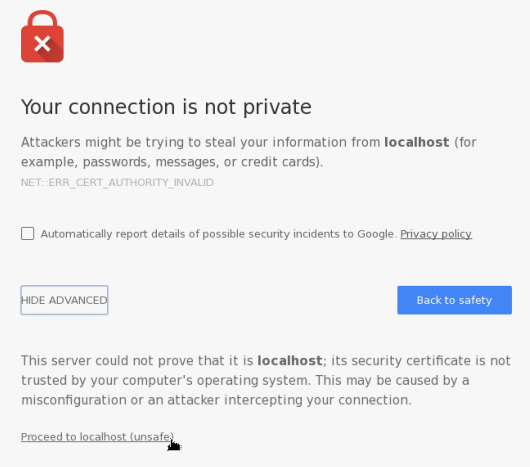

-   On the EM login page enter the following and click on **Login**:

	```
	User Name: sys
	Password: Alpha2014_
	Select the “as sysdba” box.
	```

	

-   Feel free to explore the Enterprise Manager console.

	

### **STEP 13**:  Access Apex Monitor

-   Enter the following URL into a browser window to access the **Apex
    console** (click to add a security exception if necessary).
    **Note**: All traffic to the default https port (443) on local host
    is also routed through the ssh tunnel to the database cloud service.

	https://localhost/apex/pdb1/

	

-   If you get a security warning, click **ADVANCED** followed by **Proceed to localhost (unsafe)**

	

-   Once the Apex login window is displayed, **enter the following** and click on **Sign In**:

	```
	Workspace: internal
	Username: ADMIN
	Password: Alpha2014_
	```
	

-   You are now connected to Apex. Feel free to explore the menu
    options.

	

-   You are now ready to move to the next lab.
