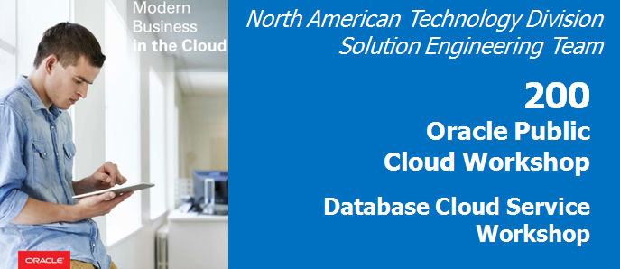

Update March 28, 2017

## Introduction

In this lab, you will explore some common use cases for moving your data from on-premises to the cloud. There are multiple options for solving this data movement challenge. In this lab, we will use SQL\*Developer and command line tools to clone and move a pluggable database from your on-premises database (your Virtual Machine) to your cloud database. You will also use standard Oracle Data Pump tools to export a schema from the on-premises database, and then import that data to your cloud database in a new schema. The final exercise uses the SQL Developer cart feature to quickly move data from the local database to the cloud using only the privileges of a normal schema owner.

- To log issues and view the Lab Guide source, go to the [github oracle](https://github.com/pcdavies/DatabaseCloudService/tree/master/dbcs) repository.

## Objectives

-   Clone, unplug, transfer and plug the AlphaPDB pluggable database using SQL Developer.

-   Export and import a schema using SQL Developer to execute Oracle Data Pump jobs.

-   Export and import a small collection of tables using SQL Developer.

## Required Artifacts

-   The following labs assume that the steps outlined in lab guide 100 have been completed.

-   The SSH tunnels must be active in a terminal window.

# Cloud Migration Using Pluggable Databases

## Configure the Environment

### **STEP 1**:  Start the on-premise Oracle Database

-   From the VNC Session desktop, locate and double-click on the **StartDB** icon.

	

-   It will take a minute for the Database to fully start. Once the Database has succesfully started, the Log Window will automatically close.

### **STEP 2**:  Open a **DBA Navigator** connection to the on-premise database

-   From the VNC Session desktop, locate and double-click on the **SQL Developer** icon. ***NOTE***: The first time SQL Developer is brought up; it may take some time to instantiate.

	

-   Double-click the **On-premises** folder to expand the list of
    database connections. Please note the pre-configured connections to
    the on-premises database.

	

-   Select the **View** -> **DBA** menu option from the top dropdown menu.

	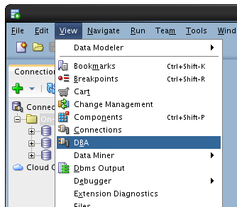

-   On the DBA tab, click the green plus icon to create a new connection.

	**Note**: you may also right-click on Connections and select Add Connection.

	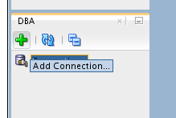

-   Select the **sys - CDB** connection and click **OK**. 

	**Note: sys - CDB** is an “on-premises” database located on the Virtual Box Image.

	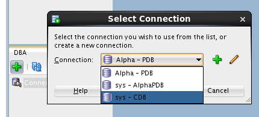

-   Expand the **sys - CDB connect**, and then expand the **Container
    Database** tree item. Click on the **ALPHAPDB** pluggable database
    to show the details for the pluggable database.

	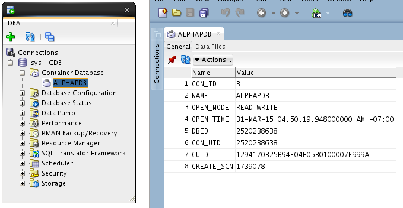

## Clone the ALPHAPDB

### **STEP 3**:  Clone ALPHAPDB

-   In the DBA Navigator panel, right click on the ALPHAPDB pluggable database and select the **Clone Pluggable Database...** menu option.

	

-   Enter the following:

	**Database Name**: `ALPHACLONE`
	
	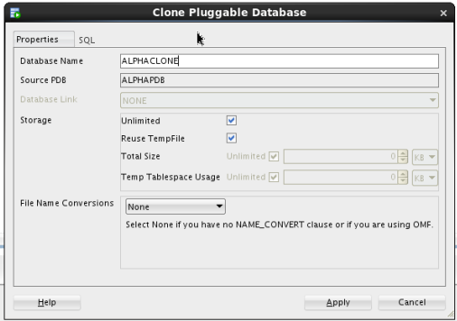

-   Select **Custom Names** from File Name Conversions and review the
    Source File names - note the "**/AlphaPDB/**" directory name of
    the source file names. For a successful cloning operation, we must
    create new target files different than the source files.

	

	**Note**: At this point we could manually change all the target files to point to a different directory, but there is an easier way.

-   Select **Custom Expressions** from the File Name Conversions drop
    down. Click the **green plus icon** and enter the source directory
    portion we want to change, followed by the target for the new files. 
	
	Enter the following - please use the indicated upper and lower case letters:

	**Source File Pattern**: `AlphaPDB`

	**Target File Pattern**: `AlphaClone`
	
	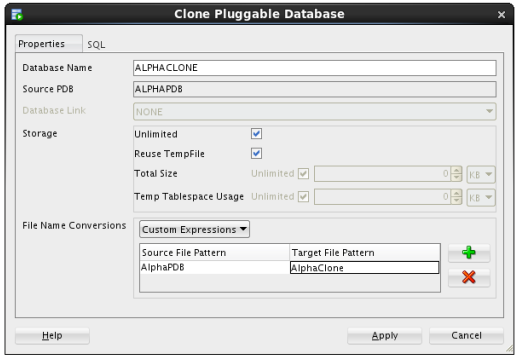

-   Review the SQL statement by clicking on the SQL tab - note the ***FILE_NAME_CONVERT*** clause mapping the existing files to new files in a new directory. Click the **Apply** button.

	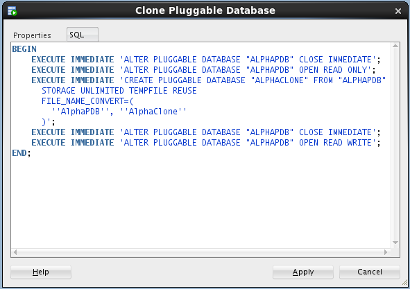

-   SQL Developer shows the action in-progress message for roughly 1-2 minutes followed by a success message. Click **OK** on the success message.

			

-   Click on the **ALPHACLONE** database in the DBA navigator to see the status of the database.

	**Note**: The cloned database shows an **OPEN_MODE** of **MOUNTED** indicating the database is plugged-in but is not open for access.

	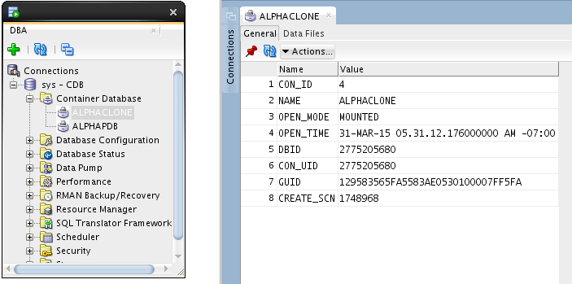

-   Click on the **Data Files** tab for the ALPHACLONE to review the data files created during the cloning operation.

	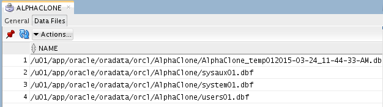

## Create SSH Host

### **STEP 4**:  Create SSH and SYS Database Cloud Connections

-   First we need to setup a SSH host connection to the Database Cloud Service instance. From the top menu select **View -> SSH** to display SSH hosts panel on the left.

	  

-   Right click on **SSH Hosts** and select **New SSH Host**.

	

-   We will now configure an SSH connection to our DBCS instance

	**Name**: `Alpha01-DBCS`

	**Host**: `<public IP you obtained in lab 100>`

	**Username**: `oracle`
	
	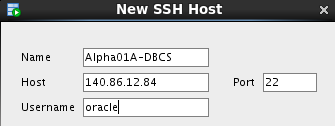

-   Select **Use key file** and click **Browse...** Select file **/u01/OPCWorkshop/lab/labkey** and click **Open**.

	

-   Click **Add a Local Port Forward** and enter the following values:

	**Name**: `Database`

	**Host**: `<Public IP you obtained in lab 100>`
	
-   Select **Use specific local port** and enter **1530**

	**NOTE**: We are using port 1530 since 1521 is already in use for our local database.

	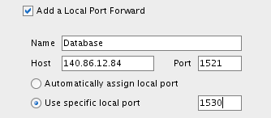

-   Verify the configuration and click **OK**

### **STEP 5**:  Create a SQL Developer connection to the Public Cloud database SYS schema

-   Click the green plus sign  in the **Connections** window to create a new connection; enter the following connection details:

	**Connection Name**: 	`sys - OPCDBCS`

	**Username**: 			`sys`

	**Password**:			`Alpha2014_`

	**Check** 				"Save Password"

	**Optionally select a color for the connection**

	**ConnectionType**: 	`SSH`

	**Role**:				`SYSDBA`

	**Service Name**: 		`ORCL.<Your ID Domain>.oraclecloud.internal`
	
	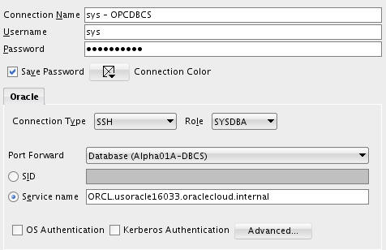

-   Click **Test** to confirm the information was entered correctly.

	

-   Click **Connect** to save the connection information which opens a
    new SQL Worksheet.

	

## Copy the Clone Pluggable Database to the Cloud

### **STEP 6**:  Copy ALPHACLONE pluggable database to the Cloud

-   Click on **View -> Task Progress** to open up the Task Progress window.

-   In the DBA window right-click on **ALPHACLONE** and select “**Clone PDB to Oracle Cloud**”

	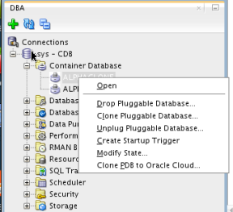

-   Verify the defaults and include your Public Cloud Connection. Click **Apply**.

	**Source PDB**: 			`ALPHACLONE`

	**Destination Connection**: `sys - OPCDBCS`

	**Action after clone**: 	`RePlug`
	
	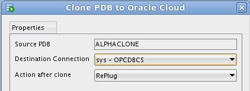

-   You will note in the Task Progress window the progress of moving the
    datafiles over to the cloud database. This task will take about a
    minute to complete. ***Note: An Error/Warning will display*** at the end of this
    task, which is **Normal**.

	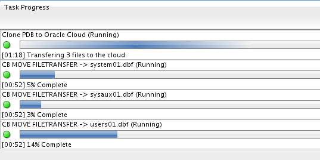

-   Upon completion, a couple of pop ups will reveal Plugin Violations.
    This is because the patch level of the local ALPHACLONE pluggable
    database is different than the Container database in the cloud. We
    will remedy this shortly. Click **OK** as **each** of the popups is received. The
    datafiles are transferred despite what the pop up implies.

	  

### **STEP 7**:  Access EM Express for the Cloud database

-   Open Chrome by clicking the icon on the menu bar or the Desktop.

	

-   Enter the following URL into the Address bar or click the "**EM
    Express - DB**" link in the header bar - note: when using
    localhost:5500 in the URL below, your browser request is routed
    through the ssh proxy you loaded in a terminal window in Lab 100. If
    for some reason that window was closed, or is not working, you
    should refer back to lab 100:

	https://localhost:5500/em

	

-   Enter the following login credentials, check the "**as sysdba**" box and click the Login button:

	**User Name**:	`sys`

	**Password**:	`Alpha2014_`
	
	**Check**: `as sysdba`
	
	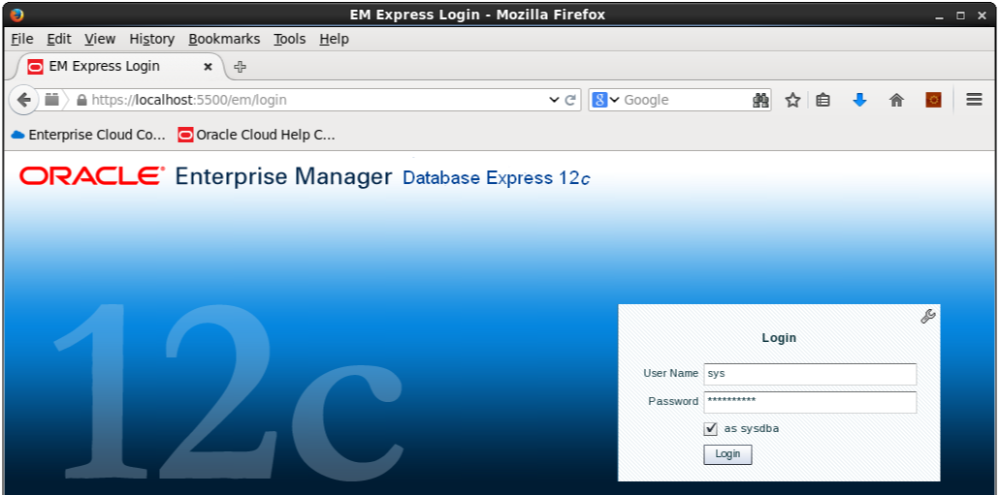

### **STEP 8**:  Plug the Alpha Clone database into the Cloud database

-   From the Database Home page, click the **CDB(1 PDBs)** link.

	

-   Open the **Actions** list in the **Containers** panel, and select the **Plug** command

	 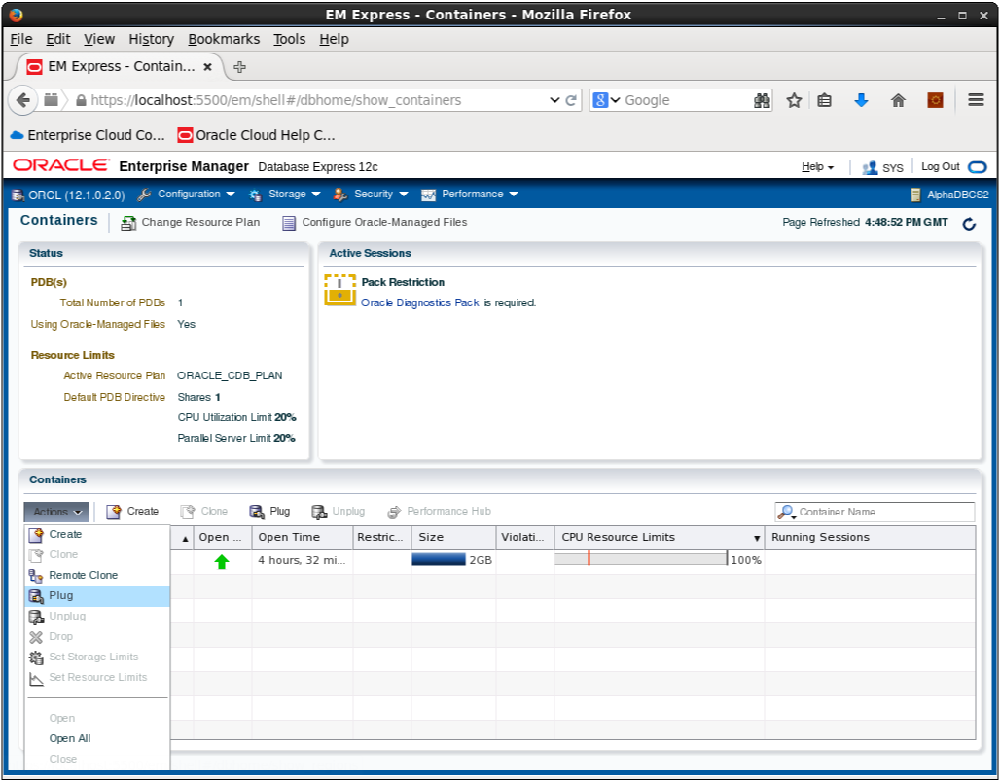

-   Enter the following on the Plug PDB dialog box and then click the **OK** button:

	**Metadata File**:	`/u02/app/oracle/oradata/ORCL/ALPHACLONE/ALPHACLONE.XML`

	**Uncheck** the **Resuse source datafile location from Metadata File** check box

	**Source Datafile Location**: `/u02/app/oracle/oradata/ORCL/ALPHACLONE`
	
	

-   The Processing message displays for the 2 minutes (approximately)
    required to plug the database into the container. Click the **OK**
    button when the Confirmation message displays.

		

-   Notice the database is now in the list of Containers. **There will be Violations because of the patch level mismatch between the original source Pluggable database and the Cloud Container database**.

	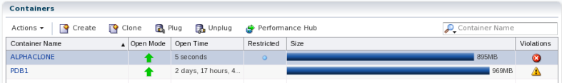

-   Using your open Terminal window, you now need to SSH into your Cloud
    database server. An Example is shown below. Substitute **your Cloud
    database server IP address**:

	```
	ssh -o ServerAliveInterval=60 -i /u01/OPCWorkshop/lab/labkey oracle@<your-IP-address>
	```

	

-   We'll need to run “**datapatch**” to apply any missing patches. It should run with no errors.

	**Note: If it complains the first time about not being able to determine the current opatch status, then wait a minute until it's had time to pick up the newly cloned pluggable database and retry.**

	```
	$ORACLE_HOME/OPatch/datapatch -verbose
	```

	

	

### **STEP 9**:  Upgrade PDB

-   If the error message is “**The pluggable databases that need to be
    patched must be in upgrade mode**” complete this Upgrade PDB Step.
    If not, move to the next step titled **(Close and Reopen ALPHACLONE PDB)**.

	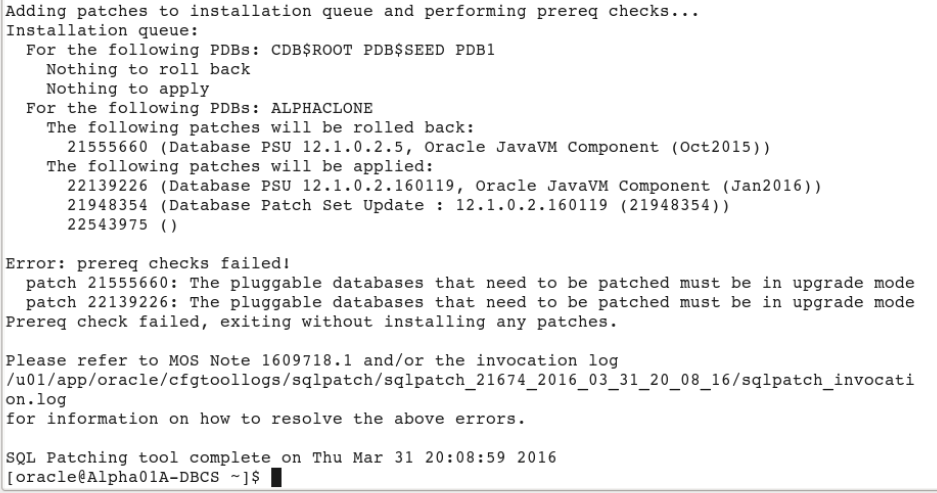

-   Connect to container database using SQL Plus and place the database
    in **upgrade mode**. Once completed run **datapatch** again and you
    should have no errors.

	```
	sqlplus / as sysdba
	alter pluggable database ALPHACLONE close;
	alter pluggable database ALPHACLONE open upgrade;
	exit
		
	$ORACLE_HOME/OPatch/datapatch -verbose
	```

	

	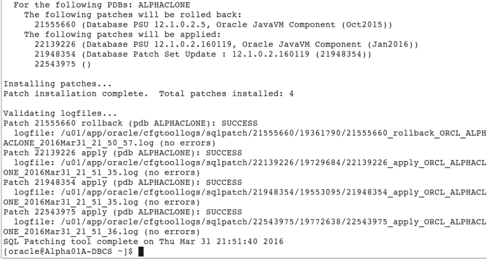

### **STEP 10**:  Close and Reopen the ALPHACLONE PDB

-   The final step is to close and reopen the ALPHACLONE pluggable
    database. Go back to EM Express, with the ALPHACLONE row highlighted
    (DO NOT CLICK THE ALPHACLONE LINK). Select **Actions -> Close**.

	

-   Take the defaults and Click **OK**.

	

-   Close the Confirmation pop up by clicking **OK**.

-   Now reopen the pluggable database via **Actions -> Open**. Take the default to open it Read / Write. Click **OK**.

	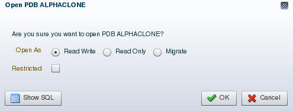

-   Close the Confirmation pop up by clicking **OK**.

-   Refresh the browser page using the refresh icon in the top right corner.

    

-   You will note that the violations are now gone for ALPHACLONE.

	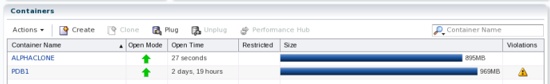

-   Click the **ALPHACLONE** container name link to review the database
    information.

	

### **STEP 11**:  Create a SQL Developer connection to the Public Cloud database ALPHACLONE schema

-   Back in SQL Developer, click the green plus sign  in the Connections window to create a new connection; enter the following connection details:

	
	**Connection Name**:	`Alpha Clone - DBCS`

	**Username**:			`alpha`

	**Password**:			`oracle`

	**Check** "Save Password"

	**Optionally select a color for the connection**

	**ConnectionType**:		`SSH`

	**Service Name**:		`alphaclone.<Your ID Domain>.oraclecloud.internal`
	
	
	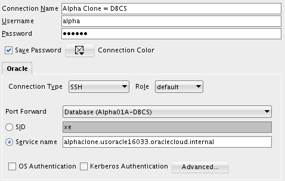

-   Click **Test** to confirm the information was entered correctly.

	
 
-   Click **Connect** to save the connection information and open a new SQL Worksheet.

	

# Cloud Migration Using Data Pump

## Export the Alpha Schema

**Note**: The default Data Pump directory object, DATA\_PUMP\_DIR, does
not work with PDBs. Data Pump requires an explicit directory object
within the PDB that is exporting or importing schemas or tables.

### **STEP 12**:  Create a Local Data Pump Directory

-   In the Connections Tab inside the "**On-Premise**" folder navigate to the **Alpha - PDB Directories** item, right-mouse click and select **Create Directory...**

	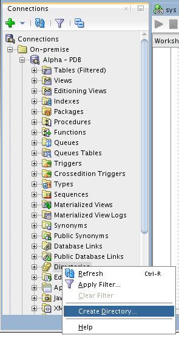

-   Enter the following values and click **Apply**. Remember to use the
    SQL tab to review the actual DDL statement. Click **OK** to dismiss
    the confirmation.

	**Directory Name**:				`alpha_backup_dir` (not case sensitive)

	**Database Server Directory**:	`/u01/OPCWorkshop`

	**NOTE:** Sometimes an error msg shows up saying it cannot create the directory. Just right-click on **Alpha - PDB** and do a **Disconnect** and then a **Reconnect**. This is because if you were connected before doing the UNMOUNT / REMOUNT during the previous "cloning" of the pdb container the connection information is lost and you have to ReConnect from within the Connections window
	
	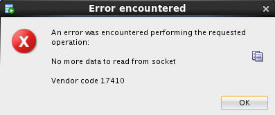
	
	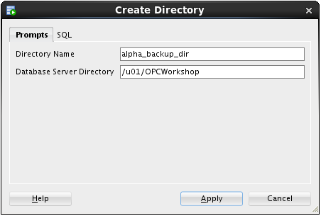
	
	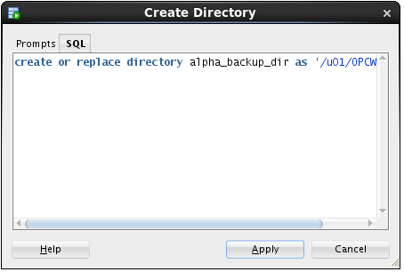
	
	

### **STEP 13**:  Create and run a Data Pump Export job using SQL Developer

-   In the DBA Window, **Add Connection** by clicking on the Green Plus sign.

	
	
-   Select the **Alpha - PDB** connection and click the **OK** button.

	

-   Expand **Alpha - PDB**, expand **Data Pump**, then right-mouse-click
    on **Export Jobs,** and then select **Data Pump Export Wizard...**
    menu item.

	

-   For this export, select **Schemas** type and click the **Next** button.

	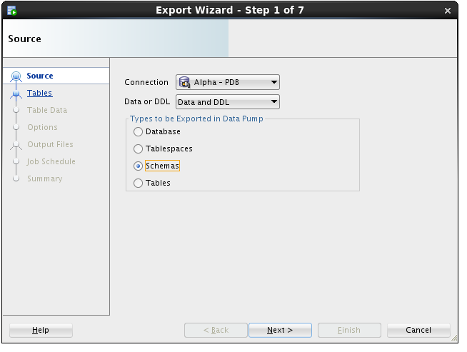

-   Select the **ALPHA** schema and move it to the right-hand column. Click **Next**.

	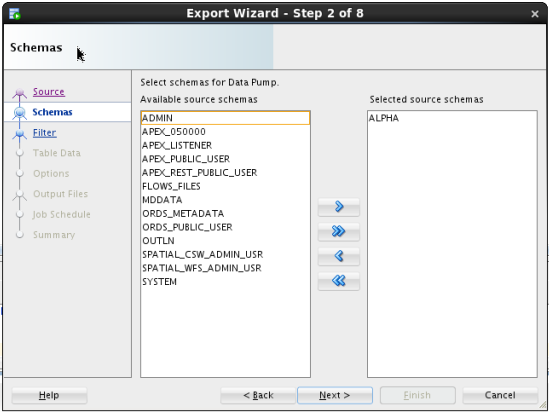

-   We are not filtering out any object so simply click the **Next** button.

	

-   We are not applying any “where” clauses to table data, so simply click the **Next** button.

	

-   We do want a log for this export, and just like the actual export
    file, we must pick a directory from the list of directories in the
    database. Select **ALPHA\_BACKUP\_DIR** from the list and click the
    **Next** button.

	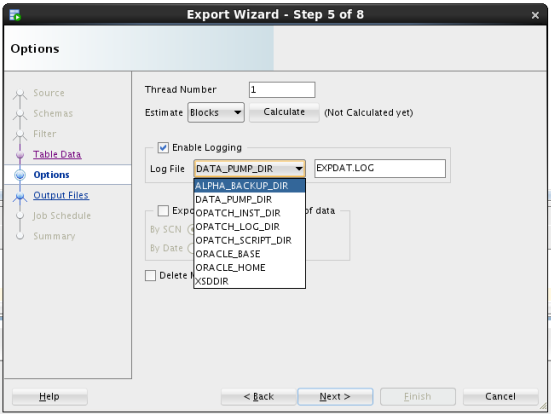

-   The most important selection for any Data Pump operation is choosing
    the directory where the export file will be written. Select
    **ALPHA\_BACKUP\_DIR** from the Directories drop down list. Then,
    select the **Delete Existing Dump Files** radio button and click the
    **Next** button. 
	
	**Note**: Data Pump always uses a server side directory for all export or import operations.

	

-   Data Pump jobs can be scheduled to run at any time and on any
    desired times of the day, week or year. For this lab, the job will
    be run immediately - click the **Next** button.

	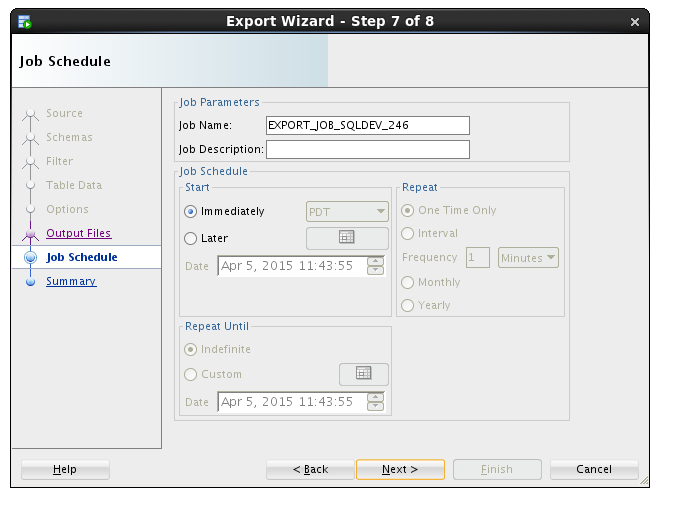

-   On the Summary panel, click the **PL/SQL** tab to review the job
    definition. Review the PL/SQL use of Oracle Supplied PL/SQL
    subprograms for Data Pump. Click the **Finish** button to create the
    job.

	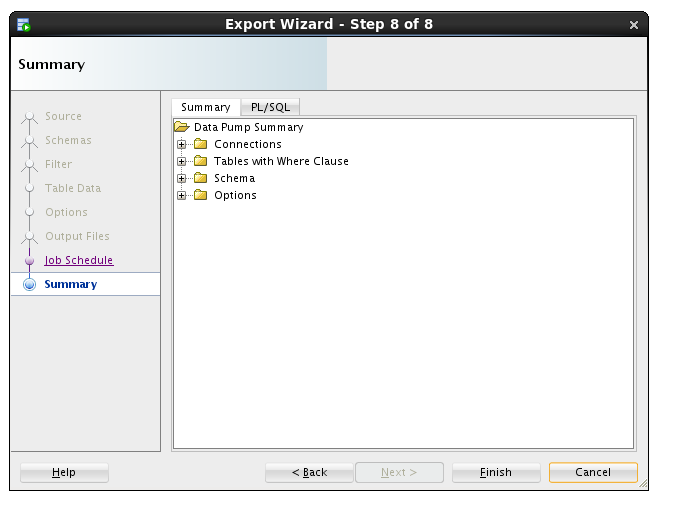		

-   For a brief time, SQL Developer shows a progress dialog while it
    creates the job in the database. Note: the import actually runs as a
    job in the database so this message is only about creating and
    scheduling the export.

	

-   While the job is running, you may view status information by
    clicking on the export job added to the DBA Navigator panel. It may
    take a couple of minutes so click the **Refresh**
    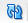 icon until the job is completed (NOT
    RUNNING).

			

### **STEP 14**:  Copy the export Data Pump file to the server

-   Start a new Terminal window using the top panel icon.

	

-   Using the following commands to print the working directory (**pwd**), list the directory (**ls**) contents and review the Data Pump log file.

    Enter the following commands:

	```
	pwd
	ls
	cat EXPDAT.LOG
	```
	
	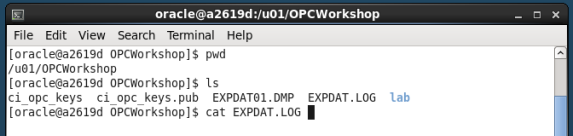

	

-   Use the following secure copy (**scp**) command to transfer the Data Pump export to the DBCS server. 
	
	**Note:** the tilde (~) represents the oracle user's home directory.
    
    Enter the following command using your Database Service's Public IP address identified in Lab 100:

	```
	scp -i lab/labkey EXPDAT01.DMP oracle@{your public IP}:~
	```
	
	

## Import Alpha to a new Schema

### **STEP 15**:  Create a directory in the Alpha Clone PDB

-   Back in SQL Developer in the Connection panel, expand the **Alpha Clone - DBCS** connection.
    Right-mouse-click on the **Directories** tree item and select the
    **Create  Directory...** menu item.

	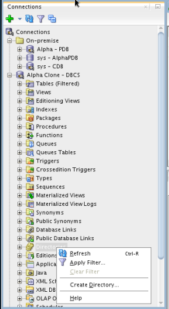

-   Enter the following values and click the **Apply** button. Click
    **OK** to dismiss the confirmation message. This lets the database
    access the same directory where the Data Pump export file was
    copied.

	**Directory Name**:				`alpha_import_dir`

	**Database Server Directory**:	`/home/oracle`

			
	
### **STEP 16**:  Create the Data Pump Import job

-   To access the Data Pump features, we need to add the clone
    connection to the DBA Navigator. Click on the Add Connection icon on
    the DBA Navigator panel

	

-   Select the **Alpha Clone - DBCS** connection and click the **OK** button.

	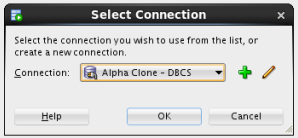

-   Expand **Alpha Clone - DBCS** > **Data Pumps**, Right-mouse on the
    **Import Jobs** menu item, and select **Data Pump Import Wizard...**
    menu item.

	

-   Select **Schemas** and the **ALPHA\_IMPORT\_DIR** then click **Next**.

	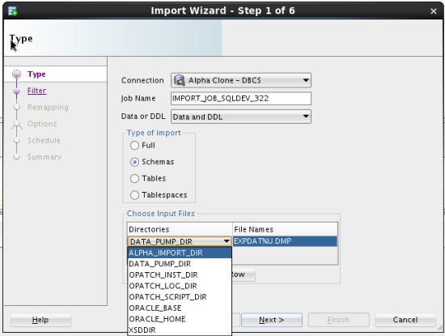

-   There is some wait time while the database locates and scans the import file in the selected directory.

	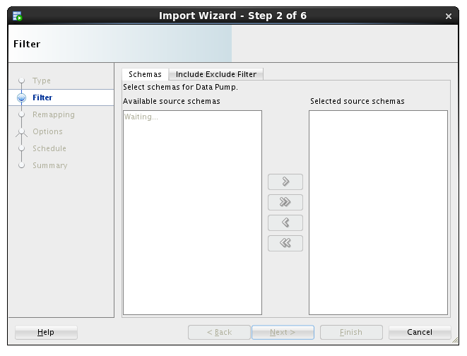

-   Move the **ALPHA** schema from the left to the right column and click the **Next** button.

	

-   For this lab, we are creating a new schema, so we will enter the new
    schema name as the destination. Under the Re-Map Schemas section
    click **Add Row**. Enter the following values and click the **Next**
    button.

	**Source**: 		`ALPHA`		(should be defaulted)

	**Destination**:	`ALPHA_COPY`
	
	

-   We want to see the log output so we will select the same directory as the import file directory. Select **ALPHA\_IMPORT\_DIR** and click the **Next** button.

	

-   For this lab, we will execute the import immediately. In a
    real-world scenario, this job could be refreshing a development
    database daily. Click the **Next** button.

	

-   Click the PL/SQL tab to review the small program that establishes the import job. Click the **Finish** button to create the job.

	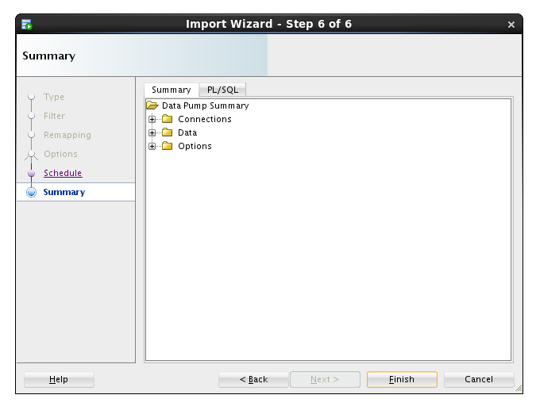	

-   For a period of time, SQL Developer shows a progress dialog while
    the job is created. Remember, the job does not run locally so this
    is only the progress of creating the job in the database.

	

-   Locate and click on the job name to see the detailed status as the
    job runs. When the job completes, the database automatically removes
    the job. You will need to use the **Refresh** icon
     to see when the job finishes. The
    Job **State** will display **NOT RUNNING** when the Job has
    successfully completed.

	
	
	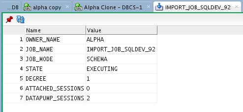

-   If you desire to verify that the ALPHA_COPY schema is the same as the ALPHA schema, feel free to create a connection and compare.

# Cloud Migration Using SQL Developer Carts

## SQL Developer Cart

The SQL Developer Cart is a convenient method for organizing the
deployment of database objects and data from one database to another. In
this trivial example, we want to update the data of just the CUSTOMERS
and PRODUCTS table in the development cloud database. More elaborate
usages of the cart can help package entire application deployments,
including pre and post processes from multiple data sources.

### **STEP 17**:  Create a new Cart

-   Show the Cart using the **View -> Cart** menu option.

	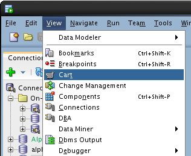

-   If Cart_1 is not already created (it should be), Click on the **New Cart** icon.

	

-   Drag the **CUSTOMERS** table from the **On-premise** > **Alpha - PDB** connection to the cart.

	

-   Now drag the **PRODUCTS** table to the cart.

	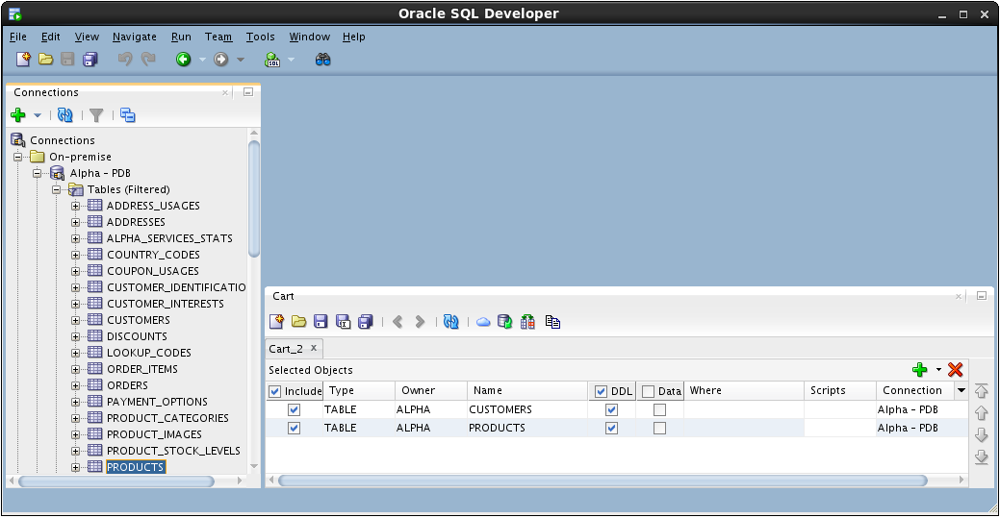

-   Include a script that runs before any other Cart activity. For this
    lab, we are disabling all the referential integrity constraints so
    we can delete and insert data without regard to foreign keys on our
    tables. In the Cart window click **drop down arrow** next to the
    **green plus** “+” and select **Add Initial Script**

	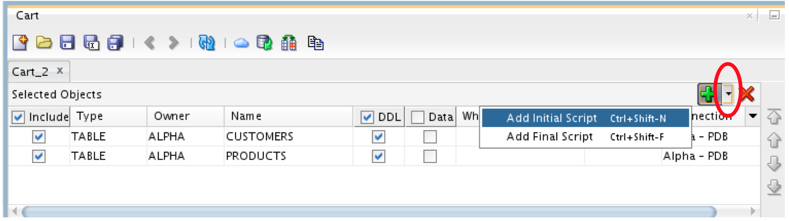

-   Click the **Browse...** button.

	

-   Locate the following file and click **Open**:

	```
	/u01/OPCWorkshop/lab/disable-constraints.sql
	```

	

-   Click **OK**.

-   Click **drop down arrow** next to the **green plus** “+” again and
    select **Add Final Script** that is included at the last operation
    performed during the cart operations. **Note: there can only be one
    Initial or Final script in a Cart.**

	

-   Click the **Browse...** button

	

-   Locate the following file and click **Open**:

	```
	/u01/OPCWorkshop/lab/enable-constraints.sql
	```

	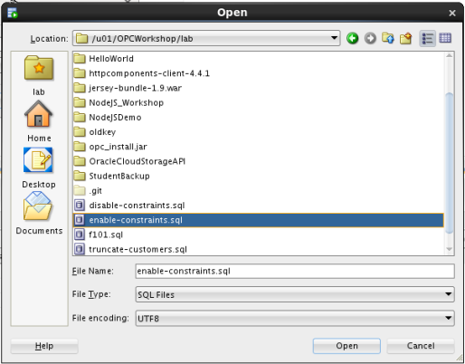

-   Click **OK**.

-   We are not creating any tables in this lab; uncheck the **DDL** column heading.

	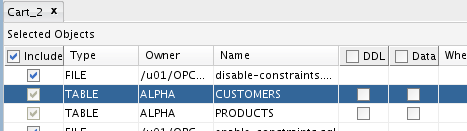

-   We want to move the data; check the **Data** column heading.

	

-   Before we can overwrite the new rows in the CUSTOMERS table, we need
    to truncate the table. Click in the **Scripts** cell for the
    CUSTOMERS table and then click the **pencil icon**.

	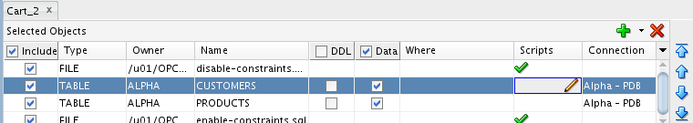

-   Check the **Before Load** box, then click the **Browse...** button and select the following file then click **OK**:

	```
	/u01/OPCWorkshop/lab/truncate-customers.sql
	```
	
	

-   Repeat the operation for the PRODUCTS table; click the **pencil icon** on the products row.

	

-   Click the **Before Load** button, then click on the **Browse**... button and select the following file then click **OK**:

	```
	/u01/OPCWorkshop/lab/truncate-products.sql
	```
	
	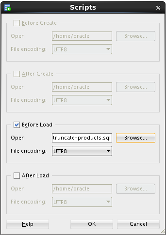

### **STEP 18**:  Export the Cart

-   Now that the cart is complete, click the **Export Cart** toolbar
    icon to generate the script of all the elements we inserted in the
    cart.

	

-   Click the **Apply** button to generate script. Note: the selections
    on this page may be saved and later reused if the cart is regularly
    used the same way.

	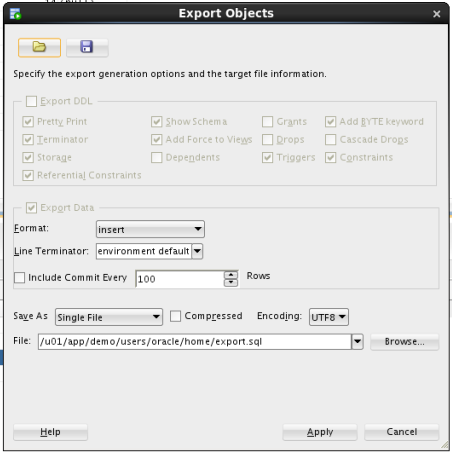

-   If the file already exists, SQL Developer asks you to confirm overwriting it with new content. If show, click the **Yes** button.

	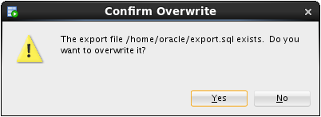

-   Review the contents of the script, paying particular attention to the SQL statements inserted based on the scripts we included.

	

-   Now run the script by clicking the **Run Script** icon and selecting the **Alpha Clone - DBCS** connection. Click **OK**.

	

-   SQL Developer shows a progress bar while the script runs. Depending
    on your window layout, you may see the command output scrolling by
    while the script runs.

	

-   When the script is complete, review the script output looking for the execution of both the script elements and the DML statements.

	

-   This Lab is completed.