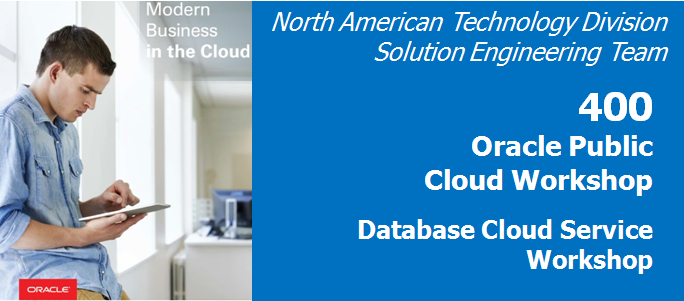

Update: March 28, 2017

## Introduction

In this Lab you will deploy an APEX application
to the Alpha Clone PDB and adjust the firewall rules to support access
to the application from the Internet using your browser, smart phone or
tablet.

Please direct comments to: Dennis Foley (dennis.foley@oracle.com)

## Objectives

-   Enable APEX in the Alpha Clone PDB.

-   Create APEX REST services

-   Deploy and access an Alpha Office APEX application.

## Required Artifacts

-   The following labs assume that the steps outlined in lab guides 100
    and 200 have been completed.

-   The SSH tunnels must be active in a terminal window.

# Alpha Office and APEX

## APEX Workspace Administration

The Alpha Clone database contains an unused APEX configuration. Just
like enabling the container database\'s APEX like we did in Lab 100, we
must finish the configuration of the cloned database APEX.

Note: The standard install of APEX for a 12c database creates many
objects shared in both the container and pluggable database, but user
and password information is always local to the database we access. In
other words, the APEX password we set in Lab 100 does not set the
password in the cloned database.

### **STEP 1**: Unlock **APEX\_LISTENER** and **APEX\_REST\_PUBLIC\_USER**

-   Make sure the SSH tunnels you set up in lab 100 are still active in
    your terminal window, if not refer to lab 100 to set up the SSH
    tunnels.

-   During the plug-in operation, many of the common objects in the
    pluggable database were evaluated by the database and some changes
    were made to the new database to work with its new container. One of
    these adjustments was locking the database accounts used to provide
    REST services. We need to unlock these accounts. Using SQL
    Developer, locate the **Alpha Clone - DBCS** item (created in
    Lab 200) in the **DBA Navigator** and open the **SecurityUsers**
    item.

	

-   Right-mouse on **APEX\_LISTENER** and select **Unlock User...**

	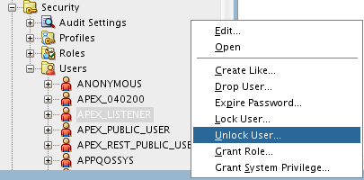

-   Click the **Apply** button to unlock APEX\_LISTENER. You may also
    use the SQL tab to review the unlock statement.

	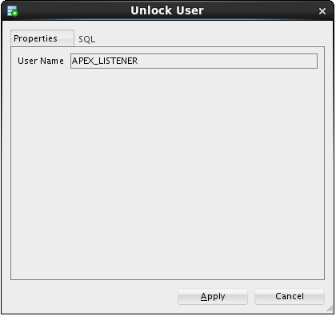	

-   Repeat the **Unlock User...** operation for the
    **APEX\_REST\_PUBLIC\_USER**.

### **STEP 2**: Access APEX in the Alpha Clone database

-   In the **Chrome** browser, open up a new tab and test the updated
    rule by accessing the APEX instance in the container database from
    the Internet. Substitute your Public IP address from lab 100.
    (**Make sure the protocol is HTTPS**).

	```
	https://<your-Public-IP>/apex/alphaclone/apex_admin
	```

	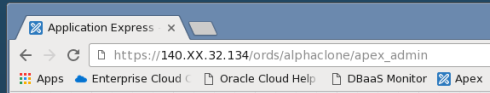

-   After you've accepted the SSL certificate and see the APEX
    administration page, enter the following admin credentials and click
    the **Login to Administration** button:

	```
	Username:	admin
	Password: 	Alpha2014_
	```
	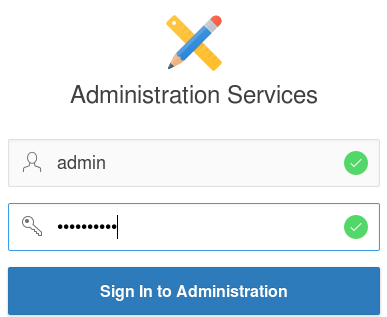
	
-   You ***may*** be prompted to change the ADMIN user password, if not,
    skip to the next step. These credentials apply to the APEX objects
    local to the pluggable database. For convenience, we will enter the
    same password as the container database. Enter the following values
    and click the **Apply Changes** button.

	```	
	Enter Current Password: Alpha2014_
	Enter New Password: 	Alpha2015!
	Confirm New Password: 	Alpha2015!
	```

	

### **STEP 3**: Create the Alpha Office workspace

-   Click the **Create Workspace** button

	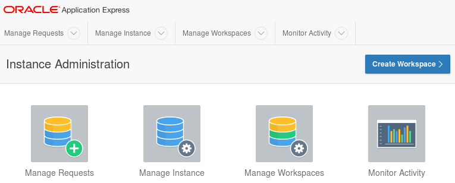

-   At the **Identify Workspace** dialog, enter the following workspace
    name and click the **Next** button.

	```
	Workspace Name:	AlphaDev
	```
	
	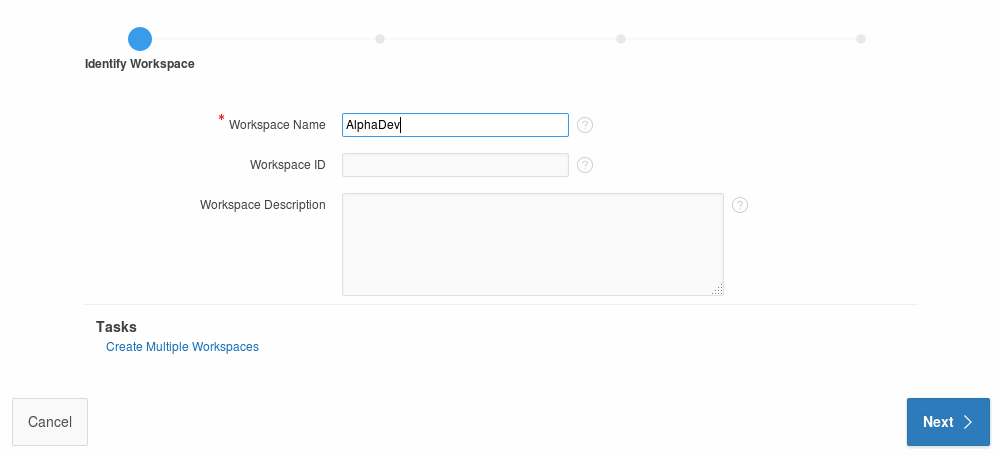

-   At the **Identify Schema** dialog, select and enter the following
    values followed by the **Next** button.
	
    **Note:** Use the search icon 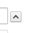 to find the **ALPHA** schema.

	**Re-use existing schema?**: `Yes`

	**Schema Name**: 	 		`ALPHA`
	

	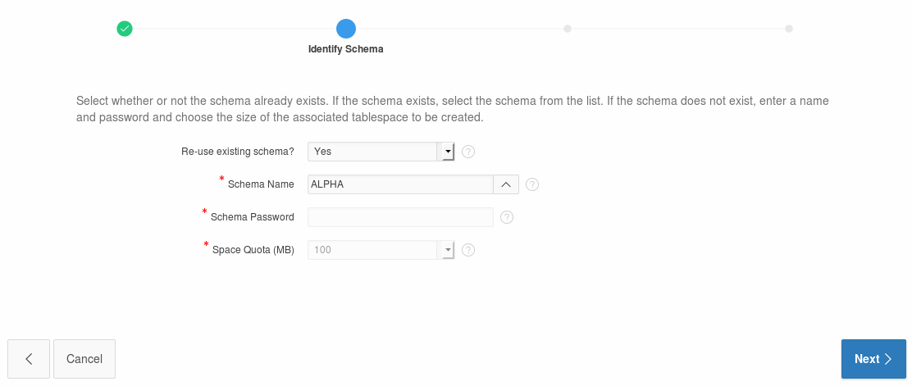

-   At the **Identify Administrator** dialog, enter the following values
    and click the **Next** button.

	**Administrator Username**:	`ADMIN`

	**Administrator Password**:	`Alpha2014_` (we may be prompted to change)

	**Email**:					`dummy@localhost.localdomain`
	
	
	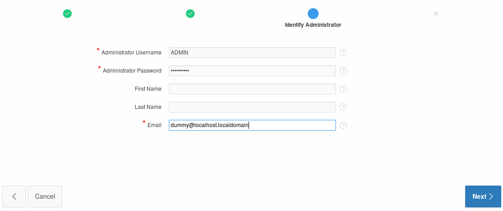

-   Review the selections on the Confirm Request page and then click the
    **Create Workspace** button.

			
	
	

-   APEX displays a success message; click the **Done** button.

	

-   Click the user dropdown in the upper right and select **Signout**

	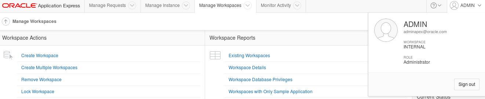

-   Click the Return to Login Page to continue

	

## Build REST services

### **STEP 4**: Login to APEX

-   Login into to the new Alpha Office Development workspace using the
    following credentials:

	```
	Workspace:	AlphaDev
	Username:	ADMIN
	Password:	Alpha2014_
	```
	
	

-   You ***may*** be prompted to change your password. Enter the
    following values and click the **Apply Changes** button.

	```
	Enter Current Password:	Alpha2014_
	Enter New Password:		Alpah2015!
	Confirm New Password:	Alpha2015!
	```
	
	

### **STEP 5**:  Create a Simple REST Services Module

-   Click the **SQL Workshop** button.

	

-   Click the **RESTful Services** button.

	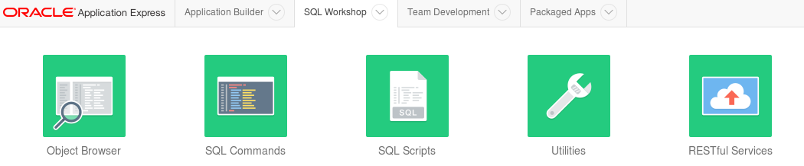

-   Click the **Create >** button

	

-	For each of the following three sections on the **REST Services Module** page, enter the listed values.

	

-   For section one, enter the following values:

	**Name**: 		`alpha.office`

	**URI Prefix**:	`alphaofc/`
	
	
	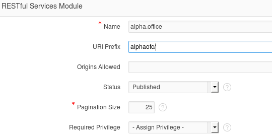

-   For section two, enter the following value:

	**URI Template**:	`products/`
	
	

-   For section three, select the **GET** method and enter the following
    query:

	**Method**: `GET`

	**Source**: `select * from products`
	
	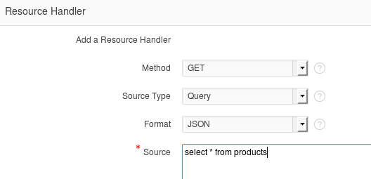

-   Click **Create Module** to complete the REST service creation.

	

-   APEX shows the new service module with a confirmation message; click
    the **GET** handler for our template.

	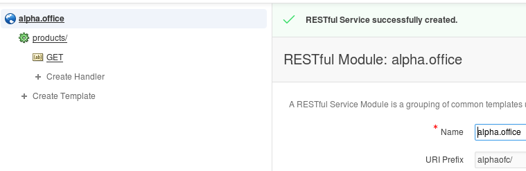

-   Review the definition. Since this operation has no parameters, we
    can easily test it by clicking the **Test** button.

	

-   Review the JSON produced by the service. Click the browser\'s **back
    button** to return to the APEX page.

	

### **STEP 6**:  Create a Parameterized REST Service

-   Now we are going to create a REST service that takes a product
    number and returns only one database row as a JSON object. Click the
    **Create Template** link.

	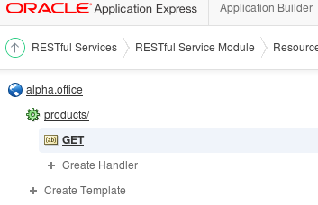

-   Enter the following URI Template. Note that the **{id}** syntax
    indicates the REST call accepts one parameter named "id" - this is
    automatically available in later for SQL queries. When the entry is
    complete, click the **Create** button.

	**URI Template**:	`product/{id}`
	
	

-   APEX displays a success message for the new template; click the
    **Create Handler** link under the **product/{id}** template.

	

-   Enter the following SQL statement. Notice the use of the "**:id**"
    bind variable, this value comes from the URI template {id} provided
    when the service is invoked. When all entries are complete, click
    the **Create** button.

	```
	Source:

	select * 
		from products
		where product_id = :id
	```
	
	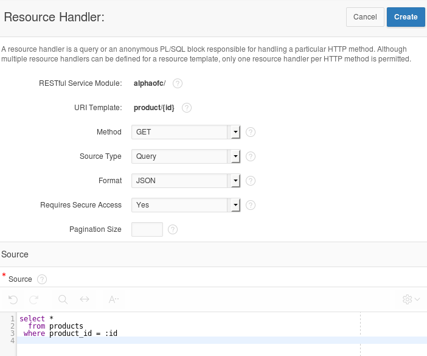

-   Notice the success message at the top. 

-	We will test this service
    just like before, but we must provide a product number to the call.
    **Scroll** the page down click the **Set Bind Variable** button.

	

-   Enter the following product number and click the **Test** button.

	**ID**:	`1020`
	
	

-   In the new browser window, notice only the single product shows in
    the JSON object. **Close** this pop-up window.

	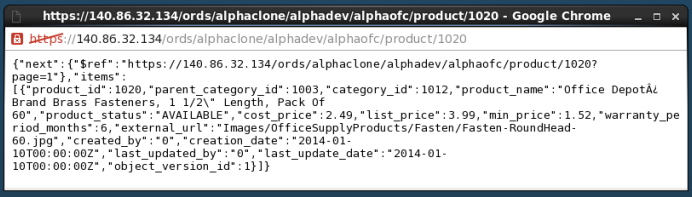

## Install APEX Mobile Application

### **STEP 7**:  Import the Alpha Office Mobile Application

-   Click the **Application Builder** menu item on the APEX page.

	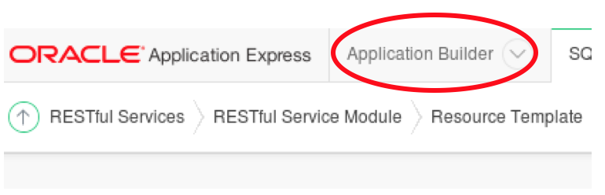

-   Click the **Import** button on the Application Builder page.

	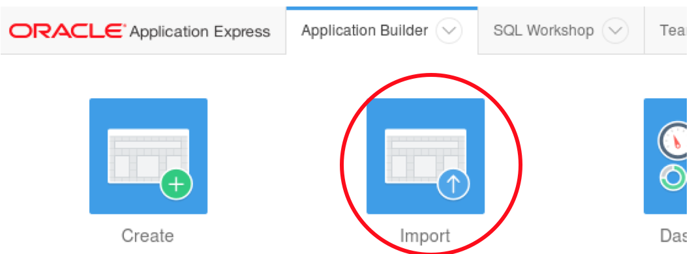

-   Click the **Choose File** button to locate the APEX application export
    file.

	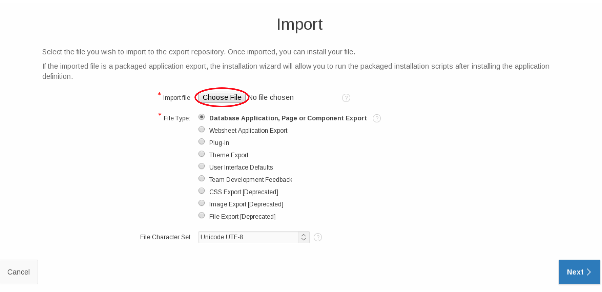

-   Locate and open the following file and click the Open button:

	```
	/u01/OPCWorkshop/lab/f101.sql
	```
	
	

-   Click the **Next** button to continue.

	

-   After a brief pause while the application file is processed, click
    the **Next** button to continue.

	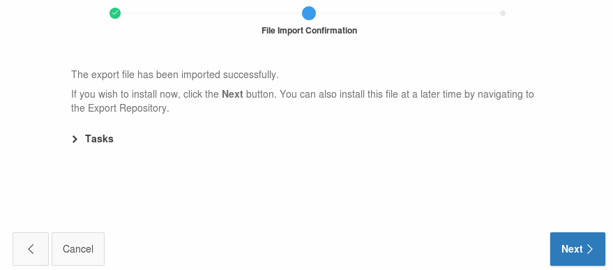

-   On the final page, select to **Reuse Application ID 101 from Export
    File** and then click **Install Application**.

	

-   APEX displays a success message for the import; click the **Run
    Application button**.

	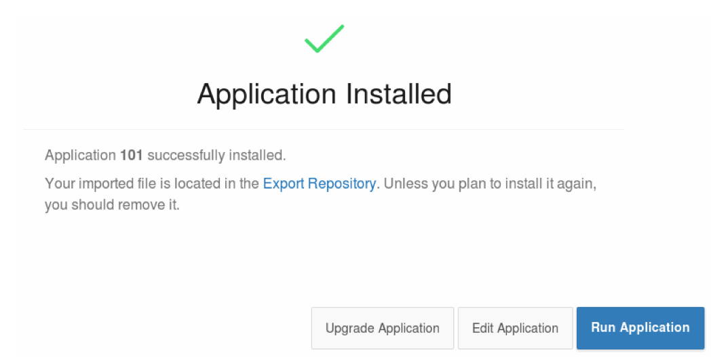

-   APEX renders the first page of the mobile application in the desktop
    Chrome - this doesn\'t look quite right since we are using a mobile
    template.

	

### **STEP 8**:  Access the Alpha Office Mobile Application on your Smart Device

-   Using any Internet connected smart phone or tablet, we will access
    the mobile application using the port we opened earlier in the lab.
    This example is using an Apple iPhone 5s.
	
    Use the device's browser (Safari), navigate to the following URL:

	```
	https://{your Public IP Address}/ords/alphaclone/f?p=100
	```

	

-   The browser should prompt you to accept the unknown certificate.
    Click to **Continue**.

	

-   Tap the screen to explore the application. On the device, tapping
    one of the pie slices highlights the slice; a second tap drills into
    that slice.

	

-   This Lab is completed.
