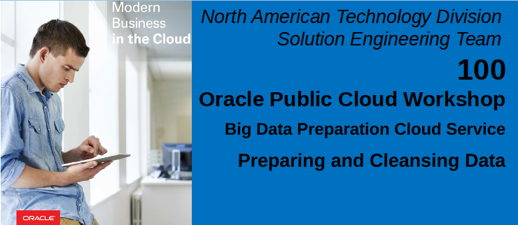

Updated: February 1, 2017

# Introduction

This lab will introduce the Oracle Big Data Preparation Cloud Service and reinforce the themes we have already discussed in the workshop presentations.  This hands-on exercise will allow you to gain a better understanding of the basic features of functions of the service.  It should become apparent that this service can be easily utilized by both technical and non-technical users to cleanse and enrich basic information in an independent fashion.

The following provides a high-level overview the information and process flow.
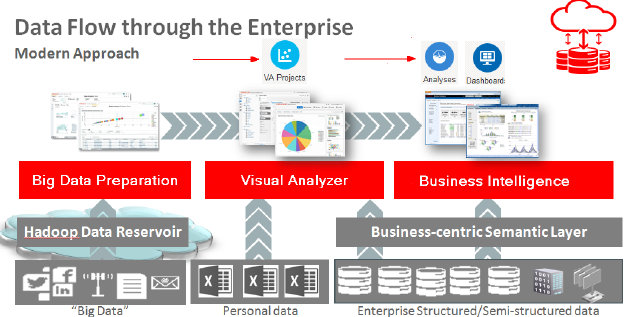

The goal of course, is to ensure data consistency and thus higher quality analysis results as a self-service activity.

The analysis components of the workshop will be covered during the afternoon session.

**Please direct comments to:  Derrick Cameron (derrick.cameron@oracle.com)**

## Credits
This lab was originally developed by Richard Stang and has been updated to reflect deployment and delivery logistics.  The NAS Innovation and Shared Services Team support this workshop.  

## Objectives
- How to connect to the Big Data Preparation Service (BDPCS).
- Exploration of the basic features of the service.
- How to create a Transform and add a dataset.
- How to configure a Transform, reviewing recommendations and tailoring the Transform script.

# Pre-Lab information

## Assumptions
You have brought a laptop to the workshop with wireless networking that is capable of connecting to Oracle’s public cloud.  Specifically, the Big Data Preparation Cloud Service. A compatible web browser as specified in the workshop invitation.

## Objective
We will be creating a BDPCS Transform that results in a cleansed and enriched customer information dataset that approximates what is shown here:
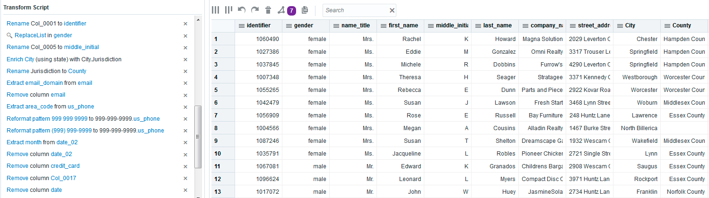

# Big Data Preparation Cloud Service overview

## Accessing the Big Data Preparation Cloud Service

Your workshop leader will provide the specific cloud service URL as well as the credentials needed to login to the service.  Open a web browser and type-in the URL to access the BDP Cloud Service.  When presented with the following screen, enter your workshop User Name, Password and Identity Domain.
- Sign in

    

- Select Home page:

    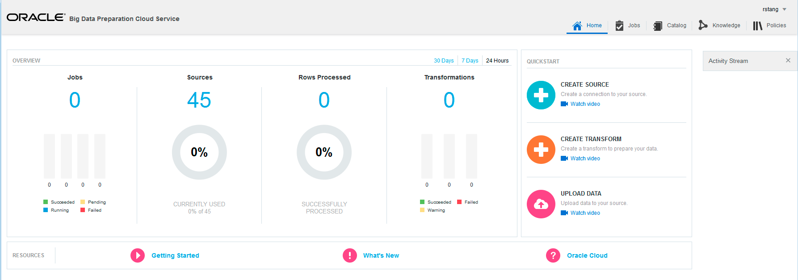

- Explore the OVERVIEW Page:

    

- Explore the RESOURCES Page:  

    

- Explore the QUICKSTART Page:

    

- Explore the JOBS Page:

    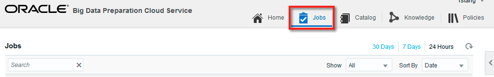

- Explore the CATALOG Page:

    

- Explore the KNOWLEDGE Page:

    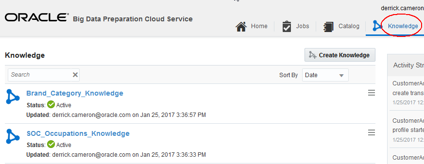

- Explore the POLICIES Page:

    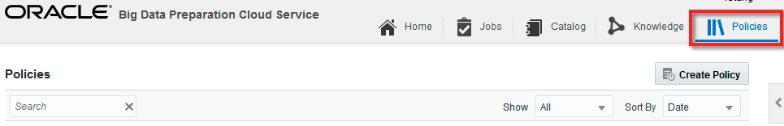

# BDPCS Workshop Source Connections

## Source Connection Setup
The two BDPCS Source Connections utilized in this workshop will be used:
- Default\_Oracle\_Cloud\_Storage
- Oracle\_BICS

The sections below provide examples of the configuration information that is required for the two sources:
- An Oracle Cloud Storage Service instance where our input files to be Transformed will reside.

    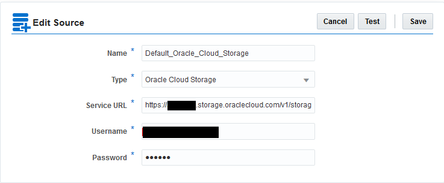

- A Transformation target source, a Business Intelligence Cloud Service (BICS) instance that will be used in the afternoon analytics lab sessions.

    

**Note:**  You may explore the specific settings for connections via the Catalog page tab.  Please do not modify any of the specified connection information.

# Big Data Preparation Transformations

## Create a Transformation
### **STEP 1:** Upload a File
- From the Home Page, Click the Upload button.

    

- Select Source

    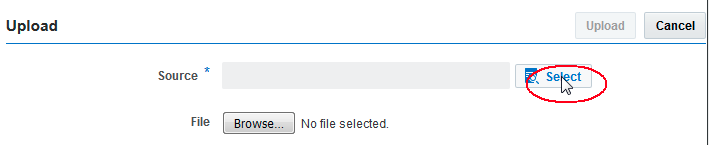
    

- Select file (provided by your instructor)

    
    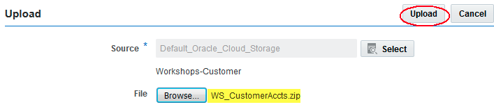

### **STEP 2:** Create Transform
- From the Home Page, Click the + graphic to Create a new Transform.

    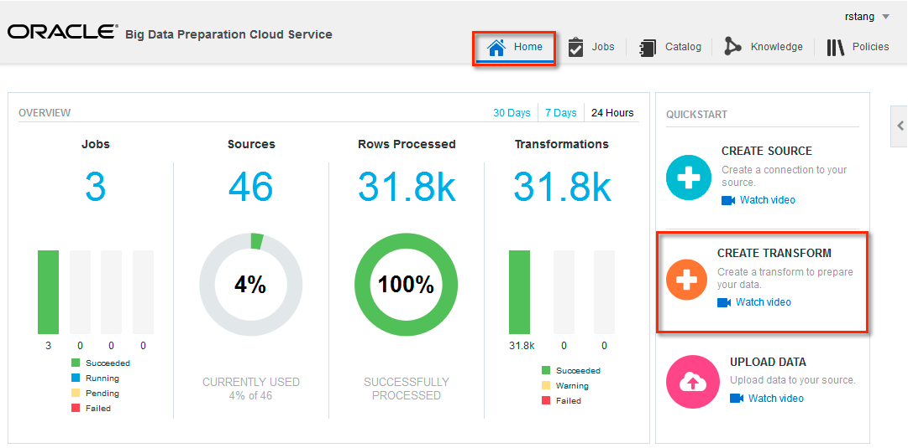

- Specify Name and Source.  Name the Transform CustomerActivity\_U[User:1..20]-MMMDD.  Example: CustomerActivity\_U1-Jan24.  ** Note that transform names should be unique.  That is, if you create a transform and then delete it, new transform names should not be the same name as current AND deleted transforms.**
- Uncheck the Contains Header checkbox
- Press the Select button to select a Source and File

    

- Select the Default\_Oracle\_Cloud\_Storage source.
- Select Workshop-Customer folder.
- Press OK.

    

- Press the Submit button on the Create Transform dialog to create the Transform and to initiate dataset processing

    

- This will return you to the Catalog page where you will see the CustomerActivity\_U01\_Jan24 Transform.  Its Status should be In Progress as shown below.

    

- After a few minutes, BDPCS processing of the file will complete and the Transform Status will change to Ready.

## Edit and Configure the Transform
### **STEP 1:** Edit the Transform
- After the Transform processing has completed and the Status is **Ready**, Click the catalog menu and select Edit to edit the transform.

    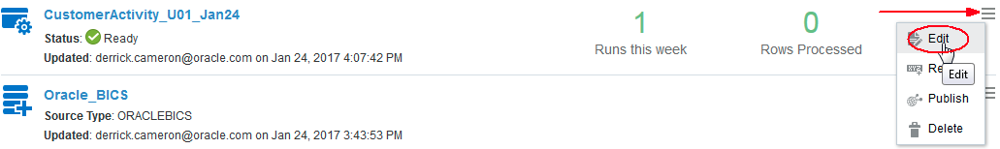

- The following should be displayed:

    

### **STEP 2:**  Explore Recommendations
#### BDPCS Recommendations for Col\_0001:  
- Click the Recommendations toolbar button.  This open a menu list of field recommendations.
- Select the recommendations for Col_0001

    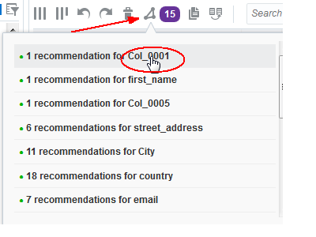

- Recommendations for the field will be displayed in the lower left pane of the screen.  For Col_0001, the field has been identified as a field with unique values and the recommendation is to rename the field to “identifier”.  
- Click the checkmark next to the recommendation to accept and add it to the Transform Script.

    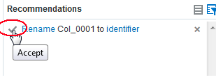

#### BDPCS Recommendations for Col\_0005
- Click the Recommendations toolbar button and select the recommendations for Col\_0005.

    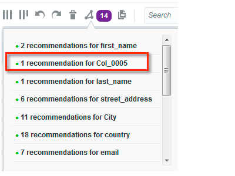

- BDPCS has noticed that this field is sandwiched between fields that are a first name and last name and has deduced that this field is most likely a name middle initial.  Click the checkmark next to the recommendation to accept and add it to the Transform Script.

    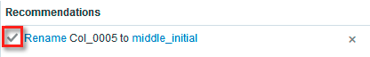

#### Recommendations for CustomerActivity\_U
- Click the Recommendations toolbar button and select the recommendations for City.

    

- BDPCS recognizes the field values as valid cities and the recommendations listed are optional data enrichments.  For example, geocodes and other useful attributes associated with the city value.  In this exercise, we will select Jurisdiction and Population.

    

#### Rename Jurisdiction to County
- Notice the two new fields contain a plus (+) sign to indicate we are adding new information to our dataset.  The Jurisdiction added to our dataset is actually the County in which the City resides.  We will rename this field as County.  The the field view, select the column and then the operations menu associated with the field.  This will display a menu of operations that can be performed on the field.  We will select the Rename operation.

    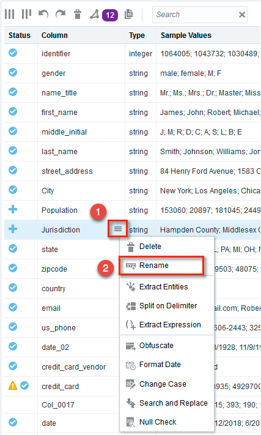

- This will display a dialog to rename the field.  Type County as the Name and press the Apply button.

    

#### Recommendations for email
- Next, we will explore the Recommendations for the email field.  As we have done before, click the Recommendations toolbar button and select the recommendations for email.

    

- Click the checkmark for Extract email_domain from email.  This will add a field to our dataset containing the customer’s email domain.

    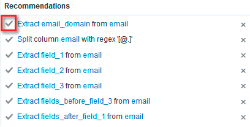

#### Remove email field
- Being sensitive to privacy concerns, we will remove the customer’s email address, but we will keep the domain for analytical purposes.  Delete the email field by selecting the email field and clicking the respective operations menu.  We select Delete to remove the email field from our dataset.

    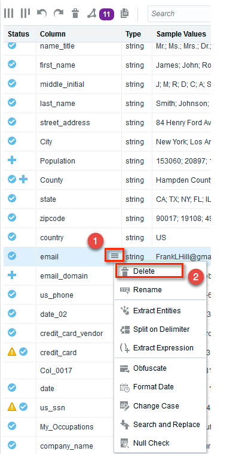

#### Recommendations for us\_phone
- Next, we will review the us_phone field recommendations.  Click the Recommendations toolbar button and select the recommendations for us\_phone.

    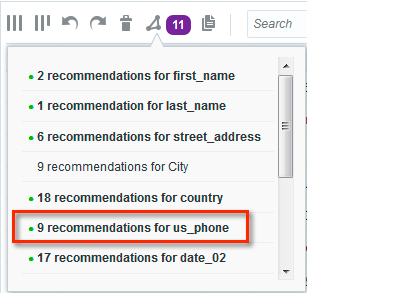

- Here we will click the checkmarks to accept the recommendation to extract area\_code and the recommendations to Reformat our phone numbers so that they are in a consistent 999-999-9999 format.

    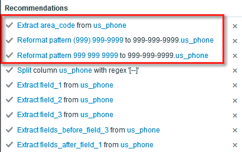

#### Recommendations for date\_02
- Returning to our transform Recommendations, we will focus on the date\_02 field.  Click the Recommendations toolbar button and select the recommendations for date\_02.  We know this is the customer’s birthdate, so we’ll apply transforms that make the most sense.

    

- Here we see many formatting and extract recommendations.  We don’t really want the specific customer birthdate, but we would like to retain the birthmonth.  Click the checkmark to accept the recommendation to extract month from date\_02.

    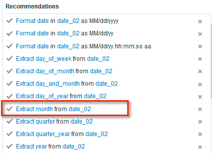

#### Remove the date\_02 field
- Select date\_02 from the dataset field list
- Click the field operations menu
- Select the Delete menu item.

    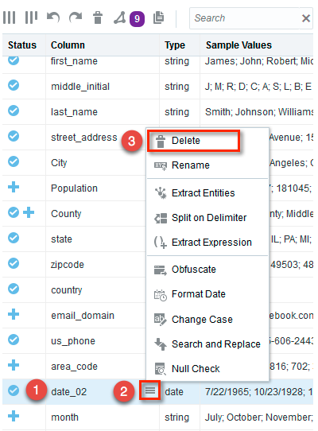

#### Rename month field to birthmonth
- Select month from the dataset field list
- Click the field operations menu
- Select the Rename menu item.

    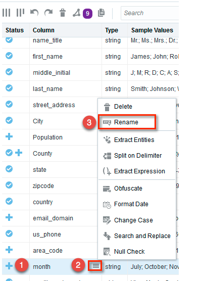

- This should display the Rename dialog.  Type Birthmonth as the Name and press the Apply button.

    

#### Remove the credit\_card field
- Notice the extra privacy icon that accompanies the credit\_card and us\_ssn fields:

    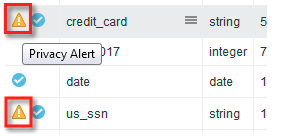

This icon indicates that BDPCS has identified that these fields contain sensitive personal information.  Depending on how we are using this information, we might consider removing or obfuscating this data to ensure we are protecting our customer’s privacy.  For our purposes, we do not need credit card information.  We’ll simply remove this field.
- Select the credit_card field
- Click the field operations menu
- Select the Delete menu item

    

#### Remove the Col\_0017 field
Col\_0017 contains extraneous data that has no value.  We will remove this field.  To remove the field:
- Select the Col\_0017 field
- Click the field operations menu
- Select the Delete menu item

    

#### Obfuscate us\_ssn
- Review the Recommendations for the us\_ssn field.

    

- Click the checkmark to accept the recommendation to Obfuscate first 5 digits in column us_ssn.

    

- Notice how this masks the first 5 digits of the us_ssn with the # character.

#### Extract field\_3 from us\_ssn
- We could use the us_ssn column as is, but instead, we will simply keep the last four (4) relevant ssn digits.  Click the checkmark to accept the recommendation to Extract field\_3 from us\_ssn.

    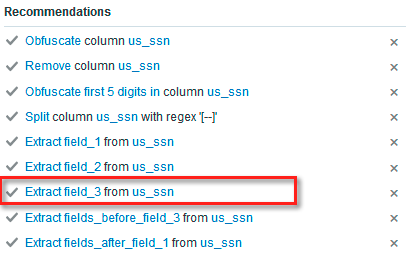

- The result should add a column to our dataset as shown here:

    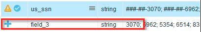

#### Rename field\_3 to Last\_4\_SSN
Here we will rename our new field to something more descriptive, Last\_4\_SSN, by doing the following:
- Select the field\_3 column
- Click the field operations menu
- Select the Rename menu item

    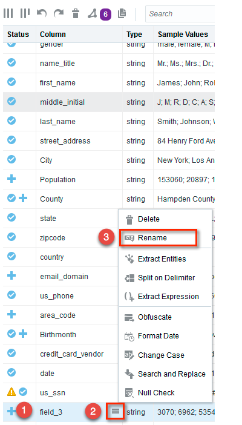

- This will open the Rename dialog.  Specify Last\_4\_SSN as the Name and press the Apply button.

    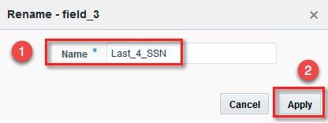

#### Remove the us\_ssn\_field
Since we no longer need the us\_ssn column, we will remove it by doing the following:
- Select the us\_ssn column
- Click the column operations menu
- Select the Delete menu item

    

#### Apply occupations enrichments
- Explore the Recommendations for the SOC\_Occupations_Knowledge column.

    

- Click the checkmark to accept the recommendation to Enrich SOC\_Occupations_Knowledge with SOC\_Occupations\_Knowledges.Mean\_annual\_wage.

    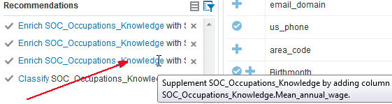

- This will add the mean annual wage for the respective occupation to our dataset.

#### Rename the SOC\_Occupations\_Knowledge
- Select the SOC\_Occupations\_Knowledge column
- Click the field operations menu
- Select the Rename menu item

    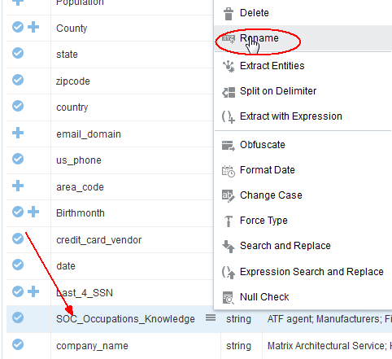

- Specify Occ\_SOC as the Name and press the Apply button.

    

#### Move the company\_name column to above street_address
- Click and drag the company_name column
- Drop the column above the street\_address column

    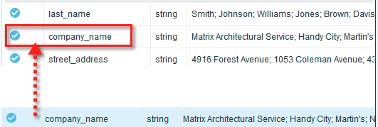

#### Normalize the value in the gender column
- Select the gender column.  **Notice that the values include male, female, M and F**.

    

We would like to ensure the results for gender are consistent, so we will change M to male and F to female using the Search and Replace operation.  To accomplish this, do the following:
- Click the field operations menu
- Select the Search and Replace menu item

    

In the search and replace dialog, do the following:
- Press Add to add a new search and replace row.
- In the first row specify M as the Find Value and male as the Replace By value.
- In the second row specify F as the Find Value and female as the Replace By value.
- Press the Apply button

- The result of the Search and Replace should be:

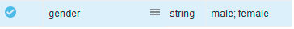

- Press the Done button to close the Transform.

# Lab 100 Summary

This completes Lab 100 and your preparation results should resemble this:

Hands-on Lab 200 will focus on blending an additional dataset and publishing your prepared dataset results to the Business Intelligence Cloud Service.
