Updated: February 1, 2017

# Introduction
This is the fourth lab that is part of the Oracle Public Cloud Big Data Preparation and Business Intelligence workshop. These labs will give you a basic understanding of the Oracle Big Data Preparation and BI Cloud Services, and how those in a non-technical line of business role can quickly access, cleanse, validate, explore, and analyze their business information without needing IT support.

This lab will walk you through creating how to create dashboards and analytic workbooks on your curated data after you have first prepared in Lab one and two. You will first create an ‘Analysis’ workbook for publishing into a dashboard, and then you will create a new dashboard and dashboard prompt, and then add your workbook to the dashboard.

The following shows the self service flow of information, as business users take prepared data, explore it, and create dashboards off the curated data.

** Please direct comments to: derrick.cameron@oracle.com **

## Objectives
- Understand how to create analytics workbooks and various types of interactive visualizations.
- Understand how to create dashboards and dashboard prompts.
- How to publish content into dashboards and share with others.

# Answers
While Visual Analyzer is used to explore your data and discover patterns and analmalies, Answers and Dashboards provide an environment for building richly visual reports and dashboards for curated data.  You first create one or more analysis (Answers workbooks) and dashboard prompts, and then assemble them on interactive dashboards.

Note:  There are several views that are part of this workbook – save frequently to avoid losing work.

### **Step 1:** Create new analysis
- Select Analysis from the main BICS page.

    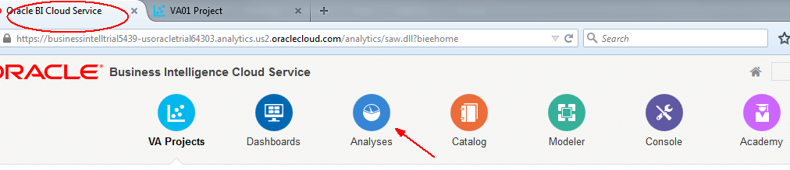

    

    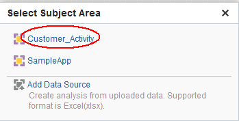

### **Step 2:** Expand and drag the following items to the ‘Selected Columns’ area.  Use the <CTRL\> key to multi-select items, folder by folder.
- Select and drag and drop items to selected columns region from left to right.

    

- Include only the past four quarters.

    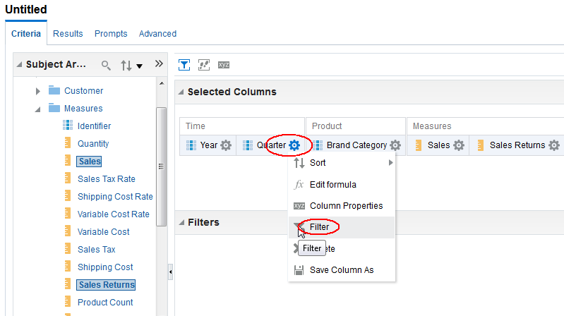

    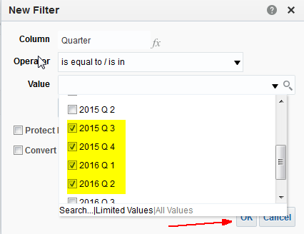

- Calculate sales returns as a percentage of sales (rather than dollar value amount).  Enter this calculation:  "Measures"."Sales Returns"/"Measures"."Sales"

    

    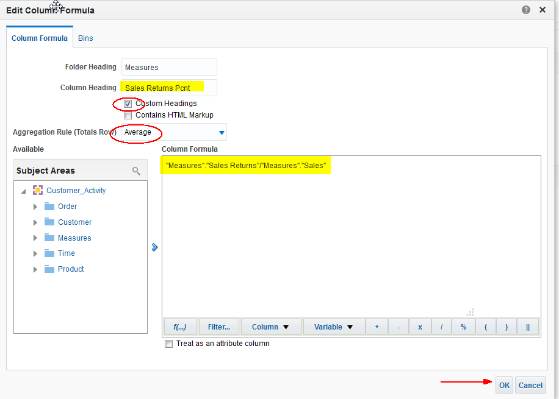

- Highlight return percentages that are high.

    

    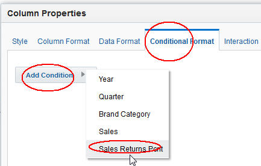

    

    

- Next format the Sales Return Pcnt value.  Select Data Format.

    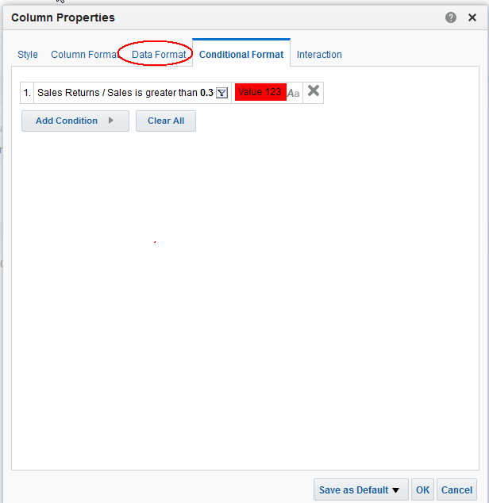

    

### **Step 3:** Create a Pivot Table  
- Click on the Results tab and then (lower left) create new View and select Pivot Table.

    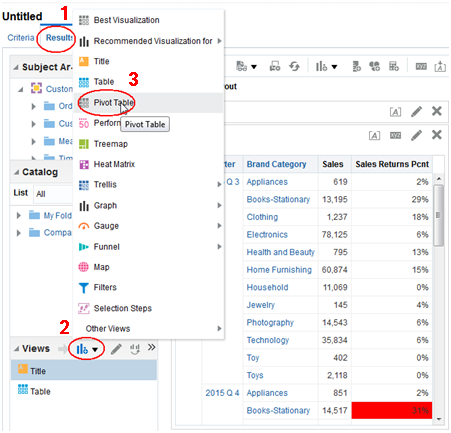

- Drag year and quarter to the Columns Region.

    

- We’ll add a total.

    

- We’ll also have this view communicate context for other views in the workbook.  Select Sales Returns Pcnt column properties.

    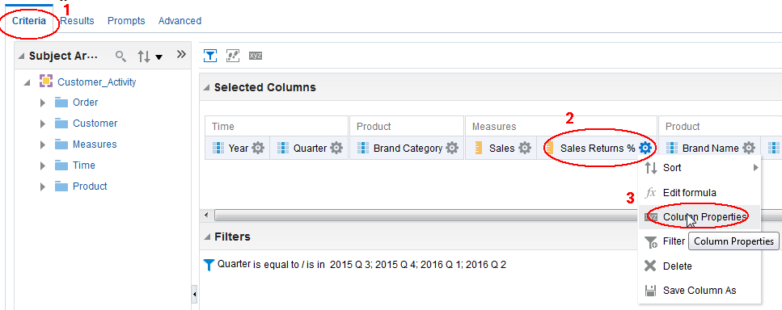

- Select Interaction tab and create ‘channel’ C1.  Click OK when finished.

    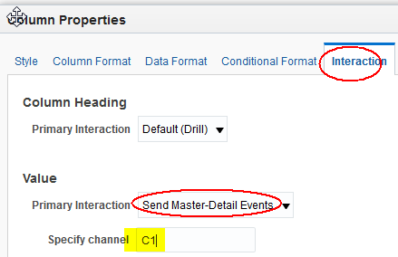

- Now graph the results to enhance the visual information.

    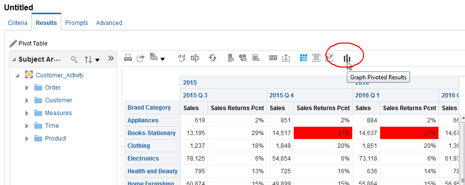

    

    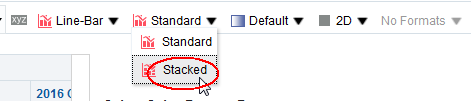

- Then ‘done’

    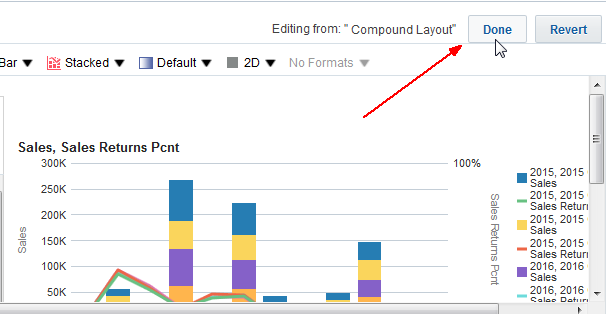

- Drag and drop the Pivot Table between the Title and the Table views.

    

### **Step 4:** Complete Table View
- Edit the table view.

    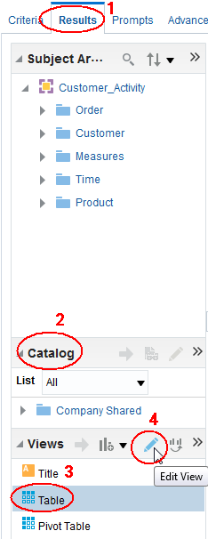

- Drag and drop the following items to the table view.  Be sure to place items between existing columns.

    

    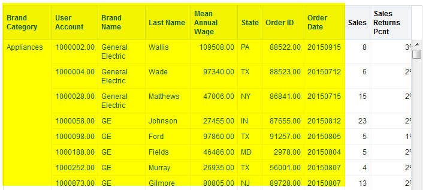

- Edit Table View to format results.

    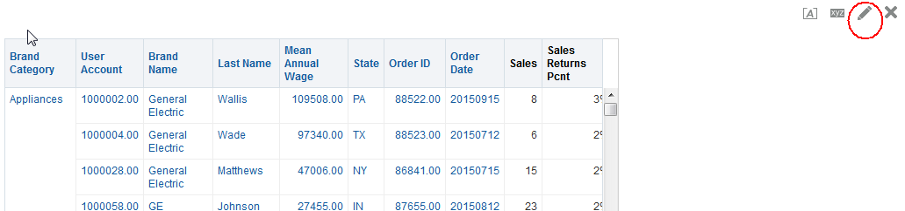

- Drag and drop year, quarter, and brand category to the Table Prompts region.

    

    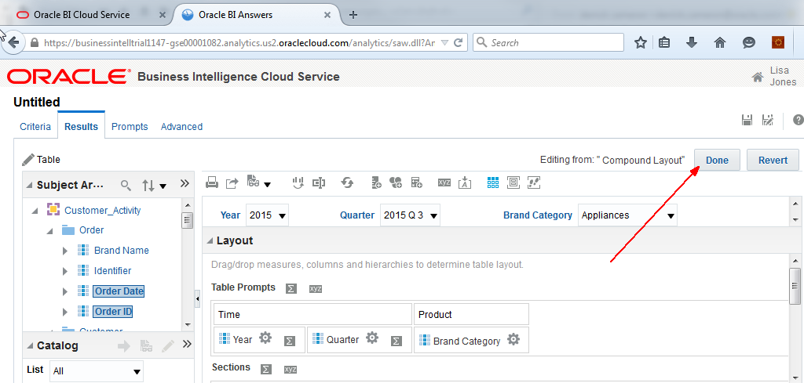

- One last thing – edit properties and specify channel C1 whereby the table view will respond to Pivot Table selections.

    

    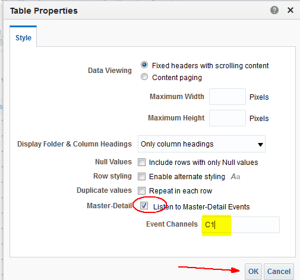

- Now when you highlight/select an item in the Pivot Table other views listening on channel C1 will respond.  Select the highlighted item below to observe the behavior.

    

- Select the `Save Analysis` icon upper left.  Enter `Customer Analysis`

    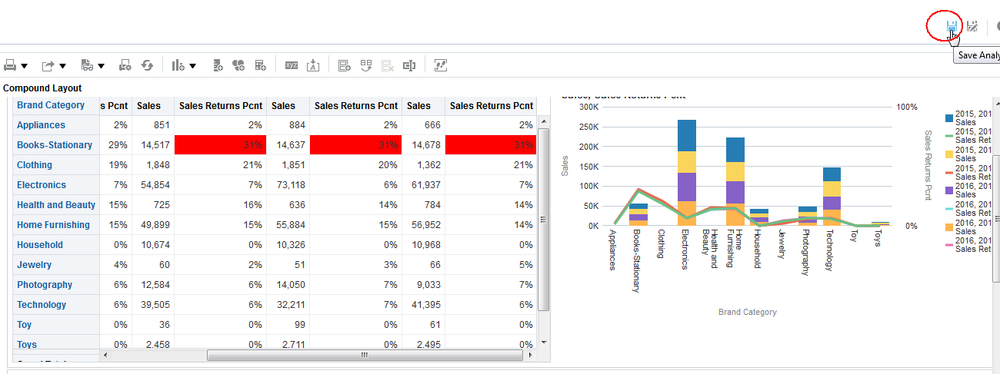
    
    

# Dashboards
### **Step 1:**  Create Dashboard prompts
- Return to the main Cloud Service tab and select `Catalog`.

    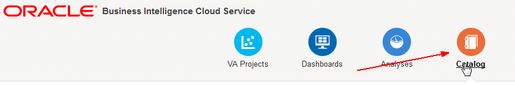

- On the left select ‘new’ icon and select Dashboard Prompt.

    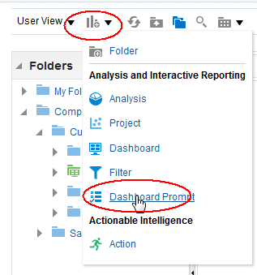

- Select Customer Activity Subject Area.

    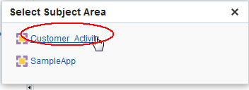

- Select create new column prompt.

    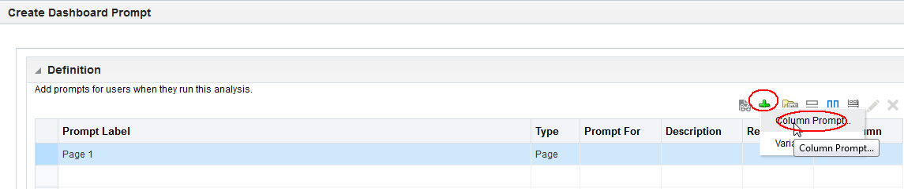

- Choose year.

    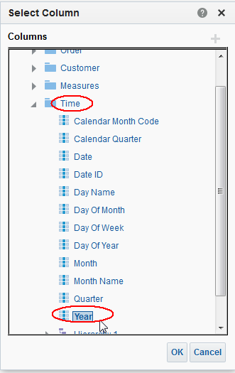

- Accept defaults.

    

- Add a second column prompt for quarter.  Set defaults to 2015 Q3 and Q4, and 2016 Q1 and Q2.  Note these can be dynamic and relative to the current month (or any other variable).

    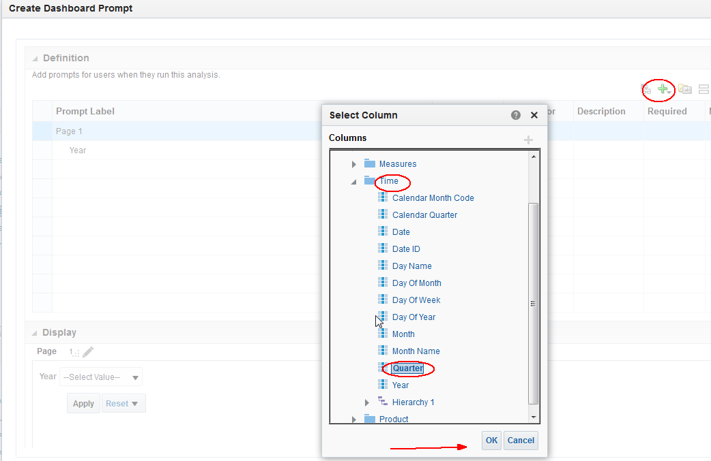

    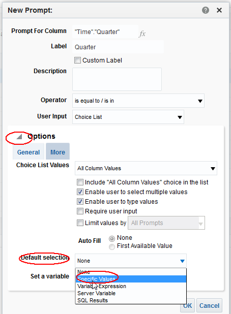

    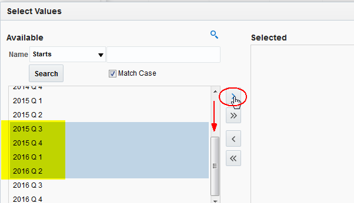

    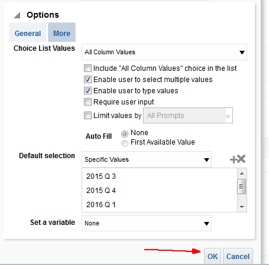

- Save Prompt.

    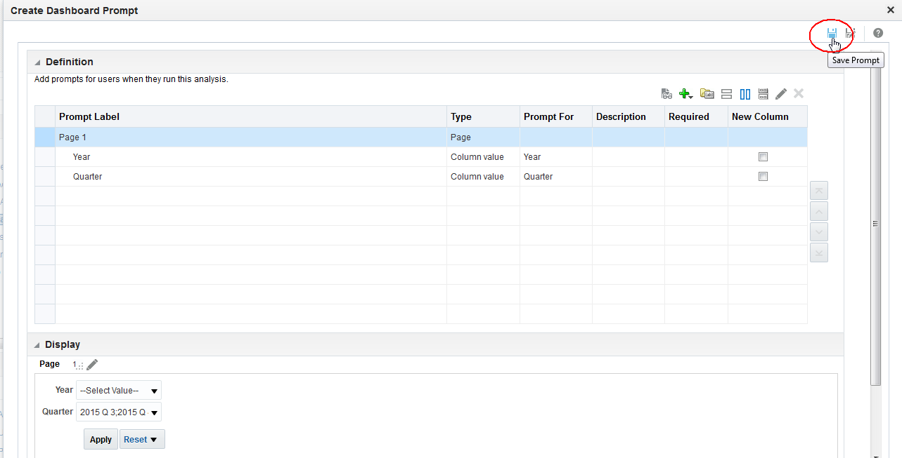

- Call it `Time Prompt`.

    

### **Step 2:**  Create Dashboard
- Go back to Catalog and select new Dashboard.

    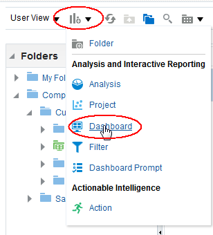

    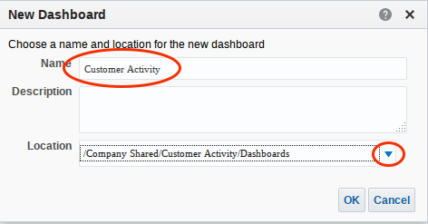

    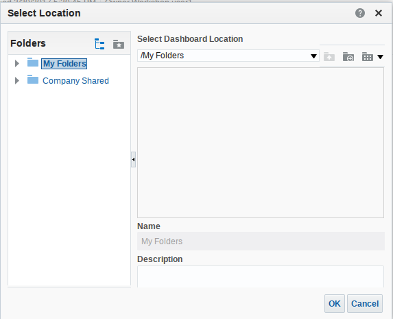

- Ignore this error.

    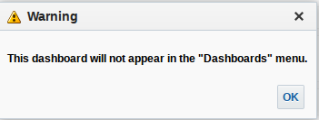

- Expand the catalog and drag the Time Prompt and the Customer Activity Dashboard on to the Dashboard Page at the top.  Then drag your saved analysis workbook on to the dashboard just below the dashboard prompt.

    

- After saving, run the Dashboard.

    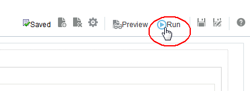

    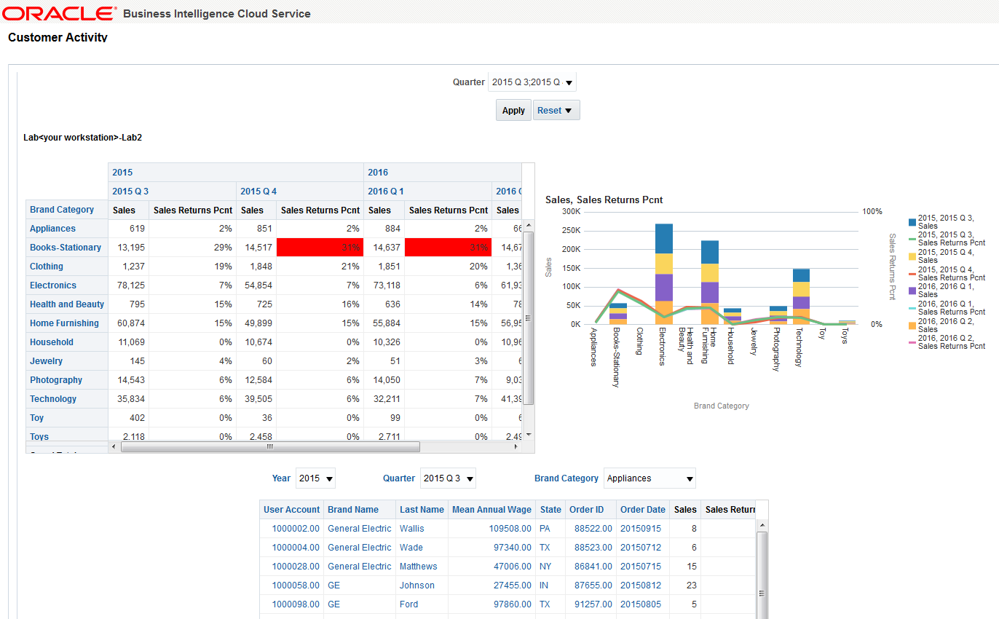

# Optional - Analytics for Mobile Devices
Any and all content created in BICS is automatically available on your smart phone or tablet.  The content you created in this lab can be accessed as follows:

### **Step 1:**  Install the Oracle BI Mobile Application from the play store
- Go to the Play Store and search for Oracle.  Install App.
- Start the Oracle BI Mobile Application and select Connections.  Enter the following:
- Host:  **businessintelltrial1147-gse00001082.analytics.us2.oraclecloud.com** (see below for where to get this URL)
- Port:  **443**
- SSL/TLS:  **on**
- Userid / Password:  Use the userid/pw you have been using in this lab.  In this case the user is lisa.jones.

    

# Optional - Review SampleApp content
- Go back to the Catalog and select SampleApp.

    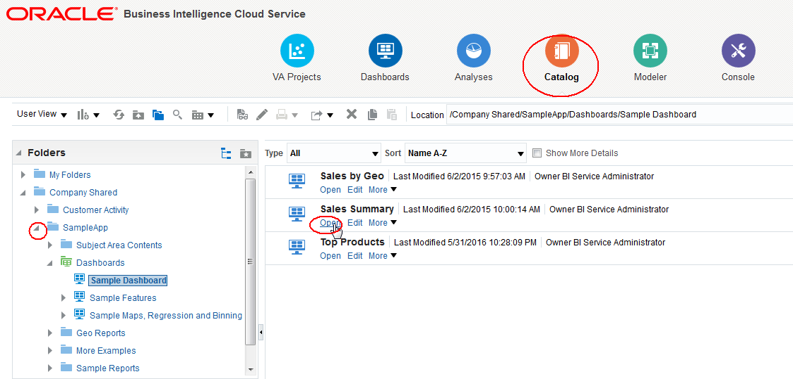

    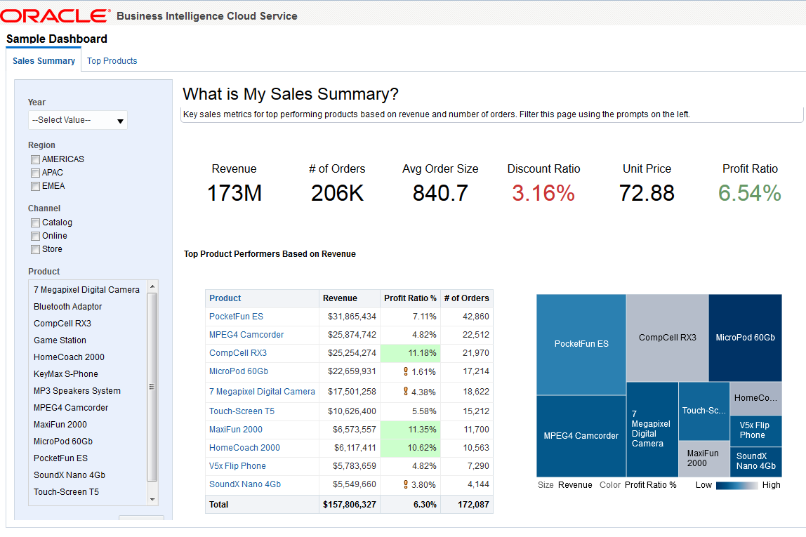
    
