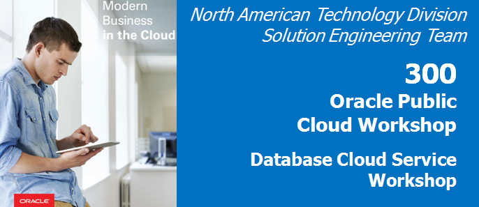
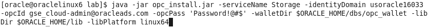
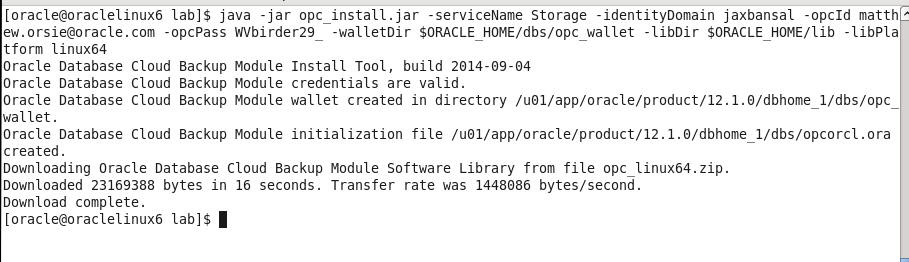
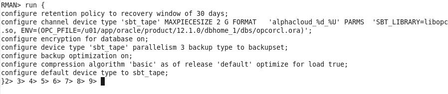
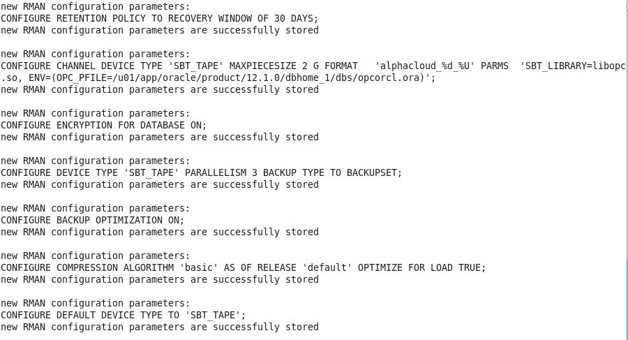
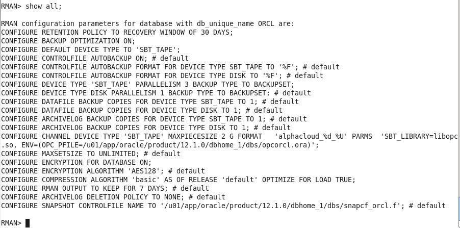
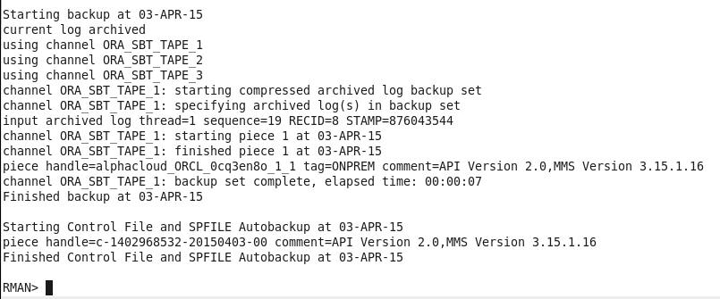
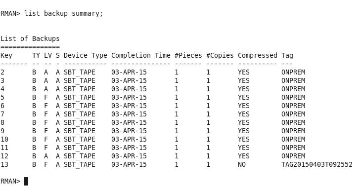
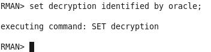
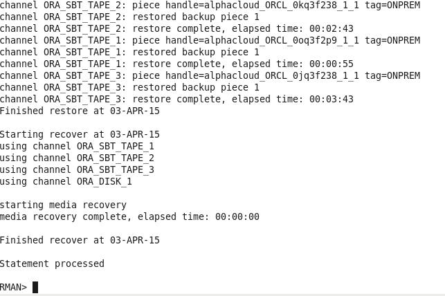

Update: March 28, 2017

## Introduction

Oracle Database Backup Service (ODBS) is a new
backup-as-a-service offering that enables customers to store their
backups securely in the Oracle cloud. ODBS provides a transparent,
scalable, efficient, and elastic cloud storage platform for Oracle
database backups. The Client side Oracle Database Cloud Backup Module
which is used with Recovery Manager (RMAN) transparently handles the
backup and restore operations.

Oracle Database Cloud Backup Module is the cloud backup module that is
installed in the database server. During the install process, a platform
specific backup module is downloaded and installed. The RMAN environment
of the client database is configured to use the cloud backup module to
perform backups to ODBS. Using familiar RMAN commands, backups and
restores are transparently handled by the backup module.

- To log issues and view the Lab Guide source, go to the [github oracle](https://github.com/pcdavies/DatabaseCloudService/tree/master/dbcs) repository.

## Objectives

-   Install the Oracle Database Cloud Backup Module onto the VM image
    provided in the workshop. The database provided is used as our
    “On-Premise” example.

-   Configure RMAN to support the Oracle Database Cloud Backup Module.
    Then, backup the database and take a restore point to be used for
    Point-In-Time-Recovery.

-   Do a destructive operation to the database and then Restore and
    Recover to a specific Point-In-Time.

## Required Artifacts

-   The following lab does not require set up or artifacts from the
    previous labs.

## Oracle Public Cloud Backup Recovery

### **STEP 1**: Start the On-Premise Oracle Database

-   If your local database is not running for some reason (it should be
    at this point) locate and double-click on the **StartDB** icon.

	

### **STEP 2**: Install the Cloud Backup Module

-   The .jar file used to install the Cloud Backup Module has already
    been placed into the /u01/OPCWorkshop/lab directory. **Open up a
    Terminal Window**, cd into the **lab** directory and verify.

	```	
	cd lab
	pwd
	ls *.jar
	```
	

-   To eliminate potential typos, the installation command has been
    saved into a **Workshop\_Commands\_URLs.txt** file that is
    represented by an icon on the Desktop. Double click on this icon to
    open the file.

	

-   Find the **OPC Cloud Backup Installation** section in the text.
    Replace **\<opc-identity-domain\>**, **\<opc-username\>** and
    **\<opc-passwd\>** (including replacing the &lt;&gt;) with the
    Identity Domain, Username, and Password student account information
    you were assigned. Also, be sure to keep the 'single quotes' around
    your password to avoid any issues with special characters.

    ```
    OPC Cloud Backup Installation
    ----------------------------
    java -jar opc_install.jar -serviceName Storage -identityDomain <opc-identity-domain> -opcId <opc-username> -opcPass '<opc-passwd>' -walletDir $ORACLE_HOME/dbs/opc_wallet -libDir $ORACLE_HOME/lib -libPlatform linux64
    ```

-   **Copy and Paste** the updated command from the text file into your
    terminal, and hit Enter.

	

-   The installation creates a configuration file **opcorcl.ora** and
    wallet directory **opc\_wallet** and places these in
    **$ORACLE\_HOME/dbs**. It also downloads a library file
    **opclib.so** that RMAN uses to communicate with the Oracle Database
    Backup Service, and places that file in the $ORACLE\_HOME/lib. You
    specified these locations in the syntax of the install command.

	

-   Verify these files are present by doing entering the following
    commands

    ```
    ls $ORACLE_HOME/lib/libopc* 
    ls $ORACLE_HOME/dbs/opc*
    ```
	

### **STEP 3**:  Configure RMAN to support Cloud Backups

Before we can do backups to the Cloud storage location in your account,
you need to configure several RMAN properties. These properties define:

    1)  How long to retain the backups (30 days)

    2)  Setting up a device type called “sbt_tape” that uses the library
        and config files you just installed. Notice that any defined storage
        chunks in the cloud will have names starting with “alphacloud_”

    3)  Turning on Encryption. This is for data security and mandatory for
        an on premise to cloud backup scenario

    4)  Set a degree of parallelism so that multiple threads will be
        backing-up/restoring your data files. This is for performance.

    5)  Setting backup optimization to ON so that RMAN will not do
        unnecessary transfers to and from the cloud. (e.g. If a backup file
        is already present and has not had any changes before a “new” backup
        is performed, this file will not be dealt with, saving time)

    6)  Setting a compression level for the files going to/from the cloud

    7)  Configuring the sbt_tape device as the default for all backups

-   Connect RMAN to our local database by running the command:

    `rman target /`

	

-   Commands in RMAN can be run in blocks, so you can do a sequence of
    commands all at once. **Copy and Paste** from the entire run block
    in **Workshop\_Commands\_URLS.txt** under the **RMAN Config Params**
    section as shown below:

    ```
    run {
    configure retention policy to recovery window of 30 days;
    configure channel device type 'sbt_tape' MAXPIECESIZE 2 G FORMAT   'alphacloud_%d_%U' PARMS  'SBT_LIBRARY=libopc.so, ENV=(OPC_PFILE=/u01/app/oracle/product/12.1.0/dbhome_1/dbs/opcorcl.ora)';
    configure encryption for database on;
    configure device type 'sbt_tape' parallelism 3 backup type to backupset;
    configure backup optimization on;
    configure compression algorithm 'basic' as of release 'default' optimize for load true;
    configure default device type to sbt_tape;
    }
    ```

	

-   Hit **Enter** and the parameters will be set to the following:

	

-   You can verify the changes in RMAN by typing **show all;**

    ```
    show all;
    ```

    

### **STEP 4**: Backup the On Premises Database

For backup and recovery, we could always run the following sequence of commands from a shell script or an RMAN run block, but we'll be copying and pasting each individual command in sequence, so you'll get a better feel for what is going on.

-   Under the **RMAN FLOW BACKUP** section of the
    **Workshop\_Commands\_URLS.txt** file **Copy and Paste**

    ```
    set encryption on identified by oracle only;
    ```
    

For security reasons, backing up to the Oracle Public Cloud requires
that encryption is used. Options are - Transparent Data Encryption (TDE)
and/or password encryption. We will be using password encryption in this
lab.

-   Copy and Paste the backup command (minus the asterisks)

    ```
    backup as compressed backupset tag 'onprem' database plus archivelog;
    ```

-   The backup will commence. Depending on the speed of your network,
    this will take a few minutes. The database control files and SPFILE
    are the last part to be backed up.

    **NOTE: If for some reason your backup does not finish properly
    because of network issues, there is a way to clean up the partial
    backup files and retry. This is documented in the Appendix at the
    end of this lab**.

	

When creating a backup, the file chunks are placed in a user defined
storage container in your account, OR will use a system generated
container called **oracle-data-storage-xxx**. We can verify the backup
actually transferred to the cloud once the backup command has completed.

-   Using RMAN, you can verify the backup files by typing:

    ```
    list backup summary;
    ```

    

-   Enter the following command at the RMAN prompt. **Note** -- If the
    GOLD restore point already exists, ignore the message and
    continue**:**

    ```
    create restore point gold preserve;
    ```

    

### **STEP 5**: Oops

Now that we have a backup of our database we are going to “accidently” drop a table that will reappear once we perform the restore.

-   Open up a new Terminal Window and connect to the alpha schema in the
    local AlphaPDB container database.

    ```	
    sqlplus alpha/oracle@alphapdb
    ```

-   There is a table called mstars in the schema. Query the table to see
    the contents.

    ```
    select * from mstars;
    ```

    

-   Drop the table.

    ```
    drop table mstars;
    ```

    

-   Exit out of sqlplus;

    ```
    exit;
    ```

### **STEP 6**: Restore and Recover the Database to a Point in Time

We now need to restore the database to the point in time before the mstars table was accidentally deleted (:&gt; The backup files stored in cloud will be used.

-   Go back to the RMAN session you used in the previous steps. If
    you've exited out of RMAN, it can be reloaded by entering the
    following within a terminal window:

    ```	
    rman target /
    ```

-   Type:

    ```
    shutdown immediate;
    ```

-   Followed by:

    ```
    startup mount;
    ```

These steps will bring the entire database to a point where media
recovery can occur. This of course takes the database offline. If you
had multiple PDBs in the database and only needed to recover data in one
PDB while leaving the others on-line, you could use the steps listed in
the **ALTERNATIVE RESTORE** section in **Workshop_Commands_URLS.txt**
under the RMAN FLOW. It takes a little longer using this method, so
we'll use the flow under the RESTORE section.

We need to set the de-encryption password we set when encrypting and backing up the database.

-   Type or **Copy and Paste** from the **RMAN FLOW RESTORE** section of
    the **Workshop_Commands_URLS.txt** file:

    ```
    set decryption identified by oracle;
    ```

	

-   **Copy and Paste** the RMAN run block that does the restore /
    recovery to our “gold” restore point. The final step opens the
    database and resets the logs since we've restored to a previous
    point in time.

    ```
    run {
    restore database;
    recover database to restore point gold;
    alter database open resetlogs;
    }
    ```

	

-   Hit Enter and the commands will be executed:

	

-   Once the script completes, go back to the Terminal Window you used
    to connect with sqlplus and re-connect back into the AlphaPDB
    container as alpha/oracle and query to see if the mstars table has
    been recovered.

    ```
    sqlplus alpha/oracle@alphapdb

    select * from mstars;
    ```

    

-   This lab is completed.

## Appendix

In case your backup does not complete properly you can clean up the
partial backup set and rerun the backup. You may have to wait a few
minutes after the backup failure before the partial backup files can be
deleted.

### **STEP 7**:  Clean Up Partial Backup (optional)

-   In RMAN type:

    ```
    delete noprompt backupset tag ‘onprem';
    ```

-   Rerun the backup

    ```
    backup as compressed backupset tag 'onprem' database plus archivelog;
    ```