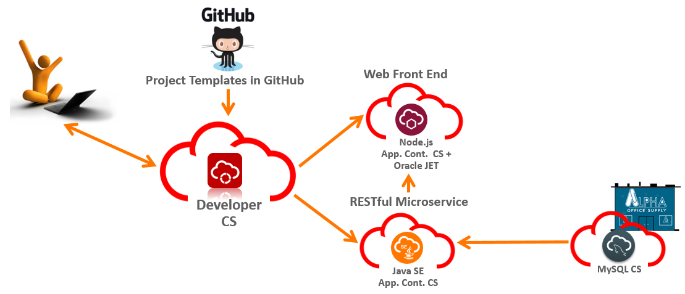

# Workshop Architecture Guide
    
## Workshop Goal

- To inform and understand the AppDev services provided to you in your trial account
- To understand the DevOps implications of these services
- To understand Oracle's support for Polyglot Development
- To build a modern microservice architecture in the cloud
    - Our Application will display a catalog of information provided by a catalog microservice that uses a MySQL DB. We will also leverage a currency microservice to provide exchange rate information for that catalog
- To apply DevOps techniques for Automation to build, configure and deploy your applications to the cloud

## Workshop Technologies
We will be executing the workshop running many different technologies behind the scenes, this section will outlne the main technologies we will be leveraging:

 - Developer Cloud Service: is centralized hub of development and DevOps technologies and tools. Of which we will be using a few:
    - Git for source code
    - Maven for build scripting
    - Shell for build scripting
    - Continuous Integration platform to run automated builds
    - Continuous Delivery platform to run automated deploys
- Our UI application:
    - Written in NodeJS
    - Uses Oracle JET as a client side UI framework
- Our MySQL microservice
    - Written in Java
    - Leverages JAX-WS and Grizzly IO to provide the REST and embedded web services
    - Leverages a backend MySQL Cloud Service instance
- Our Currency Microservice
    - Built using Google's Go Programming Language
    - Runs on a Docker container
    
## Architecture Goal
To Build out a Catalog UI supported by multiple microservices - providing supporting data and currency calculations

### Lab 100
This is the first of several labs that are part of the DevOps Starter Kit. This workshop will walk you through building and deploying a Cloud Native project that will create and use several Microservices built using various technologies. You will be applying DevOps principles to build your applications, provision your services and automate deployment of your applications.

#### Goal
Deploy the UI

#### Objectives
- Create Initial Project
- Import UI application from GitHub
- Setup automated build to create application artifacts
- Setup an automated deployment to provision and deploy your application into the Oracle Cloud

### Lab 200
In Lab 200 we will be building and deploying our first microservice, this microservice will provide a RESTful interface for our catalog database. The microservice is built using Java and leverages lightweight libraries JAX-WS and Grizzly IO to create RESTful endpoints. In Lab 300 we will be wiring up a MySQL Database to the microservice.

#### Goal
Deploy a Microservice

#### Objectives
- Import microservice from GitHub
- Setup automated build to create application artifacts
- Setup an automated deployment to provision and deploy your application into the Oracle Cloud
- Bind your microservice to the UI

### Lab 300
In Lab 300 we will be adding a MySQL database to our microservice from lab 200. We will be using an automated build process to load our baseline schema onto the database after we have provisioned it.

#### Goal
Wire the Microservice up to at MySQL Database

#### Objectives
- Provision a MySQL Database
- Create the baseline schema
- Bind the database to your microservice from lab 200

### Lab 400
Welcome to lab 400. In this lab we will be completing our application architecture by deploying a Golang microservice on Docker. The service will be responsible to translating currencies on our UI.

#### Goal
Deploy a second microserivce on a Docker image

#### Objectives
- Setup your docker host on Container Cloud Service
- Deploy the microservices from it's Docker Hub build location

