<center></center> 
> Updated: April 19, 2017

# Lab 100
## Introduction

This is the first of several labs that are part of the **DevOps Starter Kit.** This workshop will walk you through building a microservices architecture for a Cloud Native project that will create and use several Microservices built using various technologies.

You will be applying DevOps principles to build you applications, provision your services and automate deployment of your applications.

Please direct comments to: Cam Crockett (cam.crockett@oracle.com)

## Objectives
- Create Initial Project
- Import UI application from GitHub
- Setup automated build to create application artifacts
- Setup an automated deployment to provision and deploy your application into the Oracle Cloud

## Required Artifacts
- We will be leveraging a prepared application found on GitHub: [https://github.com/CloudAccelerate/TTC-CatalogApp.git](https://github.com/CloudAccelerate/TTC-CatalogApp.git)

## Technologies Involved
- Oracle Cloud Services:
    - Developer Cloud Service
    - Application Container Cloud Service
- Application Technologies
    - Written in NodeJS
    - Leverages Oracle JET for front-end widgets and scripting

## Architecture
You will be building out the first component of your Microservices Application


# Create Your Project

## Create Developer Cloud Service Project

### **STEP 1**: Login to your Oracle Cloud Account
- From any browser, go to the URL:
    `https://cloud.oracle.com`

- click **Sign In** in the upper right hand corner of the browser

    

- **IMPORTANT** - Under my services, select from the drop down list the correct data center and click on **My Services**. If you are unsure of the data center you should select, and this is an in-person training event, ***ask your instructor*** which **Region** to select from the drop down list. If you received your account through an Oracle Trial, your Trial confirmation email should provide a URL that will pre-select the region for you.

    

- Enter your identity domain and click **Go**.

    **NOTE:** The **Identity Domain, User Name** and **Password** values will be given to you by the instructor or Trial confirmation email.

    

- Once your Identity Domain is set, enter your User Name and Password and click **Sign In**


    

- You will be presented with a Dashboard displaying the various cloud services available to this account.

    

- If all your services are not visible, **click** on the **Customize Dashboard**, you can add services to the dashboard by clicking **Show.** For this workshop, you will want to ensure that you are showing at least the **Application Container, Container, Developer and Storage** cloud services. If you do not want to see a specific service, click **Hide**

    

### **STEP 2**: Check/Set Storage Replication Policy

- If you have not already done so please set your replication policy as described in the Pre-requisite guide.

### **STEP 3**: Login to Developer Cloud Service

Oracle Developer Cloud Service provides a complete development platform that streamlines team development processes and automates software delivery. The integrated platform includes an issue tracking system, agile development dashboards, code versioning and review platform, continuous integration and delivery automation, as well as team collaboration features such as wikis and live activity stream. With a rich web-based dashboard and integration with popular development tools, Oracle Developer Cloud Service helps deliver better applications faster.

- From the Cloud UI dashboard click on the **Developer** service. In our example, the Developer Cloud Service is named **developer99019**.

    

- The Service Details page gives you a quick glance of the service status overview.

    

- Click **Open Service Console** for the Oracle Developer Cloud Service. The Service Console will then list all projects for which you are currently a member.

    

### **STEP 4**: Create Developer Cloud Service Project

- Click **New Project** to start the project create wizard.

    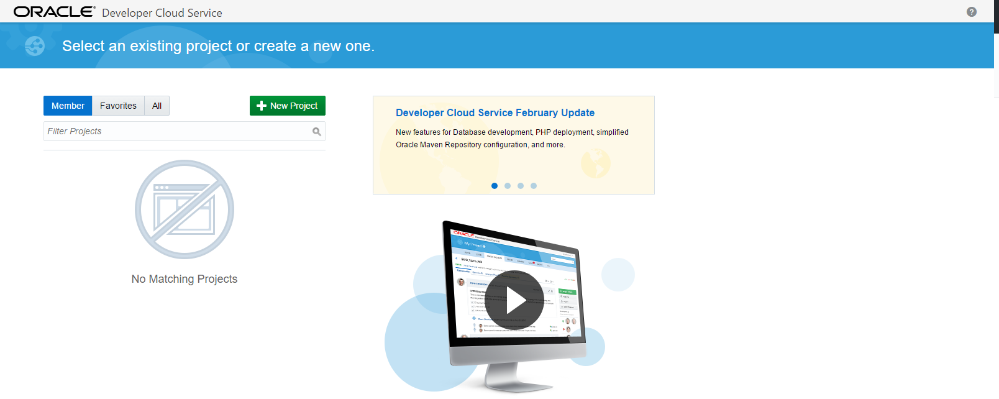

- On Details screen enter the following data and click on **Next**.


```
    Name: Touch The Cloud Demo
```

> **Note:** A Private project will only be seen by you. A Shared project will be seen by all Developer Cloud users. In either case, users need to be added to a project in order to interact with the project.

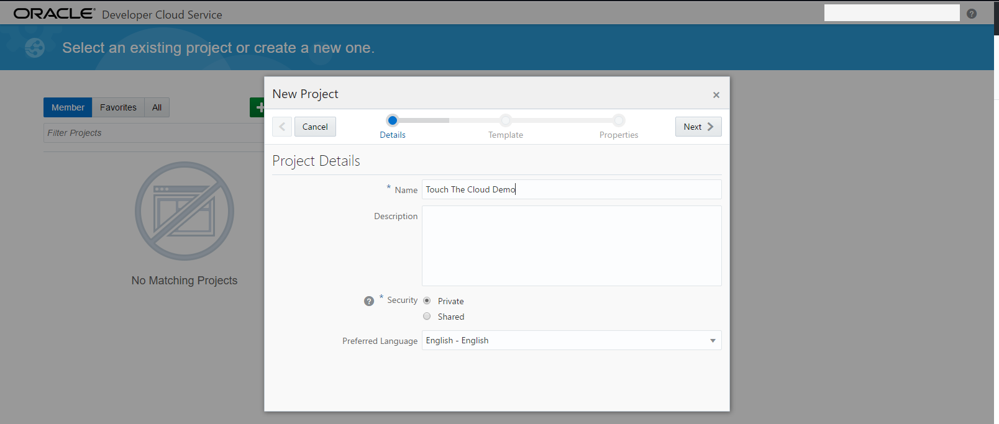

- Leave default template set to **Empty Project** and click **Next**

    

- Select your **Wiki Markup** preference to **MARKDOWN** and click **Finish**.

    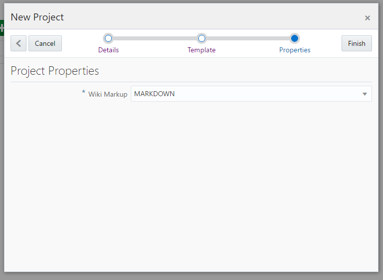

- The Project Creation on average will take about 1-2 minutes.

    

- You now have a new project, in which you can manage your software development.

    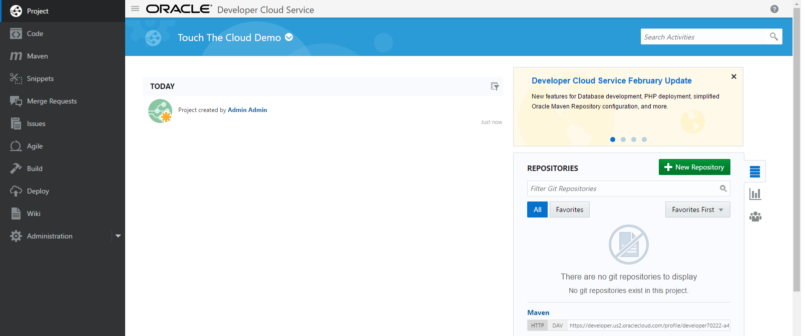


# Setup your Application

## Import the Catalog Application

### **STEP 5**: Create a New Repository

In this step we will be importing the NodeJS and Oracle JET application from GitHub directly into our Developer cloud instance

- From the main page click **New Repository**.


- Fill out the form and hit **create**


> 
> Name: CatalogUI

> Select Import from Existing Repository:

> https://github.com/CloudAccelerate/TTC-CatalogApp.git


- Your code is now being imported into a new Git repository in Developer Cloud Service


- Once finished the code in the repository will be available to browse through


### **STEP 6**: Create Deployment Artifacts through an Automated Build

- Click **Build** on the left menu

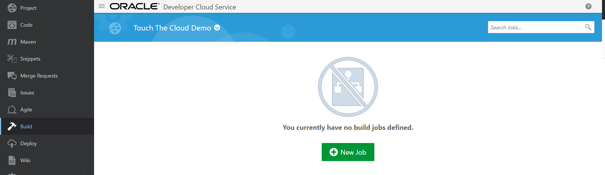

- Create a **New Job**. Fill out the form and click **Save**

> Name: CatalogUIBuild

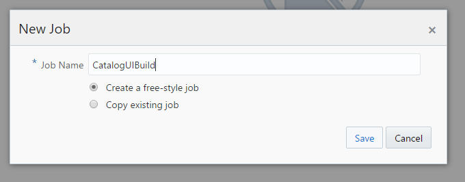

- You will now be able to configure your build.

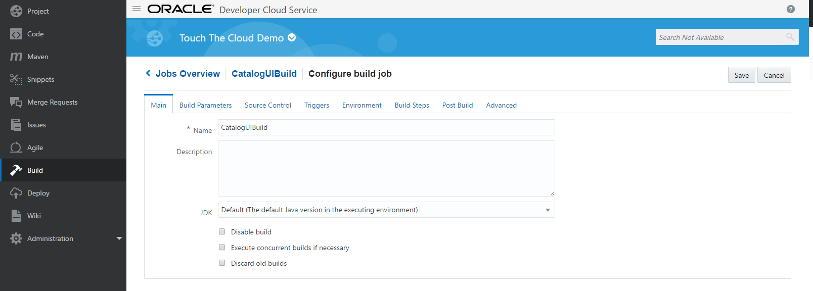

- Select the **Source Control** tab and select **Git**, followed by the catalog repository. Add the **Master branch**.


- Select the **Build Step** Add a Shell Build


- Enter the command:

`npm install`

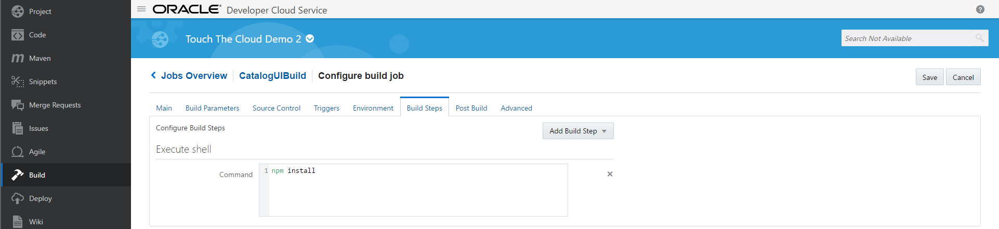

- Select the **Post Build** tab and check Archive the artifacts: `*.zip`

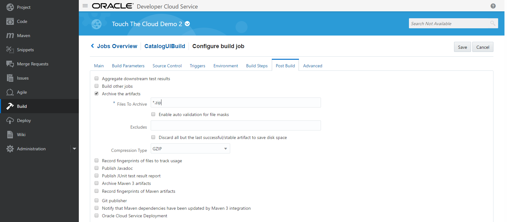

- **Save** and **Build Now**

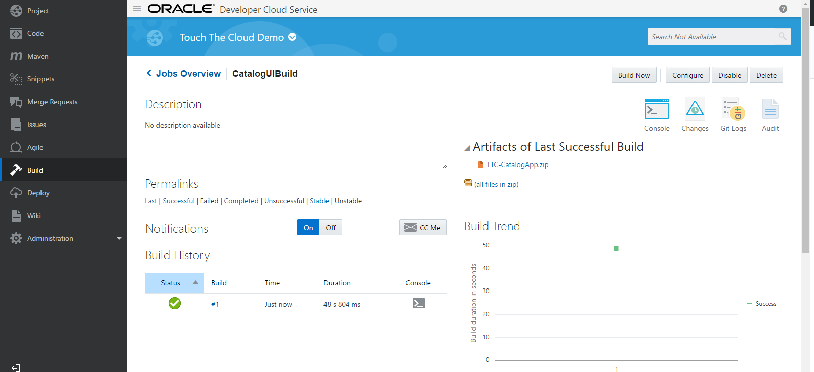

### **STEP 7**: Create an Application Deployment Tied to the build

- Click **Deploy** from the left menu


- Select **New Configuration** and fill out the Configuration Name. By Deployment Target click **New** and select **Application Container** from the drop down

> ConfigurationName: CatalogUIDeploy


- Enter in your domain credentials and Test the Connection. Once successfully tested, select connection.

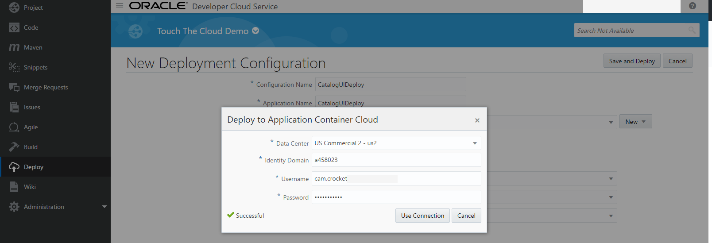

- Select the following options:


```
Runtime: Node
Billing: Hourly
Type: Automatic
Deploy Stable Builds Only
Job: CatalogUIBuild
Artifact: TTC-CatalogApp.zip
```

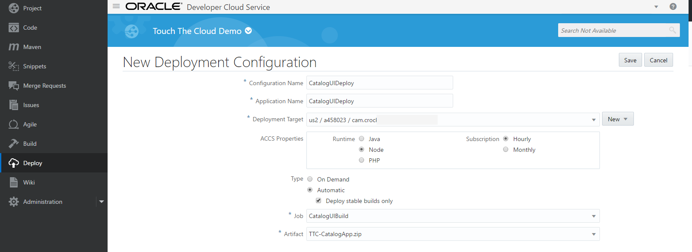

- Save and Start the Deployment

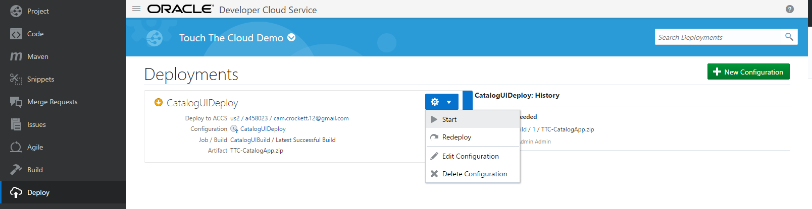

- The deployment should execute successfully

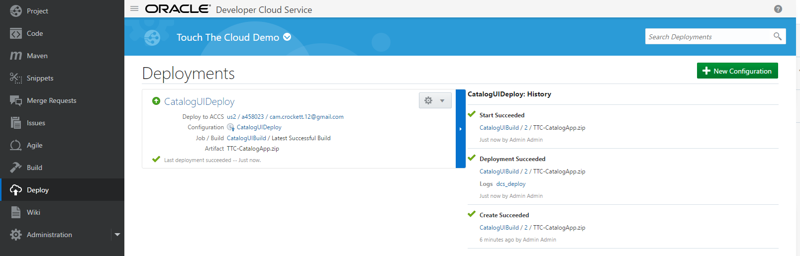

### **STEP 8**: Verify Deployment

- Click the Deploy to ACCS link on the CatalogUIDeploy Deployment to navigate to the Application Container Cloud Service Console

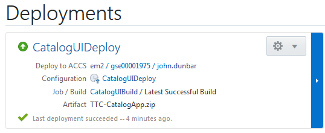

- You will now see the Deployed Application Running


- Open the link provided to view the Deployed Application


**YOU have now completed lab 100**
