# Lab 200

## Introduction

In Lab 200 we will be building and deploying our first microservice, this microservice will provide a RESTful interface for our catalog database. The microservice is built using Java and leverages lightweight libraries JAX-WS and Grizzly IO to create RESTful endpoints. In Lab 300 we will be wiring up a MySQL Database to the microservice.

Please direct comments to: Cam Crockett (cam.crockett@oracle.com)

## Objectives
- Import microservice from GitHub
- Setup automated build to create application artifacts
- Setup an automated deployment to provision and deploy your application into the Oracle Cloud
- Bind your microservice to the UI

## Required Artifacts
- We will be leveraging a prepared application found on [GitHub: https://github.com/CloudAccelerate/TTC-MySQLMicroservice.git](https://github.com/CloudAccelerate/TTC-MySQLMicroservice.git)

## Prerequisites

- Expected that lab 100 has been completed already
- Expected that your storage policy has been set as described in the **prerequisite guide**

## Technologies Involved
- Oracle Cloud Services:
    - Developer Cloud Service
    - Application Container Cloud Service
- Application Technologies
    - Written in Java
    - Leverages JAX-WS and Grizzly IO to provide a RESTful interface
    - Uses MySQL drivers for DB interface
    - Uses Maven for build scripting and library management

## Architecture
You will be building out the first component of your Microservices Application

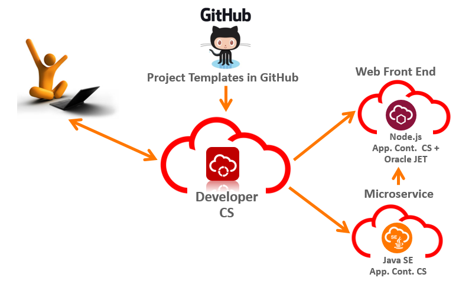

# Create, Build and Deploy a MySQL Microservice

## Add to your Developer Cloud Service Project

### **STEP 1**: Login to Developer Cloud Service

Oracle Developer Cloud Service provides a complete development platform that streamlines team development processes and automates software delivery. The integrated platform includes an issue tracking system, agile development dashboards, code versioning and review platform, continuous integration and delivery automation, as well as team collaboration features such as wikis and live activity stream. With a rich web-based dashboard and integration with popular development tools, Oracle Developer Cloud Service helps deliver better applications faster.

- Return to the main Cloud UI Dashboard


 
 - From the Cloud UI dashboard click on the **Developer** service. In our example, the Developer Cloud Service is named **developer99019**.   


- The Service Details page gives you a quick glance of the service status overview.

    

- Click **Open Service Console** for the Oracle Developer Cloud Service. The Service Console will then list all projects for which you are currently a member.

    

### **STEP 2**: Add MySQL Microservice to your Project

- From the home screen select your Touch the Cloud project.

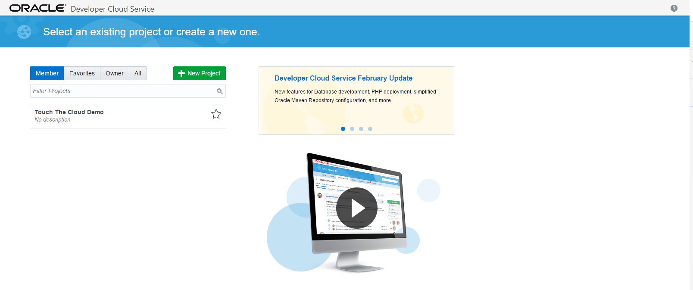

- On the Home screen you should see a list of current repositories in the project.


- Click the **New Repository** button Fill out the form and hit **create**


```
Name: MySQLMicroservice
Select Import from Existing Repository:
https://github.com/CloudAccelerate/TTC-MySQLMicroservice.git
```

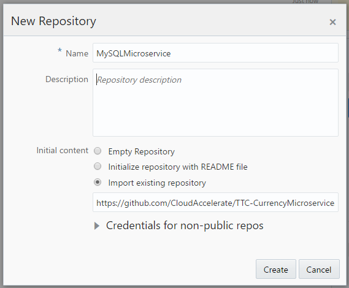

- Your code is now imported into a new Git repository in Developer Cloud Service under your project


### **STEP 3**: Create Deployment Artifacts through an Automated Build

- Click **Build** on the left menu

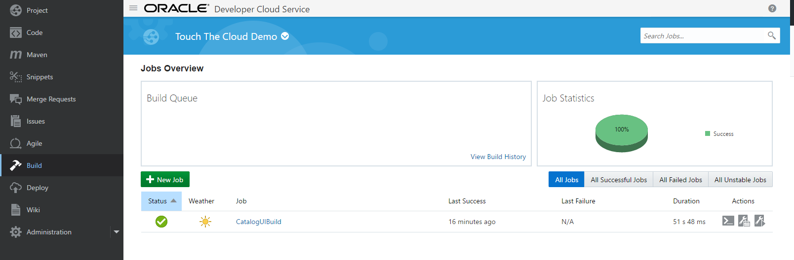

- Create a **New Job**. Fill out the form and click **Save**

> Name: MySQLMicroserviceBuild

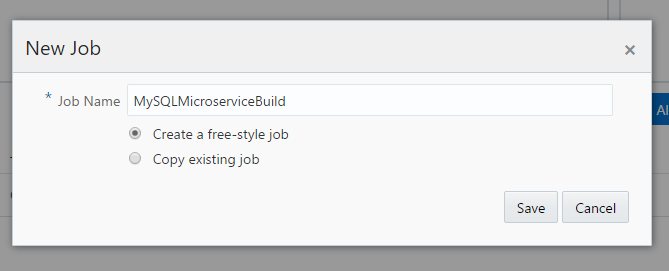

- You will now be able to configure your build. From the Main tab, ensure you select **JDK 8**


- Select the **Source Control** tab and select **Git**, followed by the **MySQLMicroservice** repository. Add the **Master branch**.

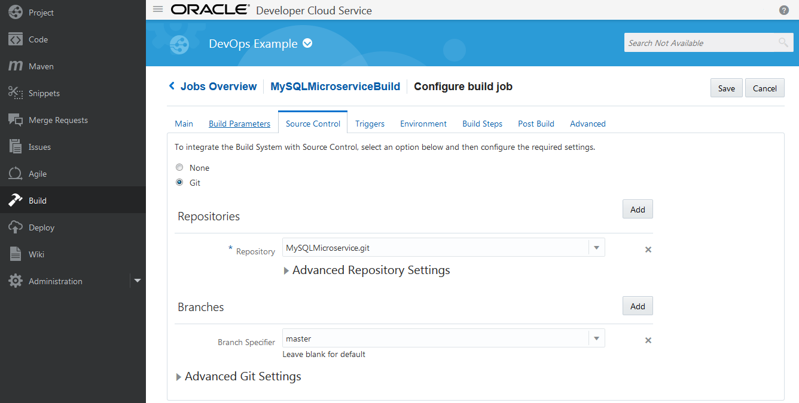

- Select the **Build Step** Add a **Maven 3** build step


- Accept the default settings


- Select the **Post Build** tab

```
Archive the artifacts: **/target/*
Publish JUnit test result report: **/target/surefire-reports/*.xml
```


- **Save** and **Build Now**

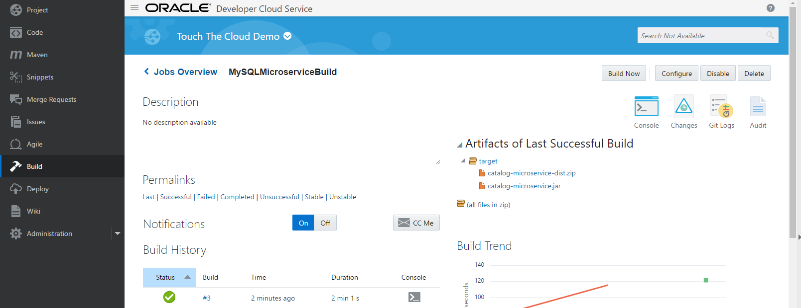

### **STEP 4**: Create an Application Deployment for the Build

- Click **Deploy** from the left menu

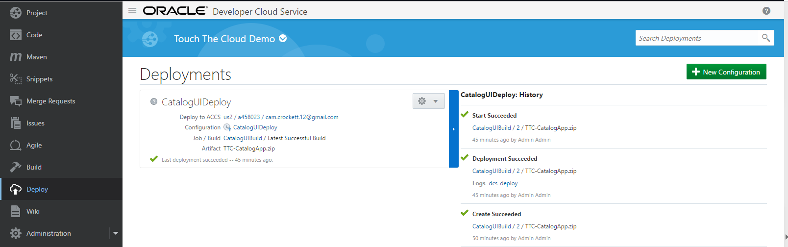

- Select Create **New Configuration** and fill out the form and select Application Container from the Deployment Target


```
ConfigurationName: MySQLMicroserviceDeploy
```


- Select your existing application container connection and enter in your domain credentials then Test the Connection. Once successfully tested, select connection.


- Select the following options:

```
Runtime: Java
Billing: Hourly
Type: Automatic
Deploy Stable Builds Only
Job: MySQLMicroserviceBuild
Artifact: target/catalog-microservice-dist.zip
```

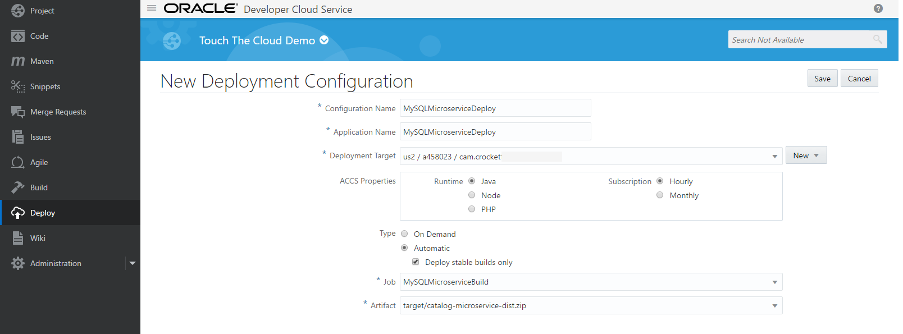

- Save and Start the Deployment


- The deployment should execute successfully

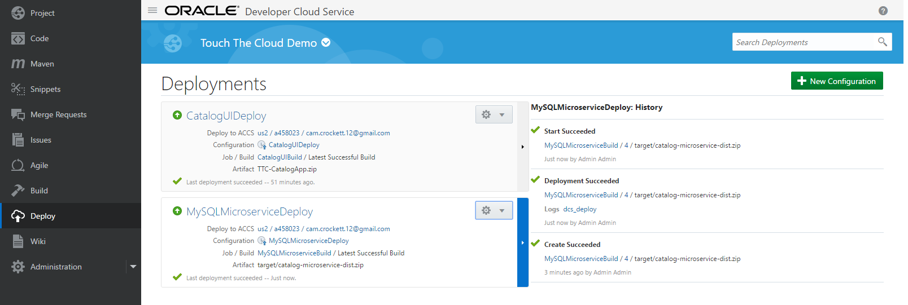

### **STEP 5**: Verify Deployment

- Click the Deploy to ACCS link on the MySQLMicroserviceDeploy Deployment to navigate to the Application Container Cloud Service Console

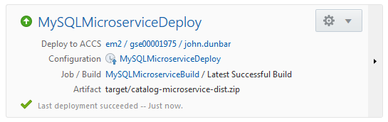

- You will now see the Deployed MySQL Microservice Application Running


- Open the link provided to view the Deployed Application and append "/catalog/v1/" to the end of the URL.

```
ex: https://mysqlmicroservicedeploy-a458023.apaas.us6.oraclecloud.com/catalog/v1/
```

> Note that until the Database is connected we are expecting a 500 (internal server error) to occur
> Take record of the full URL create as it will be used later in the lab


### **STEP 6**: Bind your Microservice to the UI Application

- Return to the main screen for Application Container Cloud Service


- Select CatalogUIDeploy


- Select the Deployments tab on the left

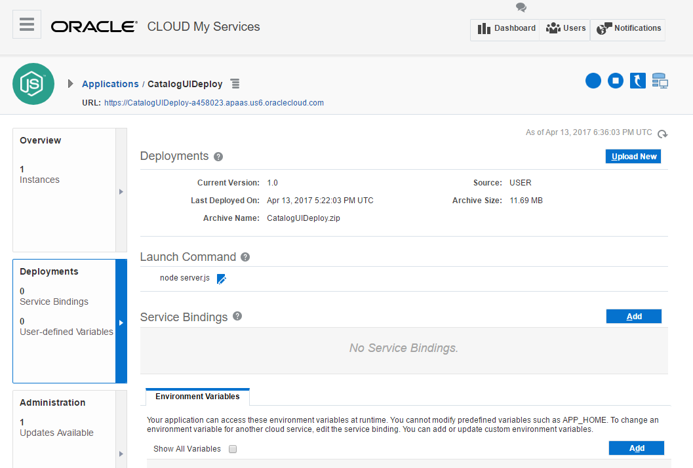

- Select **Add** Under Environment Variables and fill out the form

```
Name: CATALOG_MICROSERVICE_URL
Value: <URL from Microservice>
ex: https://mysqlmicroservicedeploy-a458023.apaas.us6.oraclecloud.com/catalog/v1
```


- Press the Apply Edits button and wait for the container to be re-created with the new variable

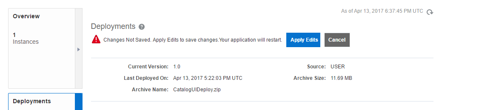

- Once restarted, select the application url and you should see an updated UI with the Lab 2 achievement unlocked


**You have now completed lab 200**
