# Lab 400

## Introduction

Welcome to lab 400. In this lab we will be completing our application architecture by deploying a Golang microservice on Docker. The service will be responsible to translating currencies on our UI.

## Objectives

- Setup your docker host on Container Cloud Service
- Deploy the microservices from it's Docker Hub build location

## Required Artifacts
- The following lab requires an Oracle Public Cloud account that will be supplied by your instructor.
- You will need an ssh key: [labkey](labkey.pub)

## Optional Artifacts

- The Code Base for Docker Hub Build is located here: [https://github.com/CloudAccelerate/TTC-CurrencyMicroservice.git](https://github.com/CloudAccelerate/TTC-CurrencyMicroservice.git)
- The Docker Hub Build is here: [https://hub.docker.com/r/cloudaccelerate/ttc-currencymicroservicebuild/](https://hub.docker.com/r/cloudaccelerate/ttc-currencymicroservicebuild/)
- Google's Go Programming Language is described here: [https://golang.org/](https://golang.org/)
- Docker information can be found here: [https://www.docker.com/](https://www.docker.com/)
- Oracle's Container Cloud Service is detailed here: [https://cloud.oracle.com/en_US/container](https://cloud.oracle.com/en_US/container)

## Prerequisites

- Expected that labs 100, 200 and 300 have been completed already
- Expected that your storage policy has been set as described in the [prerequisite guide](PreReqGuide.md)

# Setup and Deploy a Golang Microservice on Docker

## Setup your Docker Host

### **STEP 1**: Create a Container Cloud Service Instance

- Return to the Cloud Services Dashboard

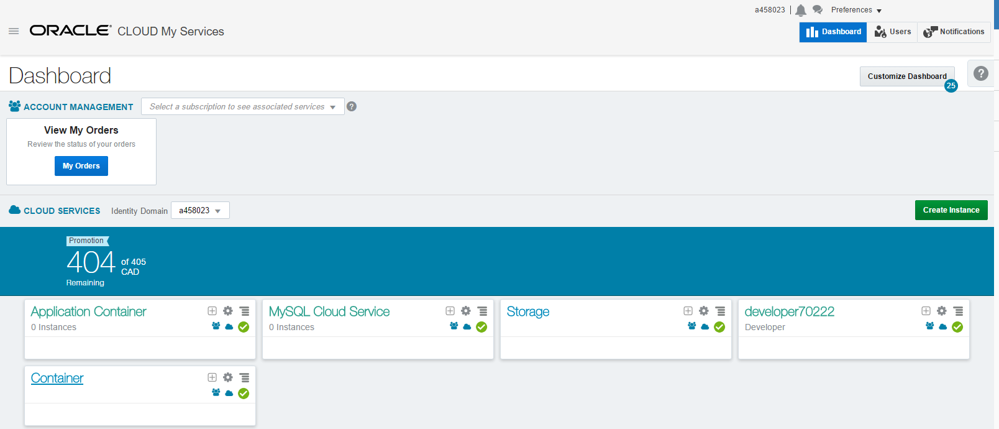

- From the dashboard click on the **Container** Cloud Service menu (not to be confused with Application Container) and select Open Service Console

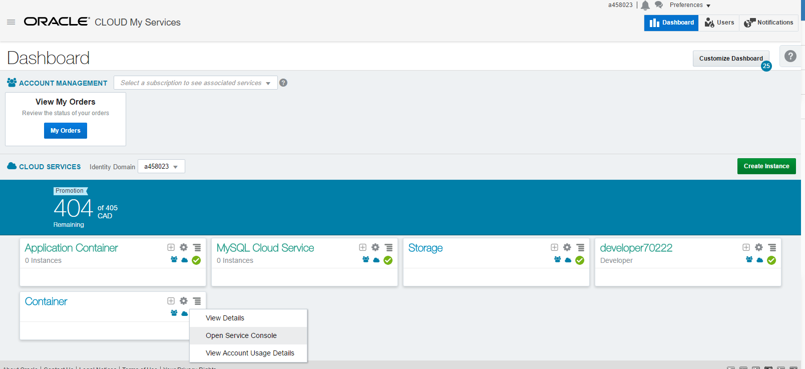

- You will now be on the landing page for Oracle's Container Cloud Service

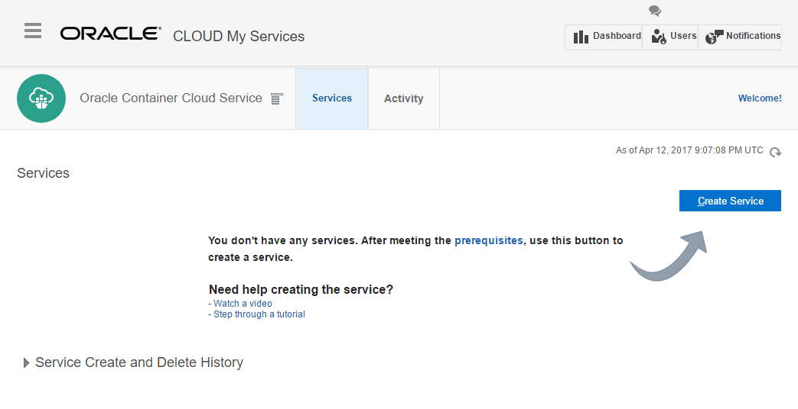

- Click Create a service to start the wizard process of setting up your Docker host


- Fill in the form and click Next

```

Service Name: TouchTheCloudDemo
SSH Public Key:<use labkey.pub found in required artifacts>
Admin Username: admin
Admin Password: Oracle123!
```


- Confirm your setup


- Wait for a few minutes while your host provisions (approx 10 minutes to setup your host)

> Note that we will see 2 OCPUs and 15GB or memory being used. This is due to the management console needing a OC3 shape to run (1 OCPU and 7.5GB memory). Additional shapes are then allocated based on the number of workers and the worker shape selected in the cofiguration. For our Demo we have a single OC3 shaped worker.

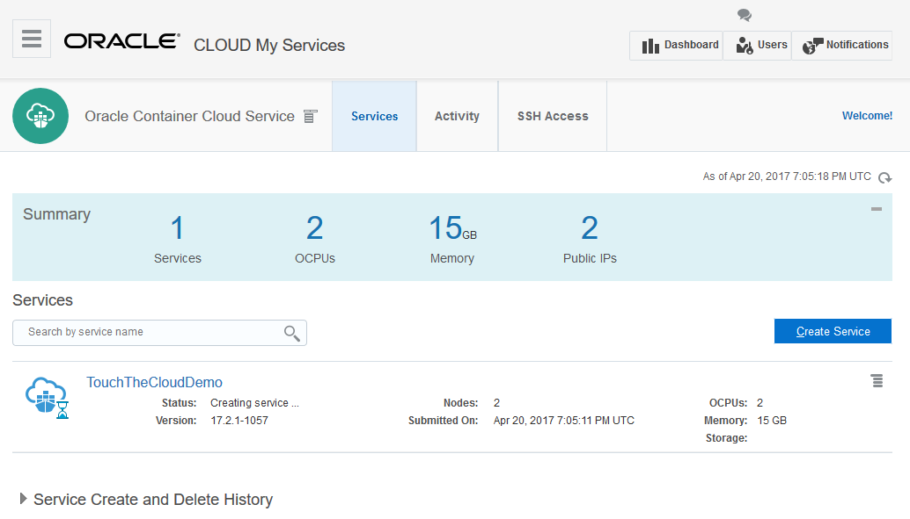

### **STEP 2**: Create a new container service

- Once your Container Service instance is provisioned, click on the menu to open the Container Console (you may have to add a browser security exception)

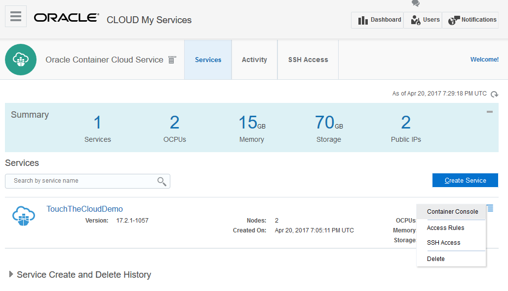

- Use the admin username and password you setup in the instance configuration to login

```

Username: admin
Password: Oracle123!
```


- Once logged in, you will be presented with the main dashboard

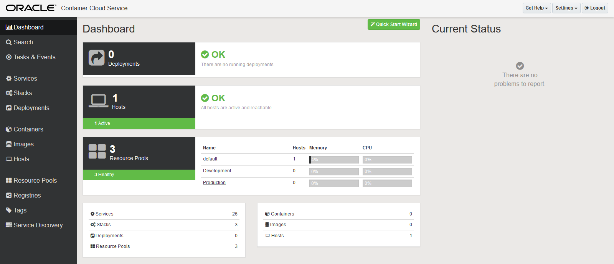

- Select Services from the left hand menu, here you will find a listing of out-of-the-box containers available to be deployed
    - A new deployment is as easy as hitting deploy.

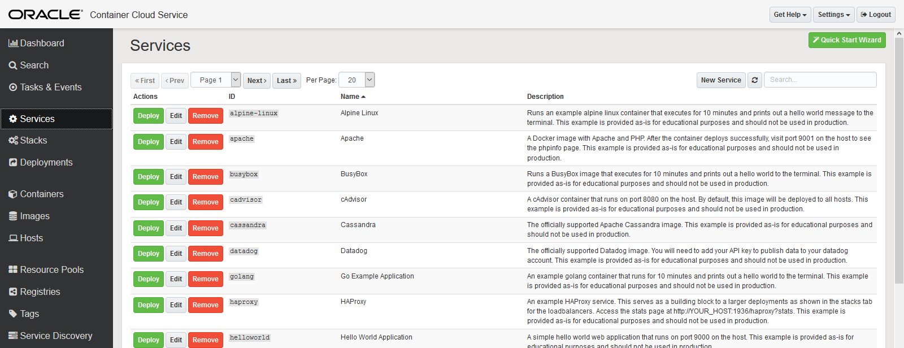

- We are now going to create a new service based off a Docker image built on Docker Hub (by default, Docker hub is linked to Oracle's Container Cloud service via the Registries Menu). Select New Service


- Fill out the New Service Form


```

Service Name: Currency Microservice
Image: cloudaccelerate/ttc-currencymicroservicebuild

```

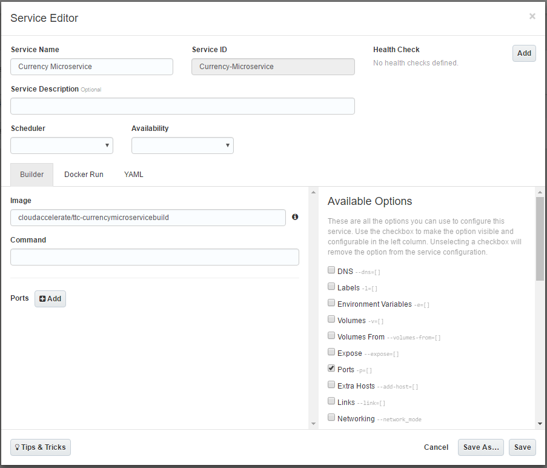

- Select Ports from the Available Options and Add a new port mapping

```

Host Port: 80
Container Port: 8089
Protocol: TCP
```

> Our application is set to listen on port 8089 which is exposed by the container (defined in the docker file). In order to access the container port we need to create a mapping from the host to the container. In this case we have chosen to set port 80 on the host to create the mapping to port 8089 on the container.

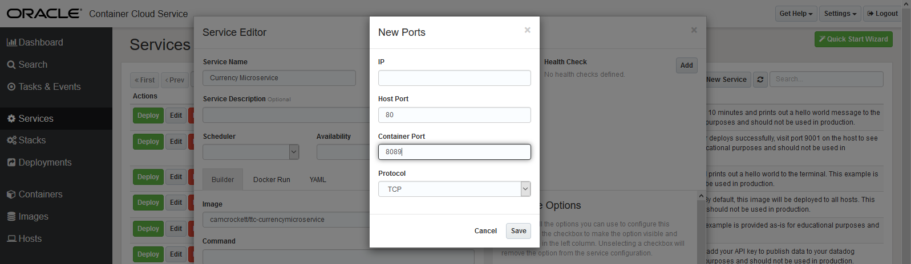

- Now Save your new service

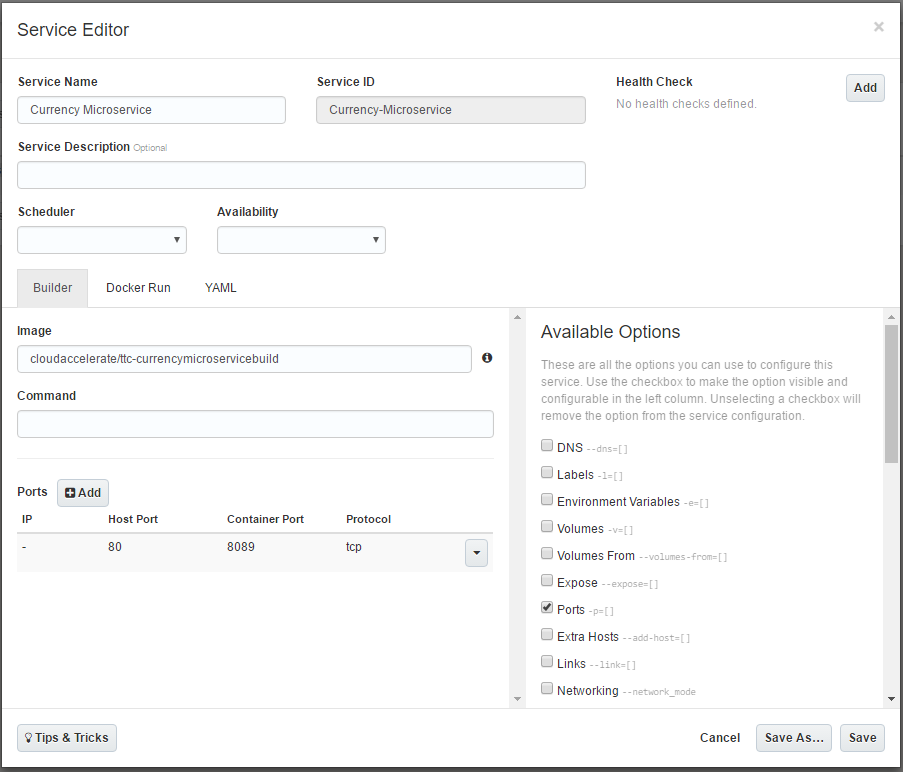

- verify your new service is in the list by filtering for Currency


### **STEP 3**: Deploy the container

- find the Currency Microservice in the list of services and select Deploy


- Use the default values for the deployment and hit Deploy

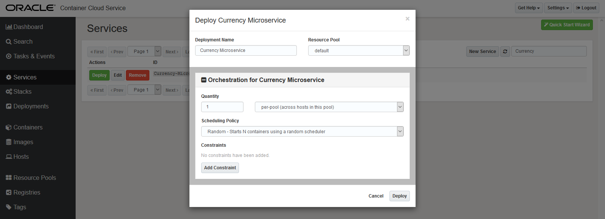

- Your container should start deploying

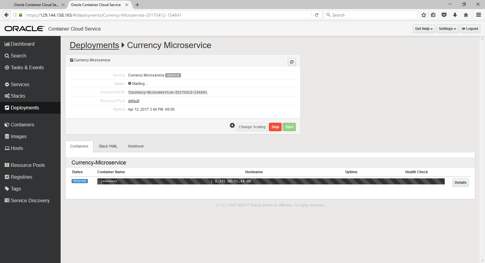

- Once successfully deployed the status should update

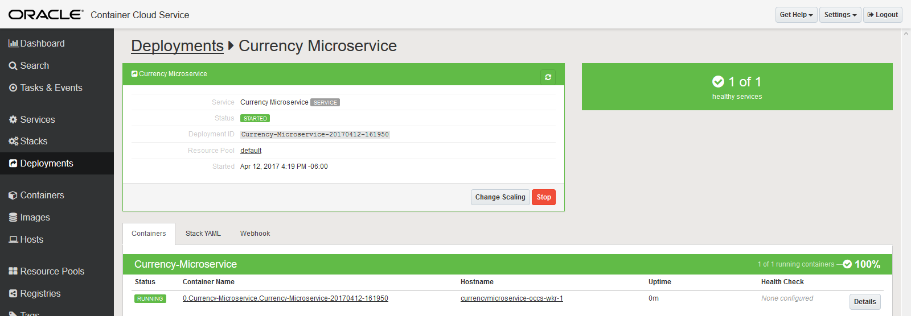


### **STEP 4**: Verify your Microservice

- Select Containers on the left menu to see a listing of your containers

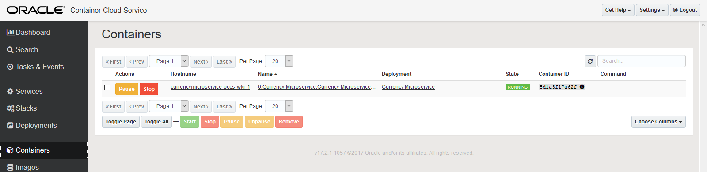

- Click on hostname to view host details. **Make a note of the public IP**


- To Verify the microservice, open a new web browser tab and use the public IP to hit the following URL:

```

http://<Public_IP>/currencies/v1/usd
ex: http://129.144.154.28/currencies/v1/usd
```

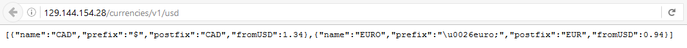

### **STEP 5**: Bind your Microservice

- Return to your main service dashboard


- Select Application Container Cloud Service to view your previously deployed Applications from Labs 100 and 200

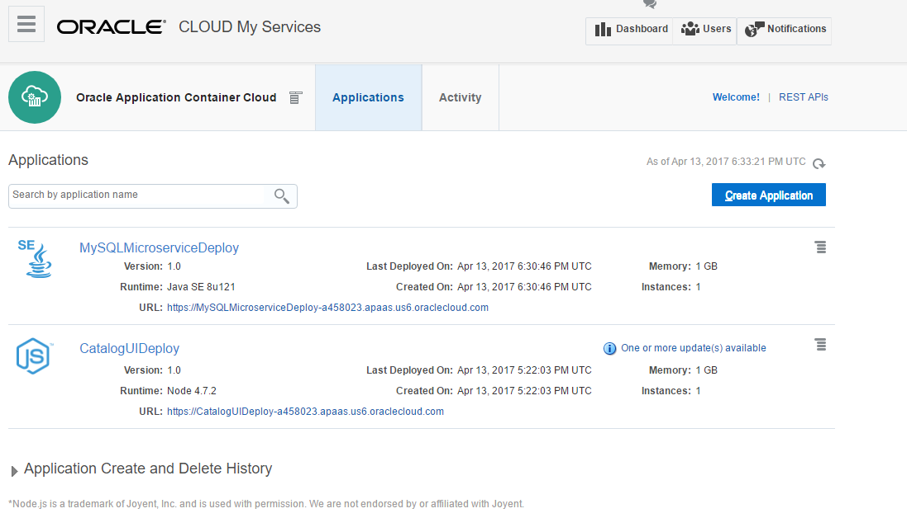

- From the application dashboard step into your UI application

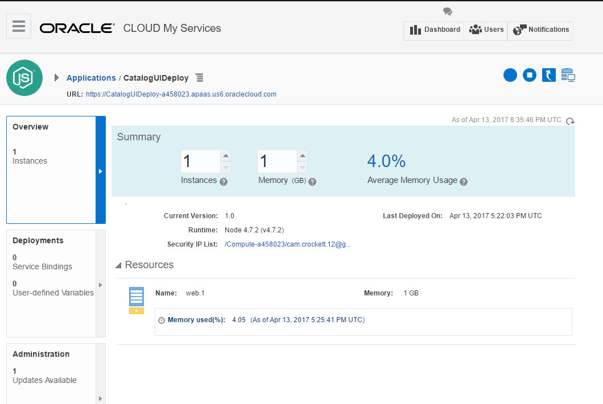

- Select the Deployments tab on the left

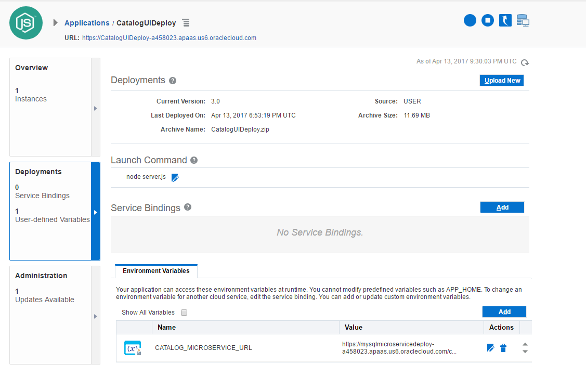

- Add a new environment variable

```

Name: CURRENCY_MICROSERVICE_URL
Value: <Currency Microservice URL>
ex: http://129.144.154.28/currencies/v1/usd
```

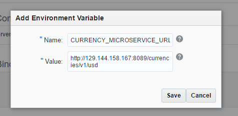

- Save and apply your biding

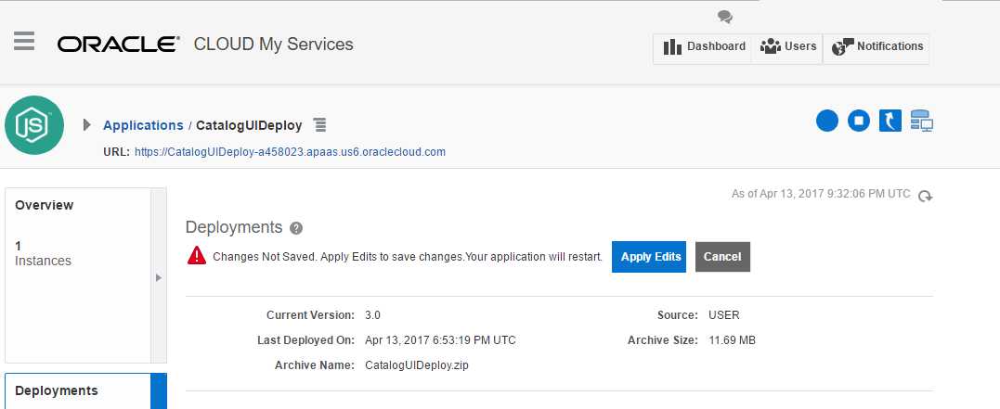

- Once the Application is recreated, open the URL to see the new binding in action.


**Lab 400 is now complete**

